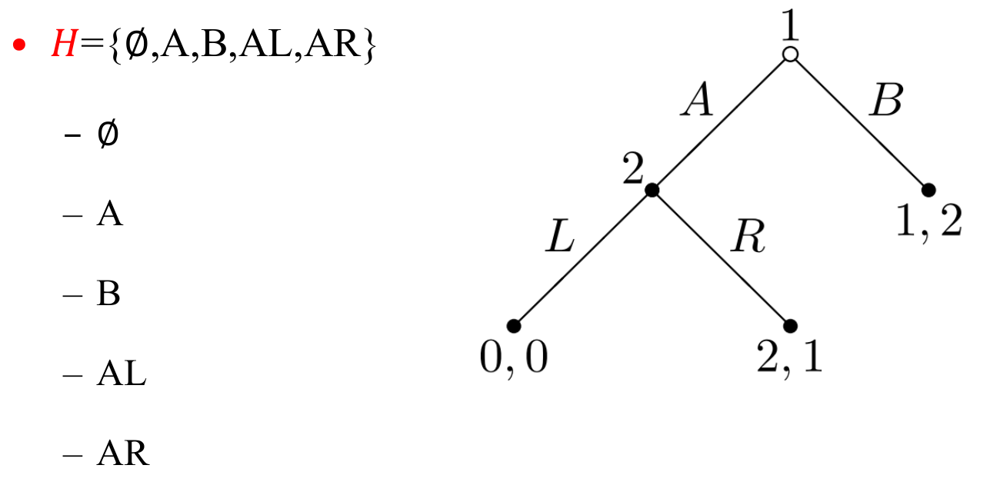
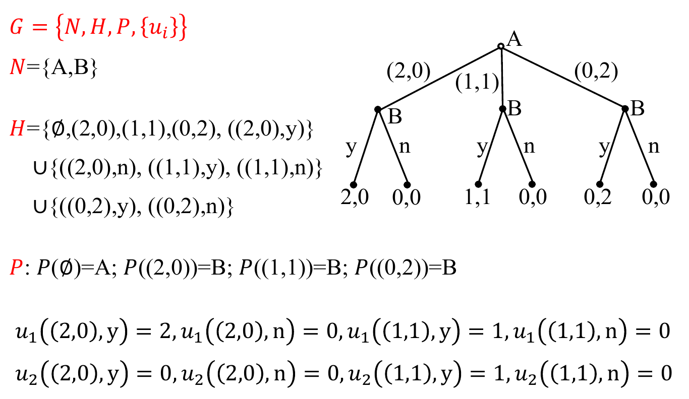
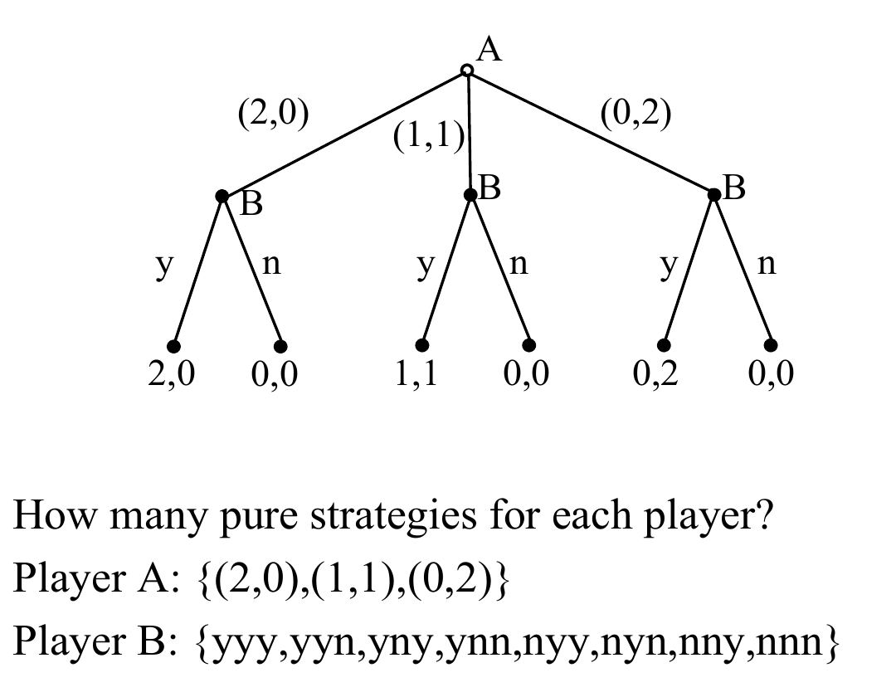
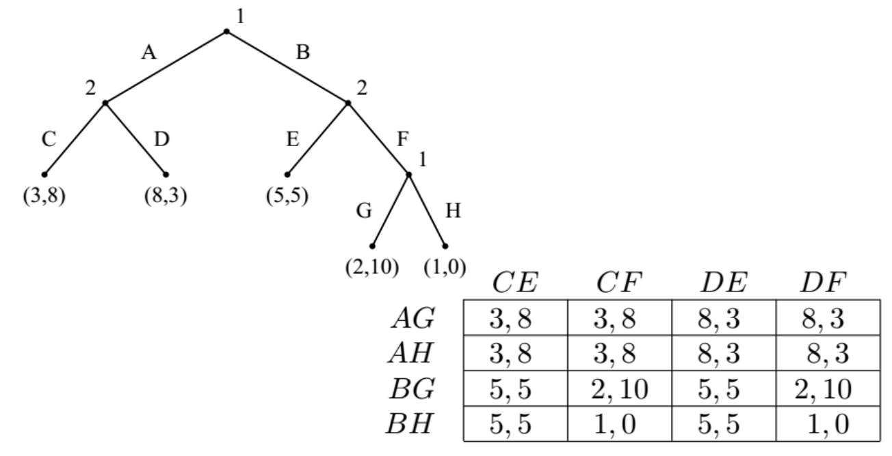
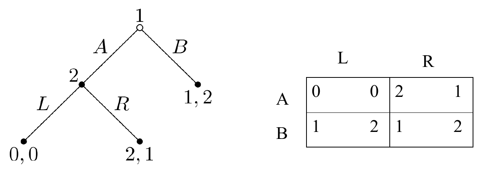

# Extensive Game
+ Strategy Game
  + Set of players, set of strategies, and payoff functions
+ Extensive Games consider more...
  + Sequence of players
  + Strategies available at each step of game (online)
## Formal Definition of Extensive Games
+ $N$ Players
+ Strategies $A$
+ Histories $H$ is a set of strategy sequence(finite or infinite)
  + $\emptyset \in H$
  + if $a^1a^2...a^k\in H$, then $a^1a^2...a^s\in H, \forall s\leq k$
  + if a infinite sequence $(a^k)_{k=1}^\infty$ satisfies $a^1a^2...a^k\in H$, then $(a^k)^\infty_{k=1}\in H$ 
  + Each sequence in $H$ is called a *history*, each *component* $a^i\in A$ is a strategy
  + **Terminal history**: $a^1...a^k\in H$ s.t. $k=\infty$ or $a^1...a^{k=1}\not\in H$ for any $a^{k+1}\in A$
  + **Terminal history set**: Z=all terminal histories 

+ **Player function**
  + $P:H\\ Z\to N$ which assigns to each **non-terminal history** a player of $N$
  + $P(h)$ denotes the player who takes action after history $h$
+ **Payoff function**: $u_i:Z\to R$
+ Thus, an extensive game can be denoted as
$$G = \{N, H, P, \{u_i\}\}$$

> 一个例子  
> 
> 两个玩家：A，B
> 历史集合中存放了博弈树从根到叶子的每种可能路径
> P为博弈玩家函数，指定了在当前历史（非叶子节点）下行动的玩家
> $u_1$, $u_2$为两个玩家的收益

> Example 2: construct a game tree with $G$
> page 14.

## Solving Extensive Games
### Pure Strategies
+ **Pure Strategy**: Given game $G$, the **pure strategy** for player $i$ is given by the cross product
  $$\times_{h\in H}\{a^s:(h, a^S)\in H, p(h)=i\}$$
  + the cartesian product of strategies at each node where player $i$ is required to play

> Example:  
> 
> 博弈玩家B在每个由它 执行行动的节点上都有$(y,n)$两种行动，因此为三个$(y, n)$的cartesian product

+ Note: **definite pure stategies lead to exactly one outcome**

### Mixed Strategies
+ Attach distributions to pure strtegies

### Nash Equilibrium
+ Given extensive Game $G$, an strategy outcome $a^*=(a_1^*, a_2^*, ..., a_N^*)$ is a **Nash Equilibrium** iff 
  $$u_{i}\left(a_{i}^{*}, a_{-i}^{*}\right) \geq u_{i}\left(a_{i}, a_{-i}^{*}\right) \text { for every } a_{i} \text { of player }$$
+ **Fact**: *Every extensive game can be converted to a strategy game*, thus we can solve NE by solving a strategy game  
  
+ **Kuhn Theorem: *Every extensive game with perfect information has at least one Pure Strategy Nash Equilibrium***
+ In extensive game, NE is not necessarily reasonbale/credible  
  
  + $(B,L)$ is a NE, but the fact is that player 1 will never choose action $L$
  + In order to rule out these incredible outcomes, we define Subgames

### Subgame
+ **Definition**: *A subgame is a set of nodes, strategies and payoffs, following from a single node to the end of game.*

#### Subgame Perfect Equilibrium
+ **Definition**: *An outcome $a=(a_1^*, a_2^*, ..., a_N^*)$ is a subgame perfect equilibrium if it is a NE in every subgame*
  + SPE rules out "non-credible threat"
+ **Theorem**: *Every extensive game with perfect information has a subgame perfect.*