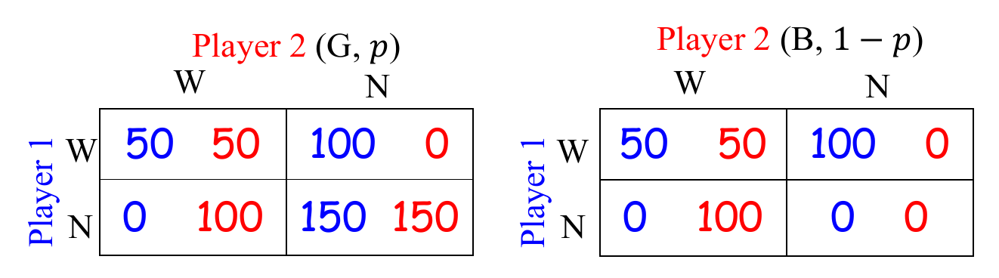

# 非完全信息下的博弈
+ 博弈往往是非完全信息的
  + 在许多博弈环境下，player并不知道真实的payoff
  + Players可能没有关于其他玩家的完整信息
  + 玩家之间不知道其他人的收益和成本
  + 有些玩家可能有一些内部消息
+ 这种非完全信息的博弈往往会鼓励player之间的交互

## Bayesian Games
### Settings
+ A set of players $N$
+ A set of strategies $A_i$ for each player $i$
+ A set of types $\Theta_i$ for each player $i$
  + Type set $\Theta_i$ include all private information for player $i$
  + The types on payoff are adequate
+ Probability distribution $p=p(\theta_1, ..., \theta_N)$ on $\times_{i=1..n}\Theta_i$
+ For player i, **a pure strategy** is a map $a_i:\Theta_i\to A_i$, which describes an strategy of each type
$$a_i=(a_i(\theta_i^1), a_i(\theta_i^2), ..., a_i(\theta_i^{n_i}))$$
+ A payoff function $u_i:\times_{i=1..N}A_i\times\times_{i=1..n}\Theta_i\to R$
  $$u_i(a_1, ..., a_N,\theta_1, ...,\theta_N)\text{ for }a_i\in A_i \text{ and }\theta_i\in \Theta_i $$

### Outcome and Payoff Functions
+ An outcome of Bayes game is given by
  $$\left(\left(a_{1}\left(\theta_{1}^{1}\right), \ldots, a_{1}\left(\theta_{1}^{n_{1}}\right)\right), \ldots,\left(a_{N}\left(\theta_{N}^{1}\right), \ldots, a_{N}\left(\theta_{N}^{n_{N}}\right)\right)\right)$$
+ Given $a_{-i}$, the expected payoff of player $i$ and type $\theta_i$ is 
  $$U_{i}\left(a_{i}\left(\theta_{i}\right), a_{-i}\right)=\sum_{\theta_{-i}} p\left(\theta_{-i} \mid \theta_{i}\right) u_{i}\left(a_{-i}\left(\theta_{-i}\right), a_{i}, \theta_{-i}, \theta_{i}\right)$$
  where $p(\theta_{-i}|\theta_i)=p(\theta_i, \theta_{-i})/p(\theta_i)$

## Bayesian Nash Equilibrium
+ **Definition:** The outcome $(a_1, a_2, ...,a_N)$ is a **Bayesian NE**, if for each type $\theta_i$, we have
  $$U_{i}\left(a_{i}\left(\theta_{i}\right), a_{-i}\right) \geq U_{i}\left(a_{i}^{\prime}\left(\theta_{i}\right), a_{-i}\right) \text { for all } a_{i}^{\prime}\left(\theta_{i}\right) \in A_{i}$$
+ Given $a_{-i}$ and type $\theta_i$, the best reponse for player $i$ is 
  $$\begin{array}{l}
B_{i}\left(a_{-i}, \theta_{i}\right)=\left\{a_{i}\left(\theta_{i}\right): U_{i}\left(a_{i}\left(\theta_{i}\right), a_{-i}\right)\right. \\
\left.\geq U_{i}\left(a_{i}^{\prime}\left(\theta_{i}\right), a_{-i}\right) \text { for all } a_{i}^{\prime}\left(\theta_{i}\right)\right\}
\end{array}$$
+ **Theorem:** The outcome $(a_1, a_2, ..., a_N)$ is a Bayesian NE iff for every player $i$ and each type $\theta_i$, we have
  $$a_i(\theta_i)\in B_i(a_{-i}, \theta_i)$$
+ 如何寻找Bayesian Nash Equilibrium

### An example: Bank Runs

