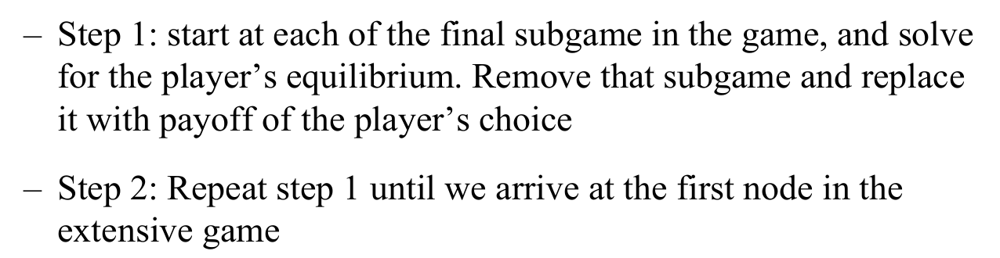
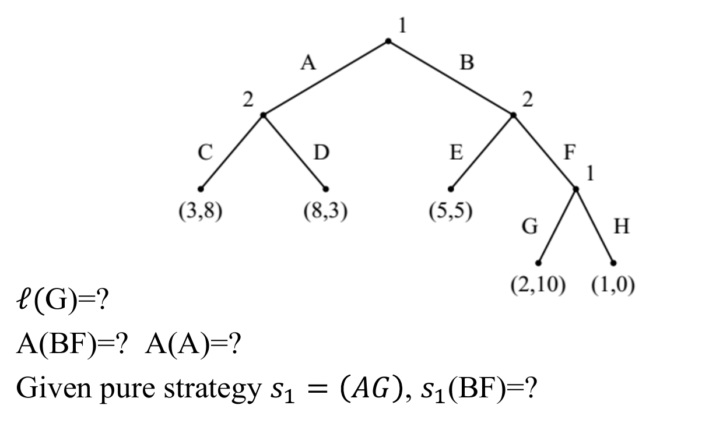
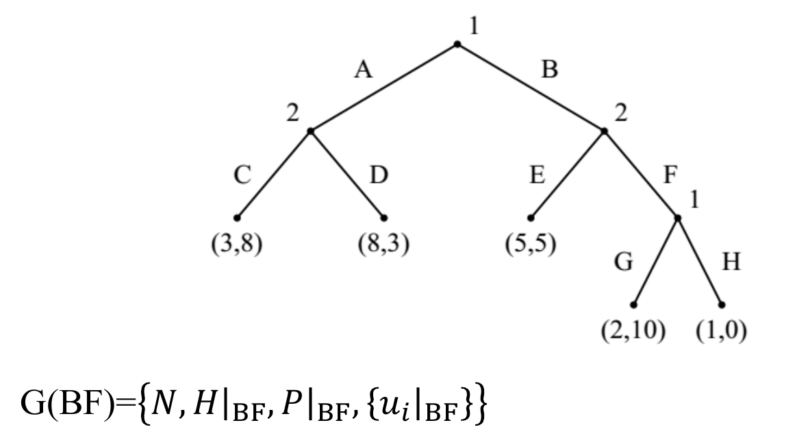
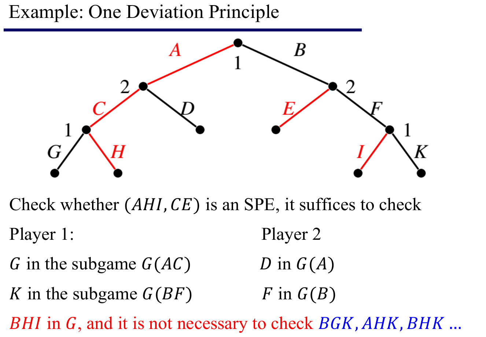
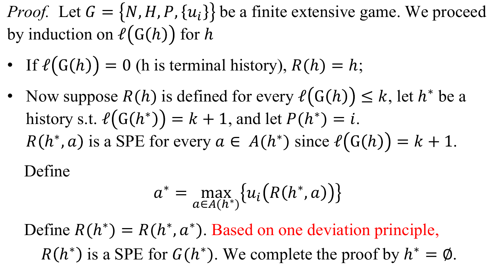
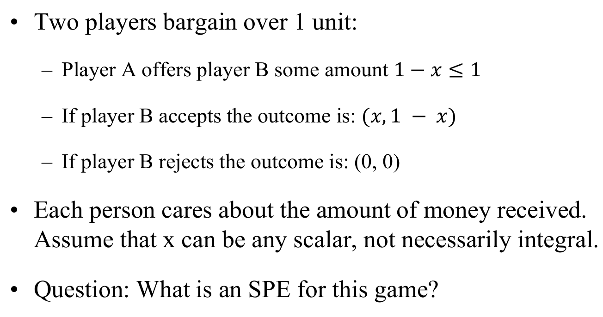
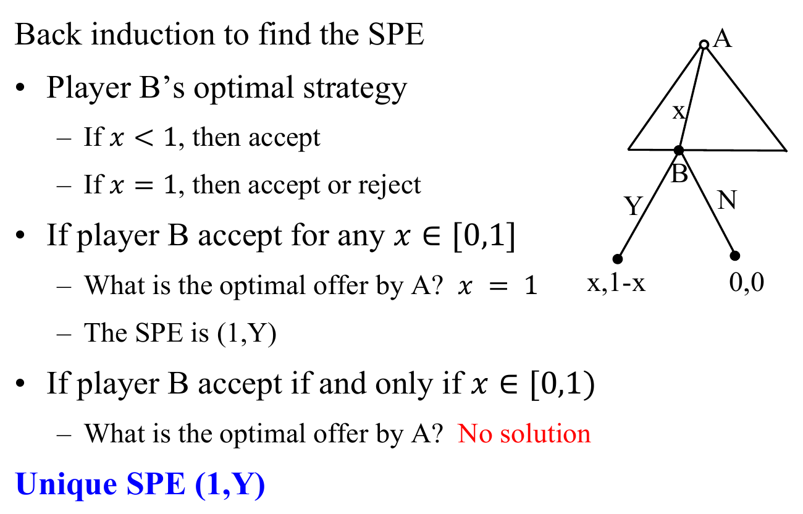
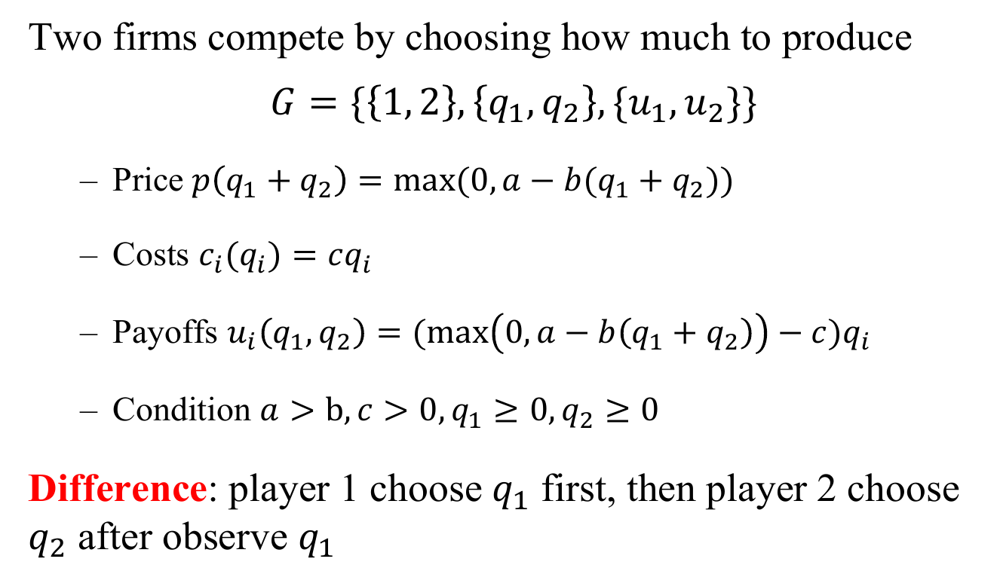
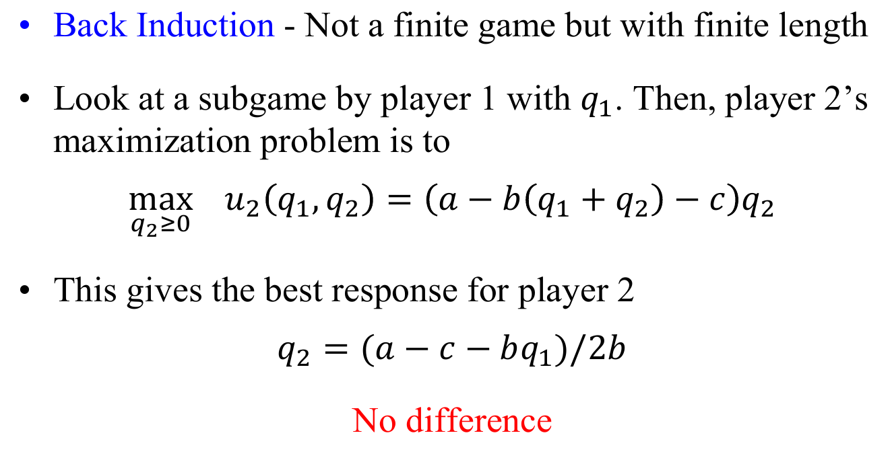
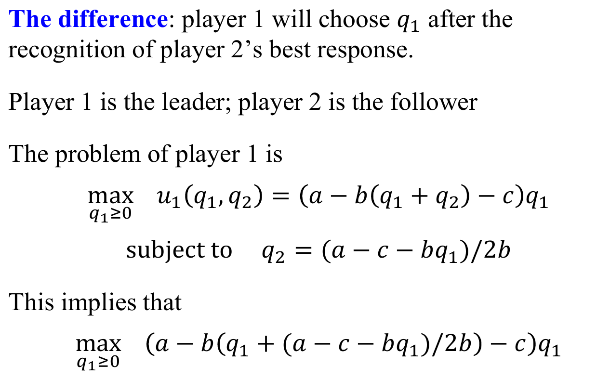

# One Deviation, Back Induction
+ Existence
  + Does every extensive game with perfect information have  an SPE?
  + If not, which extensive games with perfect information do have one?
+ Computation
  + If an SPE exists, how to compute it?

## Recap: Back Induction
+ 后向归纳过程
  
+ **Theorem**: The set of strategy game constructed by backwards induction is equivalent to the set of SPE
+ 其实就是自下而上的剪枝，如果在某处Player有两个收益完全相同的策略，那么需要在上层进行分类讨论。

## Revisit子博弈
### 定义Extensive Game
+ Given a game $G = \{N,H,P,\{u_i\}\}$
  + define **the initial history** of $h\in H$ as 
  $$A(h) = \{a:(h, a)\in H\}$$
  表示历史$h$之后player的策略有哪些
  + define the **length** of $G$ as 
  $$l(G)=\max_{h\in H}\{|h|\}$$
  表示$G$的所有可能的历史中最长的历史序列
+ Given pure strategy $s_i$, and history $h$ s.t. $P(h)=i$, 
  $$s_i(h)=a \text{ s.t. }a\in A(h) \text{ and }a\in s_i $$
  其中$P(h)=i$表示当前行动的玩家为$i$

> 例子
> 
> $l(G)=3$, $A(BF)=\{G,H\}$, $s_1(BF)=G$

### 定义子博弈
+ Given $G=\{N, H, P, \{u_i\}\}$，the **subgame** of extensive game after **history $h$** is 
  $$\boldsymbol{G}(\boldsymbol{h})=\left\{N,\left.H\right|_{h},\left.P\right|_{h},\left\{\left.u_{i}\right|_{h}\right\}\right\}$$
  + $H|_h$ is the set of sequence $h'$ s.t. $(h, h')\in H$
  + $P_h(h')=P(h, h')$ for every non-terminal history $h'\in H|h$
  + $u_i|_h=u_i(h, h')$ for every terminal history $h'\in H|_h$
+ Given pure strategy $s_i$ and history $h$, we define
  + $s_i|_h$ as the strategy that $s_i$ induces in subgame $G(h)$ （诱导策略）
  + $s_i|_h(h')=s_i(h, h')$ for every $h'\in H|_h$

> 例子
> 
> $H|_{BF}=\{\emptyset, G, H\}$
> $P|_{BF}(\empty)=1, ...$
> $u_1(G)=2, ...$

### 定义子博弈完美均衡
+ **Theorem**: For finite game $G=\{N,H,P,\{u_i\}\}, s^*=(s_1^*, s_2^*, ..., s_N^*)$ is a **subgame perfect equilibrium (SPE)** iff
  $$
  \begin{aligned}
    &\forall h\in H \backslash Z\quad \text{s.t.} P(h)=i\\
    &\left.u_{i}\right|_{h}\left(\left.s_{i}^{*}\right|_{h},\left.s_{-i}^{*}\right|_{h}\right) \geq\left. u_{i}\right|_{h}\left(s_{i},\left.s_{-i}^{*}\right|_{h}\right)\\
  \end{aligned}
  $$
  for every $s_i$ in $G(h)$
  但根据子博弈的性质，我们可以进一步简化SPE的定义
+ **【Theorem 单步偏离原则】**: For finite game $G=\{N,H,P,\{u_i\}\}, s^*=(s_1^*, s_2^*, ..., s_N^*)$ is a **subgame perfect equilibrium (SPE)** iff
  $$
  \begin{array}{c}
  \forall h \in H \backslash \mathrm{Z} \text { s.t. } \mathrm{P}(h)=i \\
  \left.u_{i}\right|_{h}\left(\left.s_{i}^{*}\right|_{h},\left.s_{-i}^{*}\right|_{h}\right) \geq\left. u_{i}\right|_{h}\left(s_{i},\left.s_{-i}^{*}\right|_{h}\right)
  \end{array}
  $$
  for every $s_i$ in $G(h)$ **that differs from $s_i^*|_h$ only in $A(h)$**
+ **注意，单步偏移原则对infinite-length game不适用**

> 例子：使用单步偏移原则检查SPE
> 

---
## Kuhn's Theorem
+ **Theorem**: Every finite  extensive game with perfect information has a SPE, such that
  + The SPE consists of **pure** strategies
  + If all payoffs for each player are different, then SPE is unique
  + Finite means **finite length**

#### Proof Sketch

> 例子：Ultimatum Game
> + 问题定义
  
> + 只需要对$x=1$时Y选择接受还是拒绝进行讨论即可
  

> 例子：主从形式下的古诺竞争（主从博弈）
> + 问题定义
>   
> + 对于博弈玩家二
>   
> + 对于博弈玩家一
>   
> **反直觉**：在完全信息的条件下，先进行选择的玩家拥有优势

---

