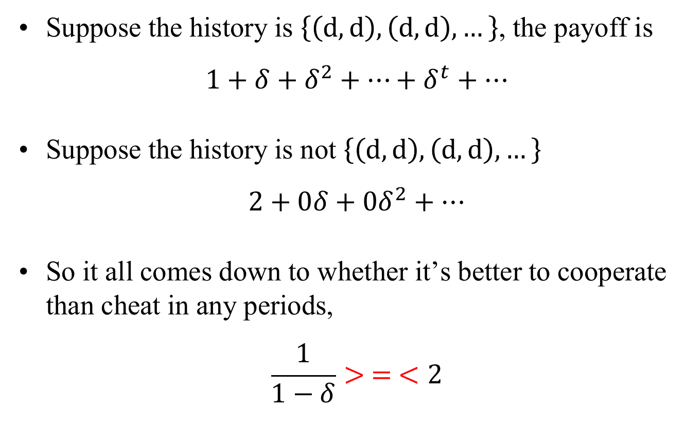
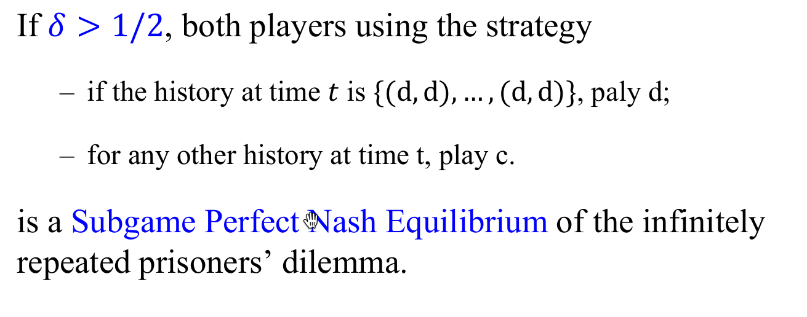
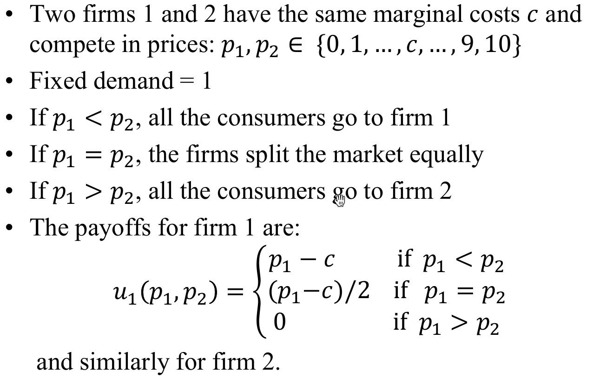
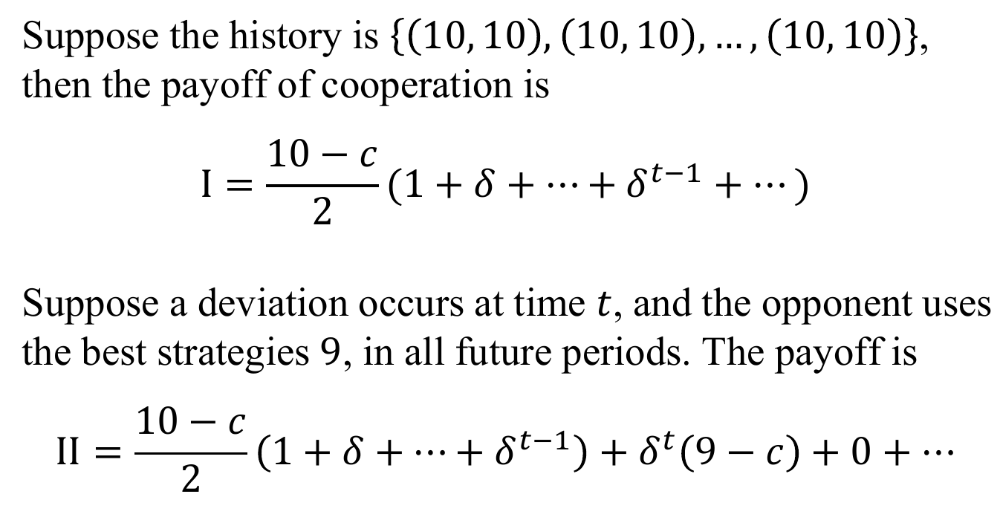
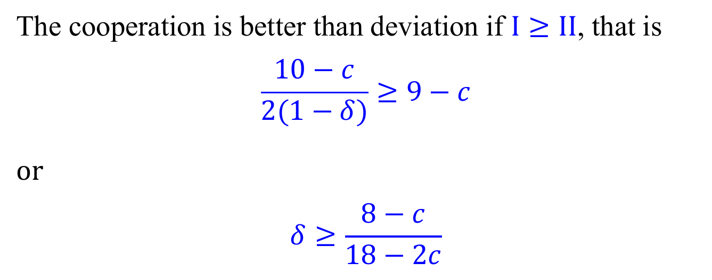
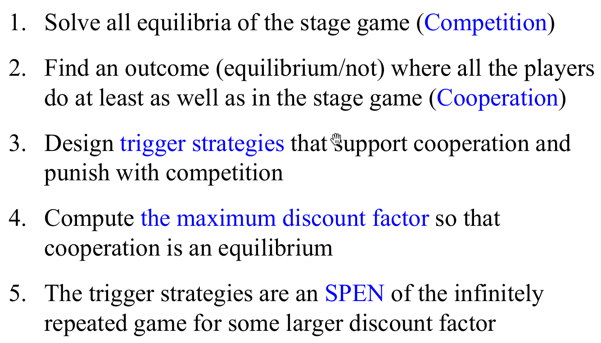
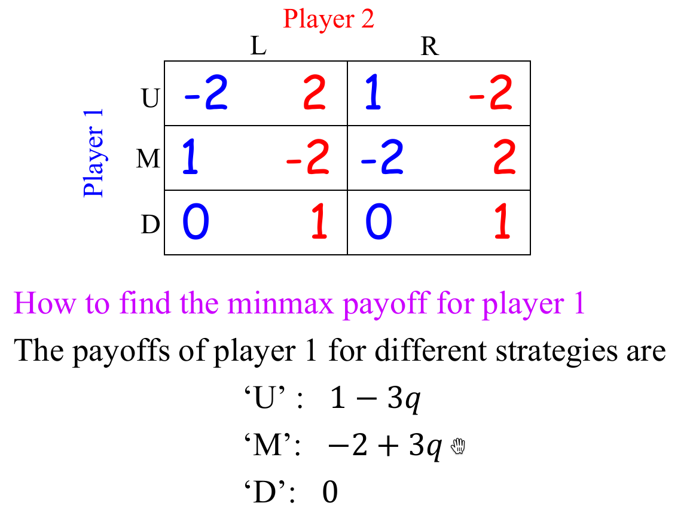
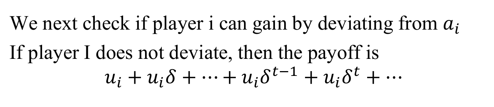
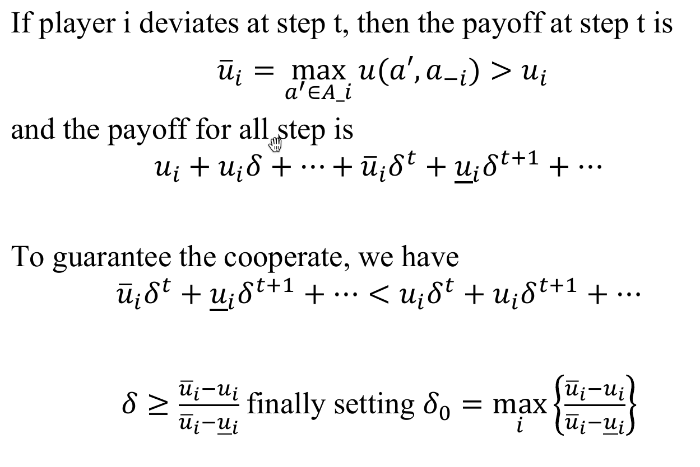
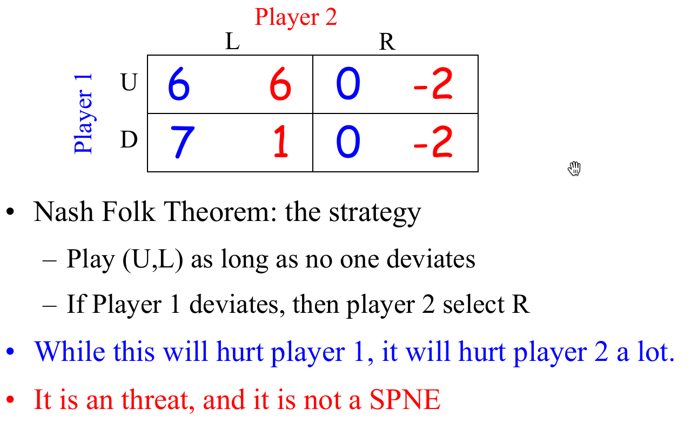

# Repeated Games
+ Many real interactions have an ongoing structure
  + 比如公司之间的博弈往往会进行多次
+ 在重复博弈的setting下，我们可以考虑建模公司的信用（比如在博弈中出老千会降低后续博弈中的信任程度）

## Settings
+ **Definition**: A repeated game $G^T(\delta)$ is
  + a stage game of finite length: $G=\{N, \{A_i\}, \{u_i\}\}$, which is usually independent of calendar date
  + a terminal date $T$
  + a discounted factor: $0\leq \delta\leq 1$
+ If $a^t=(a_1^t, a_2^t, ..., a_N^t)$ is the strategy outcome that occurs in period $t$, the player $i$'s payoff is
  $$u_{i}\left(a^{1}\right)+\delta u_{i}\left(a^{2}\right)+\cdots+\delta^{T-1} u_{i}\left(a^{T}\right)=\sum_{t} \delta^{t-1} u_{i}\left(a^{t}\right)$$
+ **History**: Players keep track of how players behave in previous periods.
  + 在单次囚徒困境博弈中，所有可能的历史 集合为
  $$\Sigma=\{(d,d), (d, c), (c,d), (c,c)\}$$
  + 在两次博弈中，所有可能的历史为十六个元素的集合：
z  $$\Sigma^2=\Sigma\times\Sigma$$
  + a history at time $t$ is an element $h_t\in H_t=\Sigma^t$

## Subgame Perfect NE for Finite Repeated Games
+ **Definition**: A set of strategies is a **Subgame Perfect Nash Equilibrium** of a repeated game if, for any $t$-period history $h_t$, there is no subgame in which any player has a profitable deviation
+ **Theorem**: 对于任何有限长度的重复博弈$G^T(\delta)$，假设在每一个时间步有一个纯策略纳什均衡$a^*$，则$G^T(\delta)$只有唯一的SPNE：$a^t=a^*\quad\forall t$。

## Subgame Perfect NE for Infinite Repeated Games
+ 我们下面研究无穷长重复博弈的情形下囚徒困境的SPNE
> 
> 

---
## Bertrand Model
+ 问题描述  
  
+ 在非重复博弈的情况下，双方的均衡为$(c, c)$
+ 考虑下述策略
  + 如果历史为$\{(10, 10), (10, 10), ..., (10, 10)\}$，那么定价策略为$10$
  + 对于任意一种其他策略（合作破裂），选择边际成本$c$作为定价
+ 在上面的策略下  
  
  

---
## Folk Theorem
+ Consider a N-player infinitely repeated game with a stage game equilibrium $a^*=(a_1^*, a_2^*, ..., a_N^*)$ with payoffs $u^*=(u_1^*, u_2^*, ..., u_N^*)$, suposse there is another $ \hat{a}=\left(\hat{a}_{1}, \hat{a}_{2}, \ldots, \hat{a}_{N}\right) $ with payoffs $ \hat{u}=\left(\hat{u}_{1}, \hat{u}_{2}, \ldots, \hat{u}_{N}\right) $, where, for every player $i$, $ \hat{u}_i> u_i^* $
+ Then for some discount factor $\delta$, there is a SPNE in which the players use $\hat{a}$ in every period of the infinitely repeated game. 
+ 此时如果对于某些玩家（比如说玩家$j$），如果存在某种行动的收益比合作行动更高: $u_j^d>\hat{u}_j\geq u_j^*$，，那么对于玩家$j$，他就有倾向在原本的合作中产生偏移。偏移后的下一个时间步所有玩家就会进入竞争模式
+ 分别计算两种情况（偏移/不偏移）的收益
  $$
  \begin{aligned}
    U_1&=\hat{u}_{j}+\hat{u}_{j} \delta_{j}+\cdots+\hat{u}_{j} \delta_{j}^{t-1}+\cdots=\frac{\hat{u}_{j}}{1-\delta_{j}}\\
    U_2&=u_{j}^{d}+u_{j}^{*} \delta_{j}+u_{j}^{*} \delta_{j}^{2}+\cdots=u_{j}^{d}+\frac{u_{j}^{*} \delta_{j}}{1-\delta_{j}}\\
  \end{aligned}
  $$
  那么合作比偏移更优的条件为
  $$
  \frac{\widehat{u}_{j}}{1-\delta_{j}} \geq u_{j}^{d}+\frac{u_{j}^{*} \delta_{j}}{1-\delta_{j}} \text { implying } \delta_{j} \geq \frac{u_{j}^{d}-\widehat{u}_{j}}{u_{j}^{d}-u_{j}^{*}}
  $$
  对所有玩家取最大的一个$\delta^*=\max\{\delta_1, \delta_2, ..., \delta_N\}$
  那么此时Trigger Policy就是一个SPNE。
+ 总的流程如图
  
---
## Back to NE
### Feasible Payoffs
+ Convec Hull
  + The Convex Hull of set $S=\{x_1, ..., x_n\}$ is defined as 
  $$ \text{conv}(S)=\left\{\sum_i a_ix_i|a_i\in [0,1],\sum_i a_i=1\right\} $$
+ Introduce the set of feasible payoffs
  $$U=\operatorname{conv}\left\{\begin{aligned}
u \in R^{N}: & \text { there exists } a=\left(a_{1}, \ldots, a_{N}\right) \\
& \text { s.t. } u=\left(u_{1}(a), \ldots, u_{N}(a)\right)
\end{aligned}\right\}$$

### Minmax Payoffs
+ **Minmax payoff of player $i$**: the lowest payoff that player $i$'s opponent can hold him to:
  $$\underline{u}_{i}=\min _{a_{-i}}\left[\max _{a_{i}} u_{i}\left(a_{i}, a_{-i}\right)\right]$$
+ **Minmax strategy outcome against to $i$**
  $$a_{-i}^{i}=\arg \min _{a_{-i}}\left[\max _{\mathrm{a}} u_{i}\left(a_{i}, a_{-i}\right)\right]$$
+ Let $a_i^i$ denote the strategy of player $i$ such that
    $$u_{i}\left(a_{i}^{i}, a_{-i}^{i}\right)=\underline{u}_{i}$$
+ **注意上述策略均有可能为混合策略**
+ **Theorem**: Let $a'=(a'_1, a'_2, ..., a'_n)$ be a (possibly mixed) NE of game G and $u_i(a')$ be its payoff, then we have
  $$u_i(a')\geq \underline{u}_i$$
  + 即 纳什均衡的收益一定大于等于一个玩家被所有其他玩家惩罚时的收益

> Example
> 
> 

### Nash Folk Theorem
+ **Definition**: A payoff vector $(u_1, u_2, ..., u_N)\in R^N$ is *strictly individually rational* if $u_1>\underline{u}_i$ for all $i$.
+ **Nash Folk Theorem**: If $(u_1, u_2, ..., u_N)\in U$ is strictly individually rational, then there exists some $\delta_0<1$  such that for all $\delta\geq \delta_0$, there is a NE of $G^\infty(\delta)$ with payoff $(u_1, u_2, ..., u_N)$

+ 在上述NE下，对应的策略为一个触发策略
  + 假设策略$a=(a_1, a_2, ..., a_N)$使得$u_i(a)=u_i$，令$(a_i^i, a_{-i}^i)$为Minmax Payoffs下玩家$i$和$-i$的策略
  + 那么如下构造的触发策略就是一个满足上述定理的NE
    + Each player plays $a$ as long as no one deviates
    + If player $i$ deviates, then $a_{-i}=a_{-i}^i$
+ $\delta_0$的计算可使用类似之前的计算方法  
  
  

> 例子
> 