# Extensive Game with Imperfect Information
+ Motivation
  + 玩家不知道其他玩家采取的行动，或者
  + 自己无法回忆起自己在更早的时间刻作出的行动
+ 同时我们还可以将以前玩家同时作出决策的博弈建模成非完全信息的扩展式博弈

## Setting

### 常规扩展式博弈设置
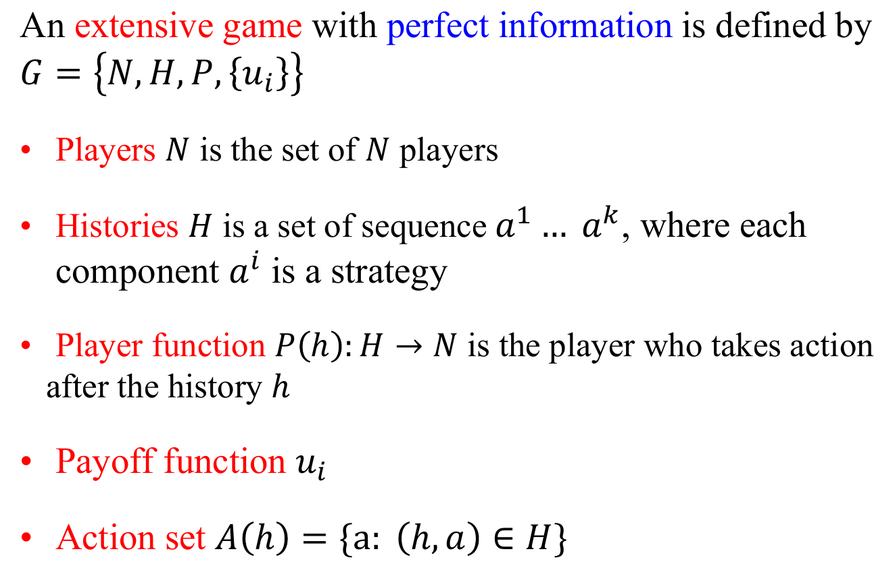
+ 注意策略集的定义是在当前历史$h$下可以选择的动作

### 非完全信息下扩展式博弈的设置
+ 加入了信息集
  + **Information Set $I=\{I_1, I_2, ..., I_N\}$** is the set of information partition of all players' strategy nodes, where the nodes in an information set are **indistinguishable** to player
  + $I_i=\{I_{i1}, ..., I_{ik_i}\}$
  + $I_{i 1} \cup \cdots \cup I_{i k_{i}}=\{\text { all nodes of player } i\}$
  + $I_{i j} \cap I_{i k}=\emptyset \text { for all } j \neq \mathrm{k}$
  + Action set $A(h)=A(h')$ for $h, h'\in I_{ij}$, denoted by $A(I_{ij})$
  + $I_{ij}$是一个集合，含义就是对于玩家$i$来讲，在第$j$个时间步，他所无法区分的历史。如果是完全信息的扩展式博弈，那么这里的每个$I_{ij}$都只包含唯一的元素

> 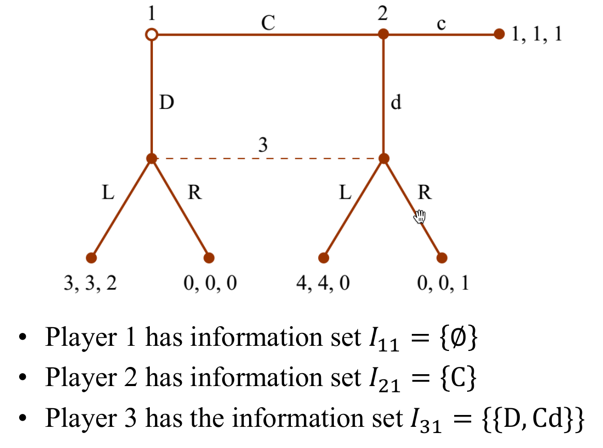

## 纯策略
+ 纯策略的定义为  
  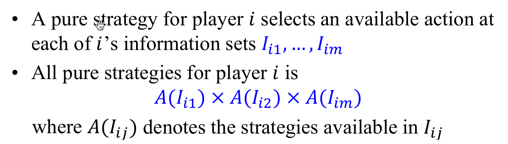
+ 例子
  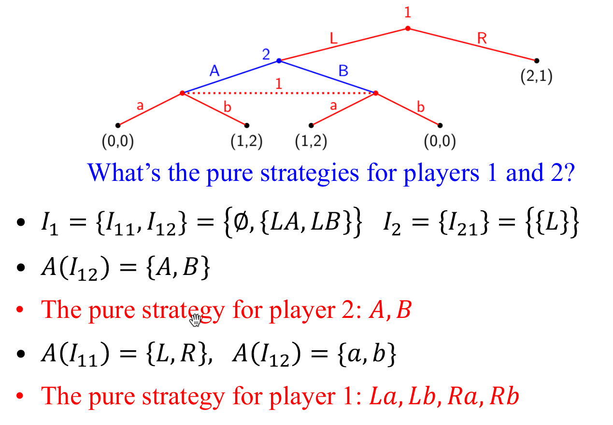
  注意这里对于player1，因为在第二个节点信息不完全，所以没有区分玩家2选择动作A或者动作B

## 求解均衡
+ 我们把求解非完全信息的扩展式博弈恢复成stage game，即可对PNE和MNE进行求解

> 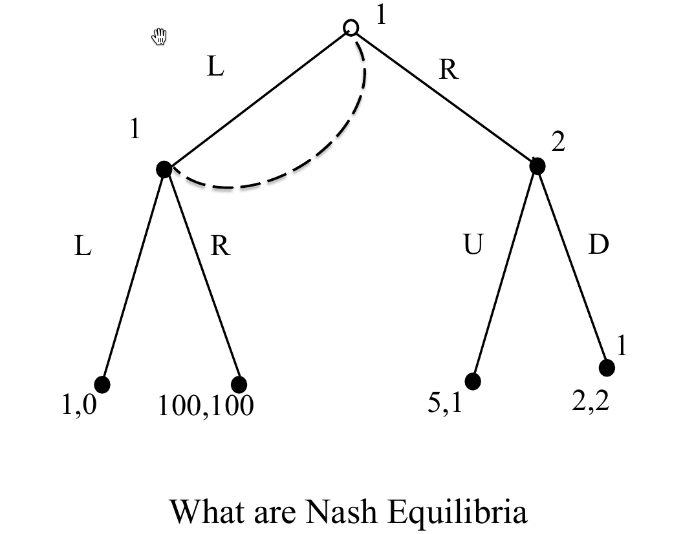
> 对于博弈玩家1，信息集为
> $$
\begin{aligned}
    I_1 = \{\{\emptyset, L\}\}
\end{aligned}
$$
> 对于博弈玩家2，信息集为
> $$
\begin{aligned}
    I_2 = \{\{R\}\}
\end{aligned}
>$$
> 使用这种方法求解均衡时，要注意纯策略的定义，是每种**信息集**上的动作的笛卡尔乘积

## 完美回忆与非完美回忆
+ 对于一个扩展式博弈，如果每个玩家能够回忆自己在之前时间段作出的决策，那么就是一个完美回忆；否则为非完美博弈

> 非完美回忆的例子

### 完美回忆定义
+ Player $i$ has **perfect recall** in game $G$ if for any two history $h$ and $h'$ that are in the same information set for player $i$, for any path $h_0, h_1, ..., h_n, h$ and $h'_0, h'_1, ..., h'_m, h'$ from the root to $h$ and $h'$ with $P(h_k)=P(h'_k)=i$, we have
  + $n=m$
  + $h_i=h'_i\quad \text{for }1\leq i\leq n $
  + 也就是除了最后一个信息集中无法区分的$h, h'$，其他所有直达$h, h'$的历史序列上，与玩家$i$相关的节点的历史都是相同的

## 定义：混合策略和行为策略
+ **混合策略**：在所有的纯策略上添加分布
+ **行为策略**：A behavior strategy of player $i$ is an independent probability collection $\{\beta_{ik}(I_{ik})\}_{I_{ik}\in I_i}$, where $\beta_{ik}(I_{ik})$ is a probability distribution over $A(I_{ik})$
  + 行为策略就是在每个信息集后的行为集上添加一个分布
+ 性质
  + 混合策略不一定是行为策略
  + 在某些博弈之下，混合策略的均衡不一定是行为策略均衡，而行为策略均衡不一定是混合策略均衡

> 考虑 博弈
> 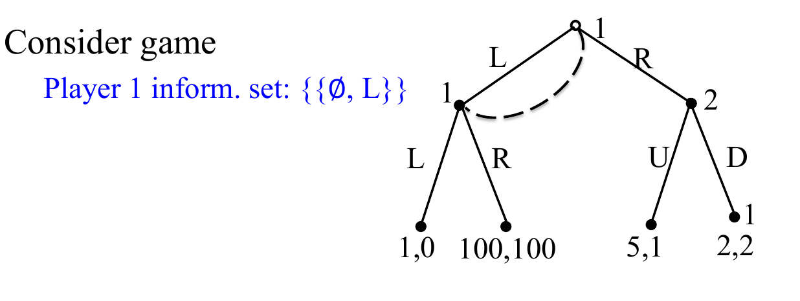
> 如果只求解PNE，那么仅有唯一的PNE：(R, D)，发现博弈玩家1的$L->R$的奖赏再高也没有用
> 如果选择求解MNE，此时$L->R$就能make a difference 了。并且此时$(R,D)$不再是behavior policy的NE
> 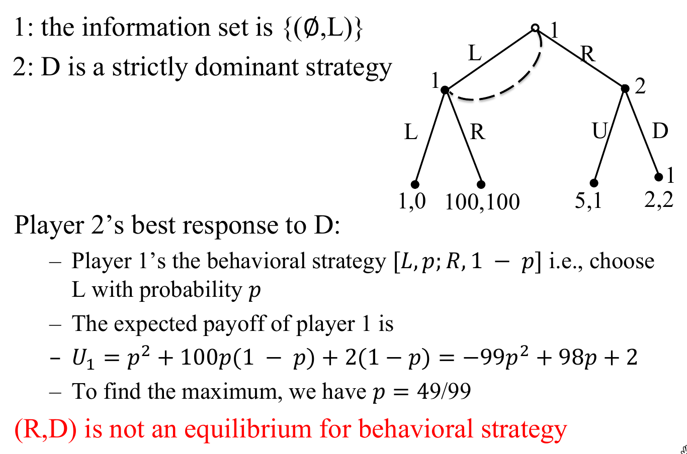

## Kuhn Theorem
+ In an finite extensive game with **perfect recall**, 
  + any mixed  strategy of a player can be replaced by an equivalent behaviour strategy
  + any behavioral strategy can be replaced by an equivalent mixed strategy
  + Two strategies are equivalent
+ **Corollary**: In an finite extensive game with perfect recall, the set of NE does not change if we restrict ourselves to behavior strategies

> 例子：behaviour policy和mixed policy的相互转化
> 
> 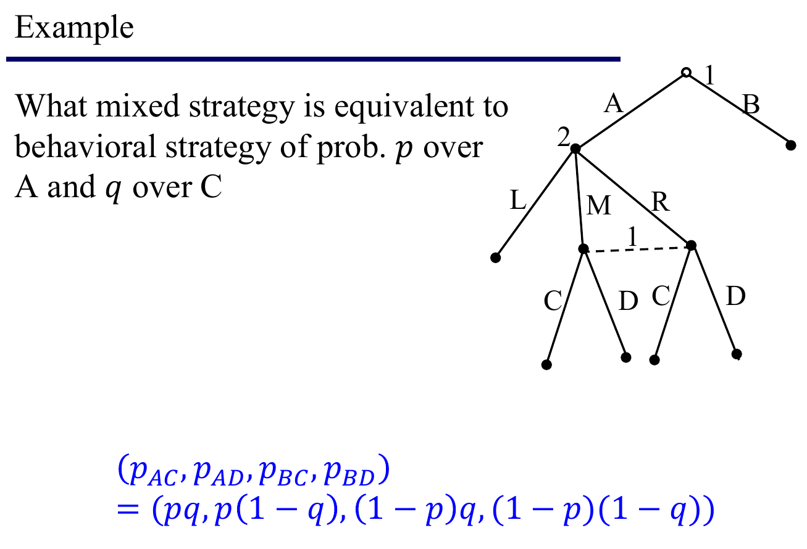

---
## 非完全信息的扩展式博弈的SPNE
### Extensive Imperfect Subgame
+ **Definition**: A subgame of an extensive imperfect game G is some nodes in the tree G and all the nodes that follow it, with the properties that **any information set of G is either completely in or outside the subgame.**

> 例如下图虚线方框中的就不是一个子博弈，因为信息集$\{h, t\}$并不全部位于虚线方框中
> 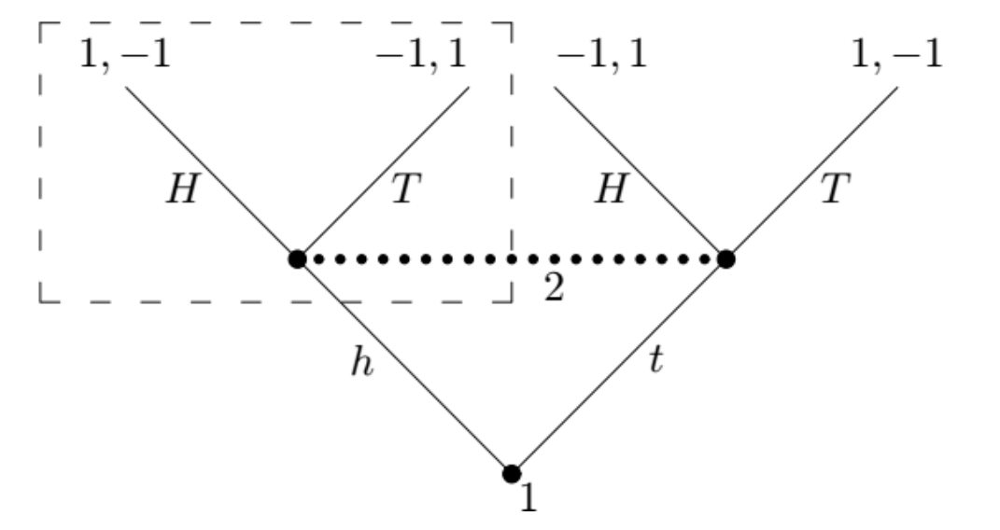

### SPNE
+ **Definition**: A SPNE of an extensive game G with **perfect recall** is a outcome of **behavior strategies** $(\beta_1, \beta_2, ..., \beta_N)$ such that it is a NE for every subgame.

+ **Theorem**: Every finite extensive game with **perfect recall** has at least one SPNE.
+ **How to find SPNE:**: 使用Backwards Induction即可，和之前的做法完全一致。

> 一个例子
> 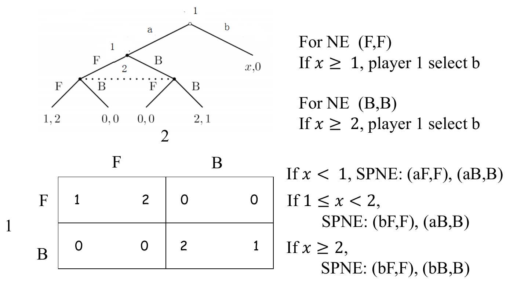

---
## Beliefs
+ **Definition**: A belief $\mu$ is a function that assigns a probability distribution to the histories in the information set.  
  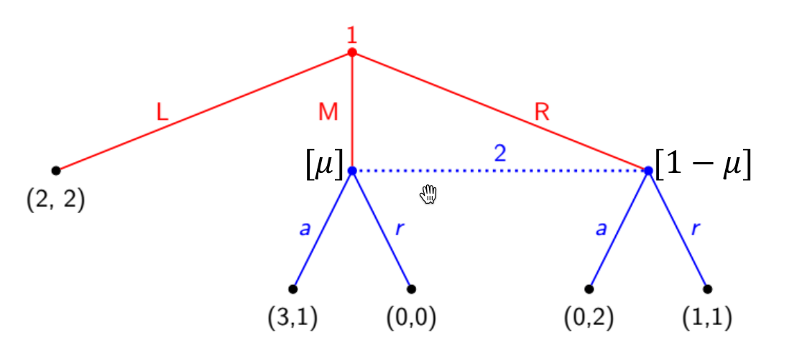
+ 对比行为策略的定义： A behavior strategy $\beta$ is a collecion of independent probability measure over **the actions after information set**.
+ 信念$\mu$和行为策略$\mu$之间的关系
  + **信念影响最优策略**：在下图中，对于玩家2，a是最优策略，如果$\mu(M)\leq 1/2$
  + **策略影响信念的目标值（ground truth）**：如果玩家1的行为策略为$\beta_1=(0.1, 0.3, 0.6)$，那么玩家2的信念真值应当为$\mu_2=(1/3, 2/3)$
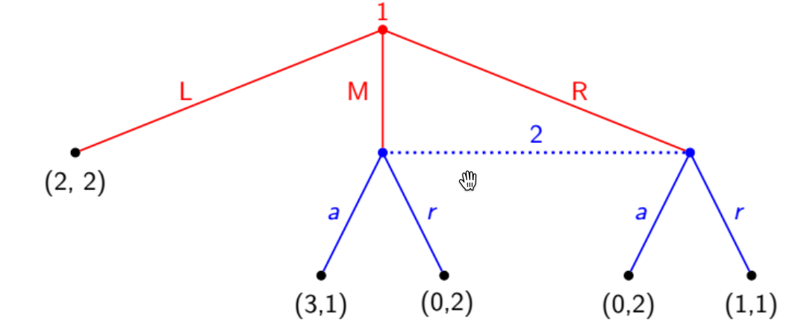

+ **信念$\mu$的两个性质**
  + **贝叶斯一致性**：如果从上层历史走到信息集中的历史的概率均为0，那么此处的信念可以随意分配；否则使用贝叶斯公式确定信息集中每种历史的信念值
  + **一致性**：如果从上层历史走到信息集中的历史的概率均为0，那么此时的信念使用极限方式进行确定
  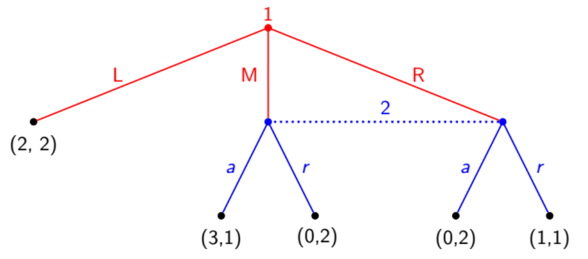
  + 在上面这个例子中，假定1的行为策略为$(1-\epsilon, 3\epsilon/4, \epsilon/4)$，如果要求玩家2的信念满足贝叶斯一致性，那么当$\epsilon=0$时玩家2的信念可以随意设定；如果要求玩家2的信念满足一致性，那么当$\epsilon=0$时信念也应当为$(3/4, 1/4)$.

## Assessment(评估)
+ **Definition**: An **assessment** is a pair $(\beta, \mu)$
  + $\beta$ is an outcome of behavioral strategies
  + $\mu$ is a belief system
  + 这里的$\beta$和$\mu$包含了这个tree中所有节点上的$\beta_i$和$\mu_i$
+ 评估的性质: Assessment $(\beta, \mu)$ is 
  + **Bayesian consistent**: 如果评估中所有的信念都是贝叶斯一致的
  + **consistent**: 如果评估中所有的信念都是一致的

> 例子
> 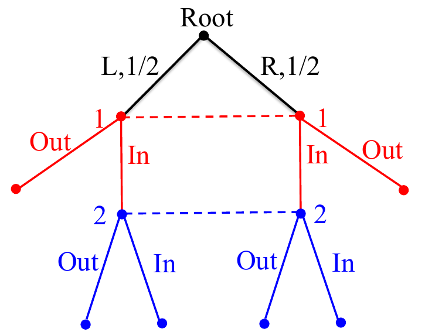
> + 贝叶斯一致性
> 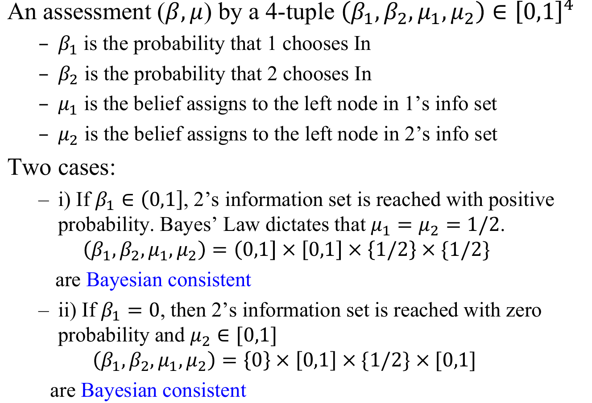
> + 一致性
> 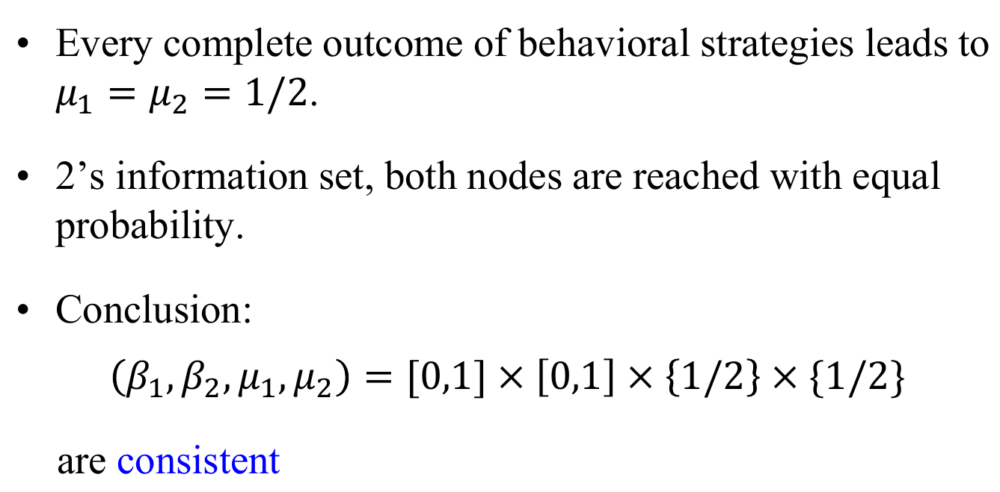

## 期望收益 与 行为策略
+ 假设在信息集$I_{ij}$（博弈玩家i的第j个信息集），信念$\mu$给信息集中所有的历史分配了概率分布，同时，对于$h\in I_{ij}$，令$P(e|h, \beta)$为从历史$h$开始，执行行为策略$\beta$**最终**到达叶子节点$e$的概率，在叶子节点$e$处的收益为$u_i(e)$。
+ **Definition**: 博弈玩家$i$在信息集$I_{ij}$关于$(\beta, \mu)$的期望收益为
  $$u_i(\beta_i, \beta_{-i}|I_{ij}, \mu)=\sum_{h\in I_{ij}}\mu(h)\left(\sum_eP(e|h, \beta)u_i(e)\right)$$

### 行为策略的序列理性
+ 评估$(\beta, \mu)$是**序列理性**的，如果对于任意的信息集$I_{ij}$，玩家$i$选择的行为策略$\beta$都是最优响应
  $$u_i(\beta_i, \beta_{-i}|I_{ij}, \mu)\geq u_i(\beta'_i, \beta_{-i}|I_{ij}, \mu) \quad\forall \beta'$$

## 序列均衡（Sequential Equilibrium）
+ 在上文中
  + **Consistency**是针对信念的，描述了信念要符合逐层的概率分布
  + **Sequential Rational**是针对行为策略的，要求为最优响应
+ **Definition**: 评估$(\beta, \mu)$是**序列均衡**当且仅当它既是一致的也是序列理性的
+ **【Theorems】**
  + Each finite extensive form game with perfect recall has a sequential equilibrium
  + If assessment $(\beta,  \mu)$ is a sequential equilibrium, then $\beta$ is a subgame perfect equilibrium.

---
## 信号传递博弈
+ 信念传递博弈是sequential equilibrium最为重要的应用之一

### 例子：Used-Car market
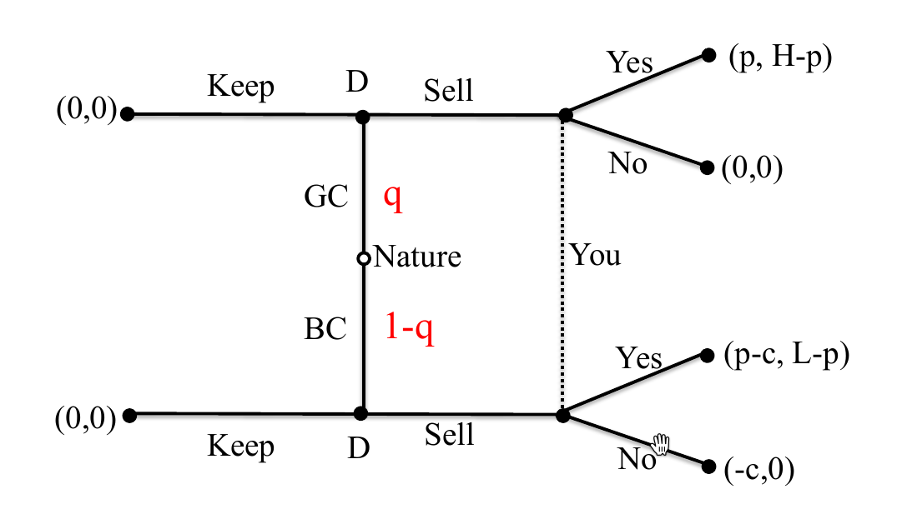

问题设置
+ 一辆好的二手车价值H，坏的二手车价值L
+ 你不知道车的真实情况，但是车处于好的状态的信念为p
+ 你所感兴趣的车的价格为p
+ 卖家知道车的真实情况
+ 如果车的展示情况不好，那么卖家需要额外花费c来让装修车
+ 假设H>p>L

在下面的讨论中，我们主要关注两种不同的equilibrium
+ Pooling Equilibrium: GC and BC dealer play the same strategy
+ Seperating Equilibrium: GC and BC
