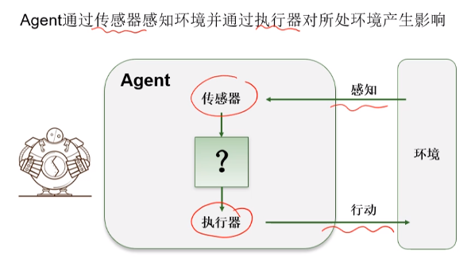
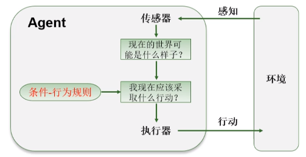
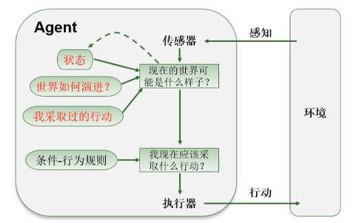
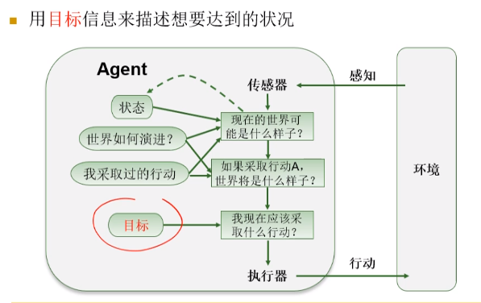
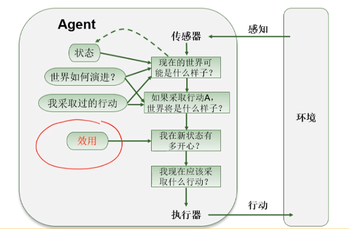
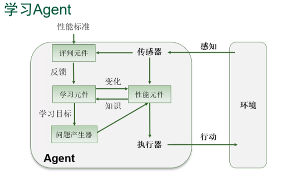

# Agent、环境
## Agent
+ 人工智能是有关智能Agent的研究与设计的学问
+ Agent

  + 感知：任何给定时刻Agent的感知输入
  + 感知序列：Agent收到的所有输入数据的完整历史
  + Agent函数：将任意给定的感知序列映射为行动 $a = \pi(h)$
  + Agent程序：Agent函数的具体实现

## 理性Agent
+ 理性的定义取决于
  + 定义成功标准的性能度量
  + Agent对环境的先验知识
  + Agent可以完成的行动
  + Agent截止到此时的感知序列
+ 全知Agent：明确知道行动的效果并作出使实际性能最大化的Agent，不等于理性。
+ 理性Agent
  + 不要求全知，选择只依赖于到当时为止的感知序列
  + 使期望的性能最大化
  + 能收集信息，从所感知的信息中尽可能多的学习
  + 有自主性，能通过学习弥补不完整或不正确的先验知识

## 任务环境
+ PEAS描述
  + 性能，目标
  + 环境
  + 执行器
  + 传感器
+ 分类
  + 可观察性
    + 完全可观察：Agent传感器在每个时间点都能获取环境的完整状态
  + Agent数量
    + 多Agent环境可能需要通讯，并且随机行为是理性的
  + 确定性
    + 确定环境：环境的下一个状态完全取决于当前状态和Agent执行的动作
  + 片段/序贯
    + 片段式
    + 序贯式：行动会有长期效果
  + 静态与动态
    + 若环境在Agent计算时会变化，则是动态的
    + 若Agent的性能评价随时间变化，则为半动态的
  + 连续性

## Agent结构
$$Agent = 体系结构 + 程序$$
+ 程序实现的是把感知信息映射到行动的函数
+ 体系结构是具备传感器和执行器的计算装置
+ Agent程序
  + 输入：传感器得到的当前信息
  + 输出：执行器的行为抉择

### 简单反射Agent
+ 基于当前的感知选择行动，不关注感知历史

```
function REFLEX_AGENT(percept) returns an action
    persistent: percepts, a sequence, initially empty
                table, a table of actions indexed by percept sequences, initially fully specified
    append percept to the end of percepts
    action <- LOOKUP(percepts, table)
    return action
```
### 基于模型的反射Agent
+ 在内部维护模型，预测*现在*的世界应当是什么样子，用于处理部分可观测的环境

+ 比如grid world，基于知识推测出当前世界的状态，然后根据简单的条件行为规则（比如不要走有怪兽的格子）来选择自己的行动

```python
function MODEL-BASED-REFLEX-AGENT(percept) return an action
  persistent: state, "the agent's current conception of the world"
              model, "how the next state depends on current state and action"
              rules, "a set of condition-action rules"
              action, "the most recent action"
  state <- Update-State(state, action, percept, model)
  rule <- Rule-Match(state, rules)
  action <- rule.action
  return action
```

### 基于目标的Agent

+ 记录想要到达的目标的集合，向达成目标的方向执行动作（贪心）

```python
function TARGET-BESED-AGENT(percept) return an action
    persistent: {
        state, "the agent's current conception of the world state"
        model, "a description of how the next state depends on the current state and action"
        targets, "target states we hope to achieve"
        last_action, "the most recent action"
        action_list, "the list of actions that an agent can take"
    }

    state <- Update-Sate(state, last_action, percept, model)
    for every action in action_list:
        state' <- Update-State(state, action, model)
        if state' in targets:
            return action
    if no action is returned, then return a random action
```

### 基于效用的Agent

+ 使用效用函数替代目标，可以实现折中和迂回
+ 执行动作时的原则是使效用最大化

```python
function UTILITY-BASED-AGENT(percept) return an action
    persistent: {
        state, "the agent's current conception of the world state"
        model, "a description of how the next state depends on the current state and action"
        utility_fn, "the utility function"
        last_action, "the most recent action"
        action_list, "the list of actions that an agent can take"
    }

    state-util-pairs <- empty dict
    state <- Update-State(state, last_action, percept, model)
    for every action in action_list:
        state' <- Update-State(state, action, model)
        util = utility_fn(state')
        state-util-pairs.add(key=action, value=util)
    return argmax(state-util-pairs.values())
```

## 学习Agent
+ 架构

+ **性能元件**就是前面所讨论的Agent架构
+ **学习元件**可以更改Agent中的任何知识组件，即模型、效用等

## 设计方法
### 显式编程
+ 显示地编码Agent在各种可能经历的场景下该如何采取行动
+ 然而复杂策略会造成编发负担的爆炸
### 监督学习
+ 样例学习的一种
+ 从样本的“输入”“输出”对中学习输入到输出的映射
### 优化
+ 给定策略空间和性能度量，在空间中搜索使性能度量最优的策略
+ 策略空间维度较低时可行，较高时优化难
### 规划
+ 一种形式的优化方法
+ 假设环境的动态模型已知，用以指导搜索
+ 可高效求解高维任务
### 强化学习
+ 假设环境模型未知
+ 通过与环境交互，从强化信号（奖赏和惩罚的组合序列）中学习
+ 行动不只有立即效果，还有延迟效果

## 智能系统
+ 简单决策系统
+ 完全可观察环境中的序贯决策系统
+ 强化学习系统
+ 部分可观察环境中的序贯决策系统

