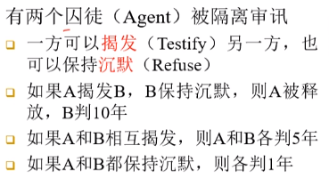
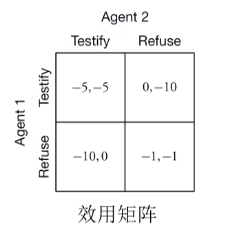
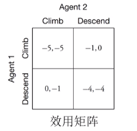
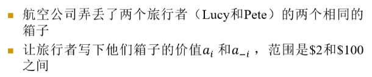
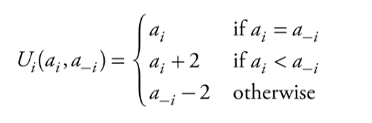
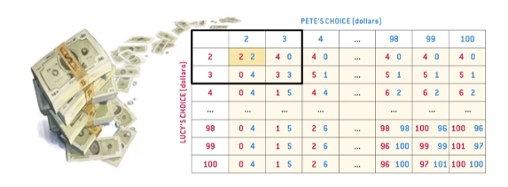
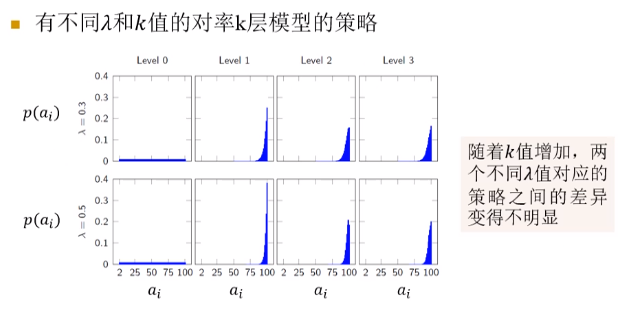

# 单步博弈
+ 在一个多Agent环境中，如果能知道其他Agent的结构、模型和效用，我们就可像在单Agent环境中进行推理
+ 如果**只知道其他Agent效用的模型**，便形成博弈

## 经典博弈问题
### 囚徒困境
+ 问题描述  
  
+ 囚徒困境下的效用矩阵  
  

### 避碰博弈
+ 问题描述
  + 两架飞机在同一高度相向而行，可以选择的行动有爬升或下降
  + 爬升会消耗更多机油，额外效用-1
  + 碰撞的效用为-4
+ 效用矩阵  
  

### 旅行者困境问题
+ 问题描述  
  
  + 航空公司的赔偿策略为  
  
+ 效用矩阵  
  

## 策略
+ Agent的策略分为
  + 纯策略
    + 行动的选择是确定性的
  + 混合策略
    + 行动的选择是策略性的
    + e.g. [揭发:0.7, 沉默:0.3]
+ **策略可以用效用来度量**
  + $U([a_1:p_1; ...; a_n:p_n])=\sum_{i=1}^np_iU(a_i)$
+ 问题定义
  + $s_i$: Agent i的策略
  + $s_{1:n}$: 所有n个Agent的策略组合
  + $s_{-i}$: 所有Agent中除去Agent i的策略组合

## 最优反应
+ 定义$U_i(s_{1:n})$为给定策略组合$s_{1:n}$下，Agent i的效用
+ Agent i对策略组合$s_{-i}$的一个**最优反应**是一个策略$s_i^*$，满足
  $U_i(s_i^*, s_{=i})\geq U_i(s_i, s_{-i})\quad \forall s_i$

## 均衡

### 占优策略均衡
+ 如果在一个博弈中，存在一个$s_i$，使得它是所有可能$s_{-i}$的一个最优反应，称$s_i$为一个**占优策略**（dominant strategy）
  + 占优策略意味着此Agent的策略不依赖与其他Agent的行动
+ 当所有Agent都使用占优策略（如果存在），称它们的组合为**占优策略均衡**（dominant strategy equilibrium）

> 在囚徒困境中，双方的占优策略都是揭发，却得到了一个次优的结果

> 在避碰博弈中，不存在双方的占优策略

### 纳什均衡
+ 对于一组Agent作出的策略组合$s_{1:n}$，若对所有的Agent i，$s_i$是$s_{-i}$的一个最优反应，则$s_{1:n}$是一个**纳什均衡**
  + 占优策略均衡为纳什均衡的子情况
+ 每个博弈至少有一个纳什均衡，但处于纳什均衡中的策略**不一定是纯策略**

> 避碰博弈中，有两个纯策略的纳什均衡

> 在旅行者困境问题中，**有且只有一个纳什均衡**：(\$2, \$2)

## 行为博弈理论
+ 建模人类Agent的行为

### 对率k层模型
+ 假设
  + 当错误的成本越低时，犯这些错误的概率越高
  + 人类能够策略性向前推理的步数是有限的
+ 参数：从数据中学习
  + 准确参数$\lambda \geq 0$: 控制对效用差异的敏感度
  + 深度参数$k$: 控制理性决策的深度
+ 结构
  + 第0层Agent：均匀随机地选择行动
  + ...
  + 第k层Agent：假设对手采取的是第k-1层策略，根据对率分布$P(a_i)$来选择行动
    $P(a_i)\propto e^{\lambda U_i(a_i, s_{-i})}$

+ 人类的行为可以用对率2层模型很好地建模

