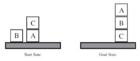

# 规划
+ 经典规划
+ 概率规划

## 经典规划问题
+ 为了简化问题作出了许多假设
  + **A0 有限系统**：问题只涉及有限的状态、行动、事件
  + **A1 完全可观察**：Agent总能知道当前状态
  + **A2 确定性**：每个行动只会导致一种确定的结果
  + **A3 静态性**：不存在外部行动，环境所有的改变都来自Agent的行动
  + **A4 状态目标**：目标是需要达到的目标状态集合
  + **A5 序列规划**：规划结果是线性行动序列
  + **A6 隐含时间**：不考虑时间连续性
  + **A7 离线规划**：规划求解器不考虑执行时的状态
+ 经典规划问题的描述方法
  + 集合描述：使用有限的命题符号集合
  + 经典描述：使用一阶逻辑符号
+ 经典规划问题的求解方法
  + 状态空间搜索
    + 在状态转移图中搜索从初始状态到目标状态的一条路径
    + 前向搜索、后向搜索、启发式搜索
  + 规划空间搜索
    + 用找缺陷的方法对规划求精，直到规划可行
    + 偏序规划

### 问题描述：积木世界

+ 有一个机械臂可以把在上面的木块拿起来放在另一些上面或者放在桌面上
+ 如何规划机械臂的行动，使其从左侧状态转变为右侧状态

## 概率规划
+ 基于概率模型和效用函数，制定理性决策
+ 问题描述方法
  + 马尔科夫决策过程 （MDP）
  + 部分可观察的马尔科夫决策过程 （POMDP）
+ 问题求解方法
  + 离线规划
    + 动态规划
  + 在线规划
    + 蒙特卡洛树搜索
+ 概率规划与序贯决策
  + 概率规划方法实际上是一类序贯决策方法
  + 序贯决策使用最大化期望效用原则选择行动

## 开环规划与闭环规划
+ 开环规划：不考虑未来状态信息
  + 很多路径规划算法都属于开环规划
  + 能够得到静态的行动序列
  + 计算开销小
  + 但仅能获得次优解
  + **实际上就是贪心算法**
+ 闭环规划：考虑未来状态信息
  + 例如动态规划算法
  + 得到反应式的策略，能对行动的不同结果做出不同反应
  + 计算开销大
  + 能获得近似最优解
  + **在行动效果不确定的序贯决策问题中，闭环规划更有优势**