# 精确动态规划
+ **有限MDP**：状态空间、行动空间均为有限集合的MDP问题
+ 在确定性策略$\pi$下
  + Bellman期望方程：$U^\pi(s) = R(s, \pi(s))+\gamma\sum\limits_{s'}T(s'|s, \pi(s))U^\pi(s')$
    + 线性方程组，可直接求解$U^\pi$
  + Bellman最优方程：$U^*(s)=\max\limits_{a}[R(s, a)+\gamma\sum\limits_{s'}T(s'|s, a)U^*(s')]$
    + 非线性方程组，可迭代求解得到$U^*$
+ **策略迭代**：用迭代的方式求解Bellman期望方程
+ **值迭代**：用迭代的方式求解Bellman最优方程

---
## 策略迭代

### 策略评价
+ **策略评价**：计算一个给定策略的期望回报$U^\pi$
+ 对于带折扣奖赏的无限步数决策问题，由Bellman期望方程有$U^\pi(s) = R(s, \pi(s))+\gamma\sum\limits_{s'}T(s'|s, \pi(s))U^\pi(s')$，则$U^\pi$可通过以下算法给出
  + 计算方法一
    + 令$U_0^\pi(s)=0$
    + 假设已知策略$\pi$的$t-1$步回报，则$t$步回报为
    $$U_{t}^{\pi}(s)=R(s, \pi(s))+\gamma \sum_{s^{\prime}} T\left(s^{\prime} | s, \pi(s)\right) U_{t-1}^{\pi}\left(s^{\prime}\right)$$
    + 当$\gamma < 1$且$t$足够大时，可证明$U^\pi_t(s)\rightarrow U^\pi(s)$  
    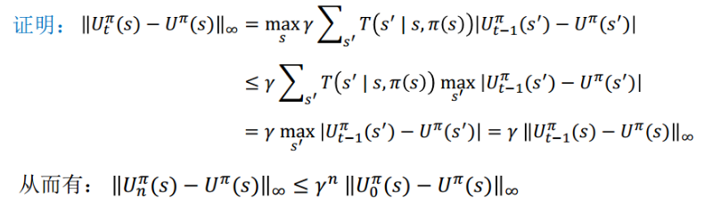
  + 计算方法二
    + 求解有n个线性方程的系统（$n$为状态数）
    + $ \mathbf{U}^\pi $为n维向量，表示状态值函数
    + $ \mathbf{R}^\pi $为n维向量，表示奖赏函数
    + $ \mathbf{T}^\pi $为n×n矩阵，表示状态转移概率
    + 则有
  $$ \mathbf{U}^\pi = \mathbf{R}^\pi+\gamma \mathbf{T}^\pi \mathbf{U}^\pi $$
  $$ \mathbf{U}^\pi = (\mathbf{I}-\gamma \mathbf{T}^\pi)^{-1} \mathbf{R}^\pi $$
    + 计算复杂度为$O(n^3)$

### 策略改进
+ **策略改进定理**：对于两个确定性的策略$\pi, \pi'$，如果对于任意$s\in \mathcal{S} $，有$ U^\pi(s)\leq Q^\pi(s, \pi'(s)) $，则有$\pi\leq\pi'$，即对于任意$ s\in \mathcal{S} $，有$ U^\pi(s)\leq U^{\pi'}(s) $
  + 注意，这里的$Q^\pi(s, \pi'(s))$表示的是只在$s$使用$\pi$策略
+ **在此基础上**，如果存在状态$ s\in \mathcal{S} $，有$U^\pi(s)< Q^\pi(s, \pi'(s))$，则存在状态$ s\in \mathcal{S} $，使得$U^\pi(s)< U^{\pi'}(s)$

### 策略迭代算法
+ **策略迭代**：令$\pi'(s)=\pi_{k+1}(s)=\argmax_a Q^{\pi_k}(s, a)$，则有$U^{\pi_k}(s)\leq U^{\pi_{k+1}}(s)$
+ **算法过程**
  + 策略评价：给定当前策略$\pi_k$，计算$U^{\pi_k}$
  + 策略改进：使用$U^{\pi_k}$，选择每一个状态动作值函数最大的动作，更新得到策略$\pi_{k+1}$  
  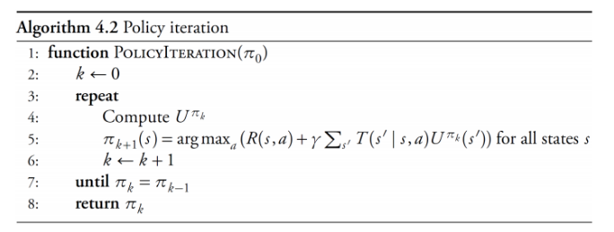

---
## 值迭代
+ 对无限步数问题，一个最优策略的值满足Bellman最优方程
  $$U^{*}(s)=\max _{a}\left(R(s, a)+\gamma \sum_{s^{\prime}} T\left(s^{\prime} | s, a\right) U^{*}\left(s^{\prime}\right)\right)$$
+ 值迭代的思想就是通过Bellman最优方程指出的$U^*$满足的迭代关系，直接求解$U^*$，并进一步提取一个最优策略$\pi(s) \leftarrow \arg \max _{a}\left(R(s, a)+\gamma \sum_{s^{\prime}} T\left(s^{\prime} | s, a\right) U^{*}\left(s^{\prime}\right)\right)$
+ **计算方法**
  + 如果$t=0$，则对所有$ s\in \mathcal{S} $，$U_0(s)=0$
  + 在时刻$t$，有$U_t(s) = \max _{a}\left(R(s, a)+\gamma \sum_{s^{\prime}} T\left(s^{\prime} | s, a\right) U_{t-1}\left(s^{\prime}\right)\right)$
  + 通过迭代更新得到的$U_{\infty}$来逼近最终的$U^*$

### 算法细节
+ 初始化
  + 初始化可以是任意有界初始值
  + 好的初始值能加速收敛
+ 收敛条件
  + $\|U_k-U_{k-1}\|_{\infty}<\delta$ ........ Bellman残差
  + 当$\|U_k-U_{k-1}\|_{\infty}<\delta$, $\delta=\frac{\epsilon(1-\gamma)}{\gamma}$时，$\|U^*-U_k\|_{\infty}<\epsilon$
  + $\gamma \rightarrow 1$时，$\delta \rightarrow 0$，收敛更慢
+ 折扣因子
  + 影响收敛速度
  + 影响值函数和策略
  + Agent的“短视”与“长视”

### 异步值迭代
+ **值迭代**：在每一轮迭代，基于$U_k$，对所有状态计算$U_{k+1}$
+ **异步值迭代**：在每一轮迭代，仅更新状态空间的一个子集
+ **Gauss-Seidel值迭代**
  + 只保存一份状态值，对值函数进行in-place更新
  $$U(s) \leftarrow \max _{a}\left(R(s, a)+\gamma \sum_{s^{\prime}} T\left(s^{\prime} | s, a\right) U\left(s^{\prime}\right)\right)$$
  + 收敛判定类似值迭代
  + 顺次迭代的顺序对收敛速度有影响
  + 相比值迭代方法，能更快收敛

---
## 结构化表示
+ **维数灾难**：如果状态空间由$n$个二值变量构成，则状态空间$ \mathcal{S} $的规模为$2^n$
+ 考虑如下问题：值函数的参量有$s, a$，但事实上如果状态$s$具有内部结构$(a, b, c, d)$，而值函数仅与其中某个状态变量$a$有关，那么我们对于这种内部结构的利用是不清晰的。同理，状态转移函数$T(s'|s, a)$的内部结构也未能得到利用
+ 下面讨论利用状态变量结构来压缩表示高维度问题

### 因子化的MDPs
+ 利用动态决策网络来压缩表示转移函数和奖赏函数
+ 例子
  + 3个状态变量：B、D、G
  + 2个决策变量：A、F
  + 2个奖赏变量：C、E  
  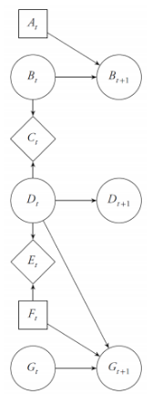
+ 使用决策树来压缩表示条件概率分布和奖赏函数，策略甚至值函数等  
  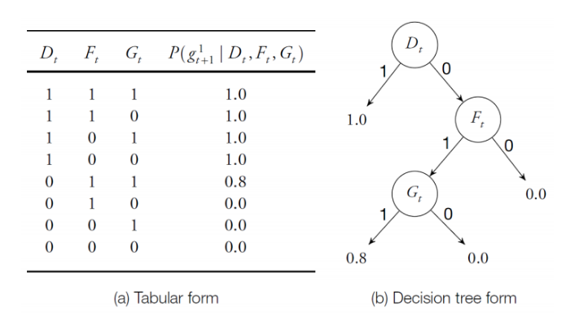

### 结构化的动态规划：基于决策树表示
+ **关键问题**：使用决策树表示时，如何使用Bellman方程迭代更新
+ 下面以基于决策树表示的值迭代过程为例

#### 基于决策树表示的值迭代
+ 考虑一个贝叶斯网络，其中状态变量的依赖关系如图。右下角表示：对于变量$Z_{t+1}$，如果$Z_t=1$，则$Z_{t+1}=1$的概率为$1.0$。如果$Z_t=0, Y_t=1$，则$Z_{t+1}=1$的概率为$0.9$  
  
+ 期望奖赏的决策树如图，仅和$Z$的取值有关  
  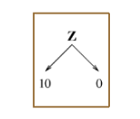
+ 下面进行迭代过程，得到动作$a$的行动值函数$Q_a$  
  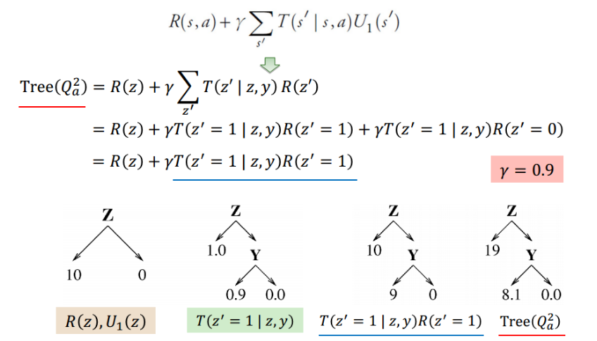
+ 最大化，对于动作$a,b$，合并两棵$Q$树，得到改进的策略$\pi'$  
  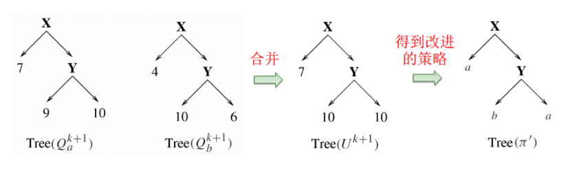

### 结构化的动态规划：基于决策图表示
+ 实际上就是把决策树进一步压缩为决策图  
  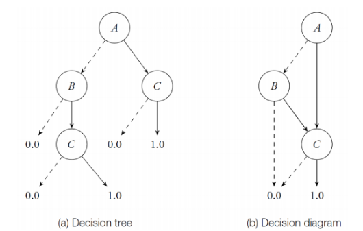

---
## 线性表示
+ 连续空间的MDP问题

### 带二次奖赏的线性系统
+ 求解满足某些条件的连续状态和行动空间的MDPs最优策略
  + 状态转移函数是线性的
    $$ \mathbf{s'}= \mathbf{T}_s \mathbf{s}+ \mathbf{T}_a \mathbf{a}+ \mathbf{w} $$
    $$ T(\mathbf{s'|\mathbf{s}, \mathbf{a}})=p(\mathbf{w}),\quad \text{if }\ \ \mathbf{s'}= \mathbf{T}_s \mathbf{s}+ \mathbf{T}_a \mathbf{a}+ \mathbf{w} $$
    + $ \mathbf{T}_s, \mathbf{T}_a$: 矩阵，基于$ \mathbf{s}, \mathbf{a} $确定下一个状态$ \mathbf{z} $的均值
    + $ \mathbf{w} $: 均值为0，方差有限的噪声
    + $p(\mathbf{w})$: 噪声的概率密度函数
  + 期望奖赏是二次的
    $$R(\mathbf{s}, \mathbf{a})= \mathbf{s}^{\top} \mathbf{R} _{s} \mathbf{s}+ \mathbf{a} ^{\top} \mathbf{R} _{a} \mathbf{a} $$
    + $ \mathbf{R}_s=\mathbf{R}_s^\top \preceq 0$
    + $ \mathbf{R}_a=\mathbf{R}_a^\top \prec 0 $

> 例：直流电机
> 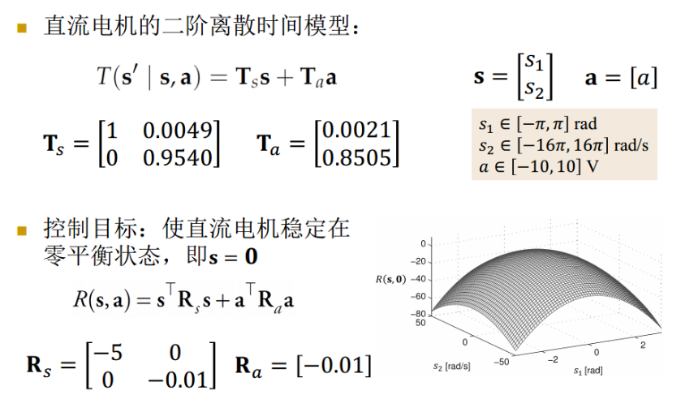
> s中的两个状态$s_1, s_2$分别表示角度和转速

### 二次奖赏线性系统：值迭代
+ 假设一个有限步数的无折扣奖赏问题
  $$U_{h+1}(\mathbf{s})=\max\limits_{\mathbf{a}}(R(\mathbf{s}, \mathbf{a})+\int_{\mathbf{s'}}T(\mathbf{s'}|\mathbf{s}, \mathbf{a})U_h(\mathbf{s'})\mathrm{d} \mathbf{s'})$$
+ 代入关于$T, R$的假设
  $$U_{h+1}(\mathbf{s})=\max\limits_{\mathbf{a}}(\mathbf{s}^{\top} \mathbf{R} _{s} \mathbf{s}+ \mathbf{a} ^{\top} \mathbf{R} _{a} \mathbf{a}+\int_{\mathbf{w}}p(\mathbf{w})U_h(\mathbf{T}_s \mathbf{s}+\mathbf{T}_a \mathbf{a}+\mathbf{w})\mathrm{d}\mathbf{w})$$
  + 对 $\forall \mathbf{s}\in \mathcal{S} $, $U_0(\mathbf{s})=0$
+ 下面证明: $U_n(\mathbf{s})$可以写成$ \mathbf{s}^\top \mathbf{V}_n \mathbf{s}+q_n $的形式
  + 证明：  
  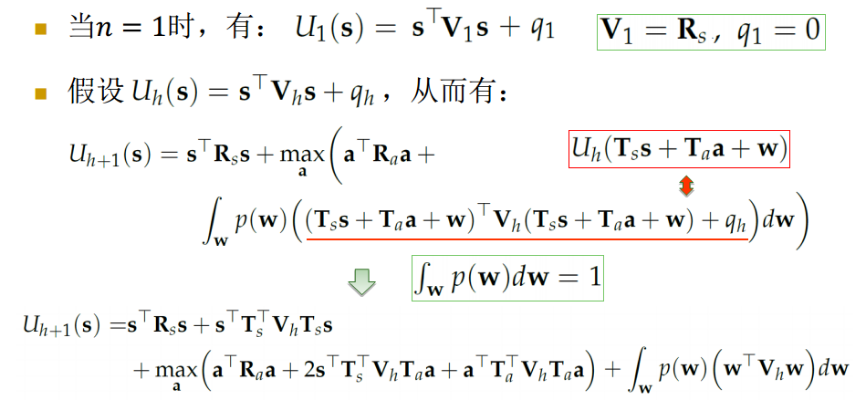
  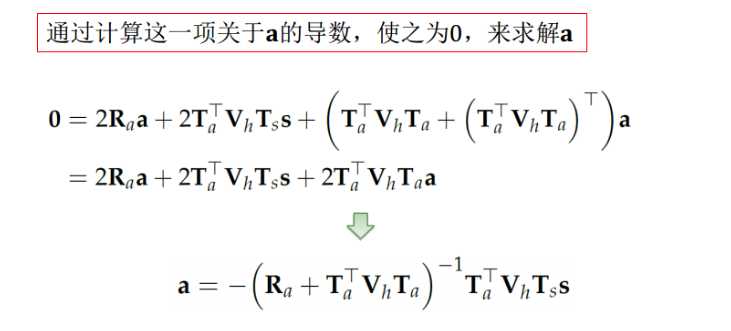
  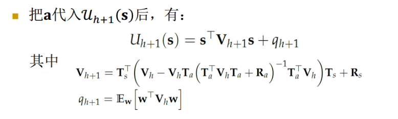
  + 为了计算$ \mathbf{V}_n $和$ q_n $，可先令$ \mathbf{V}_0=q_0=0 $，再使用上述方程进行迭代
+ 在已知$ \mathbf{V}_{n-1} $和$q_{n-1}$后，第n步的最优策略为
  $$\pi_h(\mathbf{s})=-(\mathbf{T}_a^\top \mathbf{V}_{h-1}\mathbf{T}_a+\mathbf{R}_a)^{-1} \mathbf{T}_a^\top \mathbf{V}_{h-1}\mathbf{T}_s \mathbf{s} =\Pi_{h-1} s $$
  + 其中，$\Pi_{h-1}=-(\mathbf{T}_a^\top \mathbf{V}_{h-1}\mathbf{T}_a+\mathbf{R}_a)^{-1} \mathbf{T}_a^\top \mathbf{V}_{h-1}\mathbf{T}_s$为$h-1$时刻的策略矩阵，它与上文中对$a$求导得到的表达式是一致的
