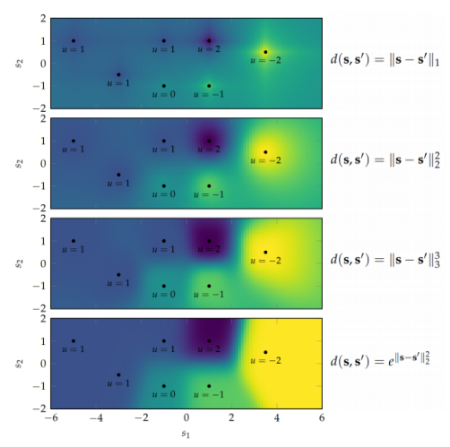
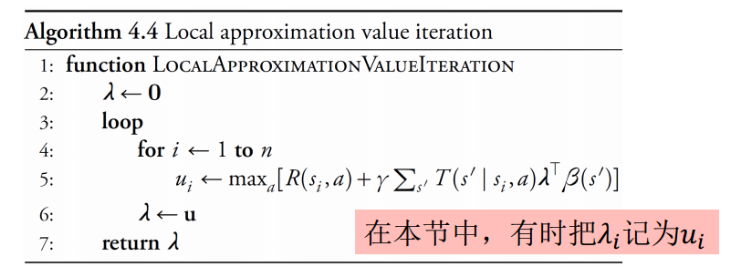
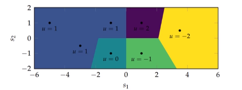
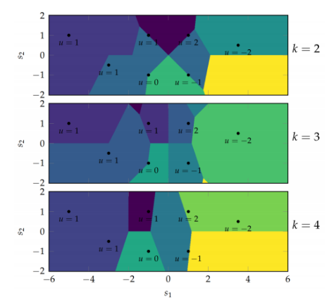
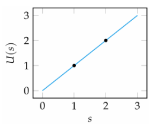
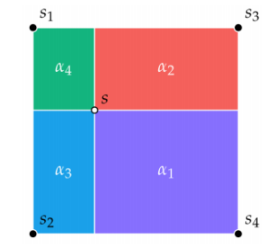
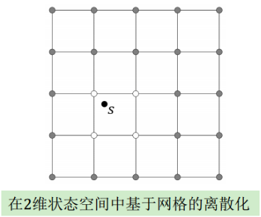
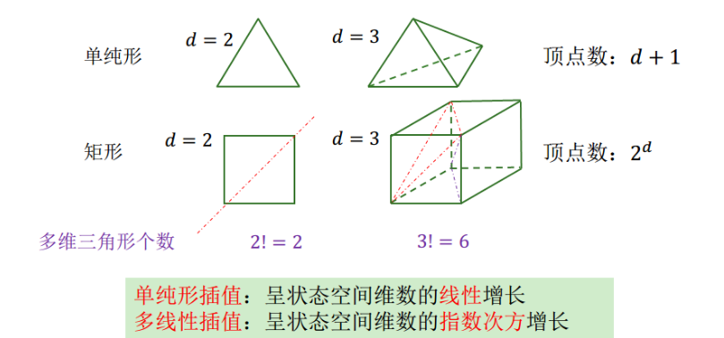
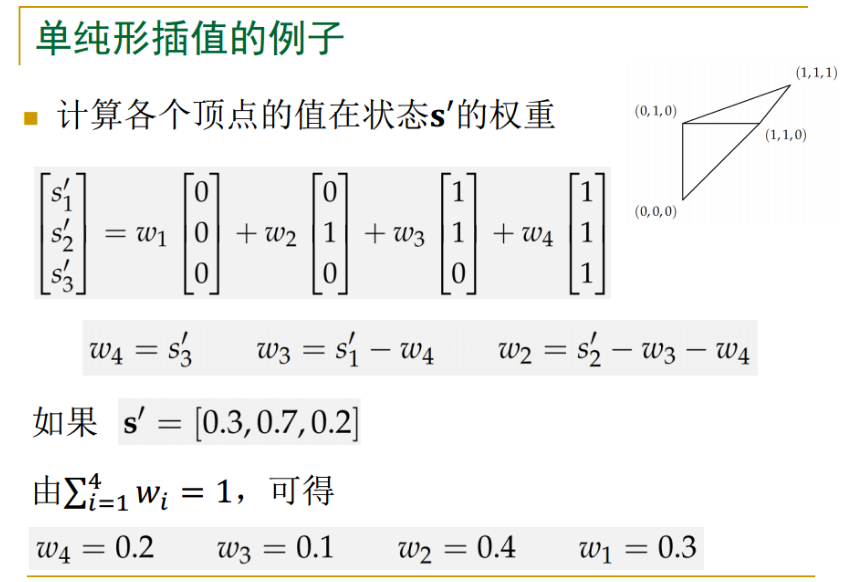
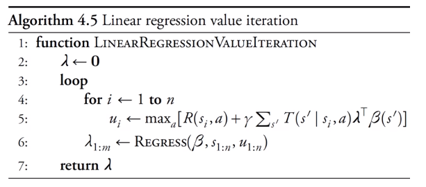

# 近似动态规划
+ 对状态空间/连续空间的MDP问题，精确动态规划是不可行的
+ **近似动态规划**：在模型已知的前提下，近似求解最优策略和值函数。使用有限的关于状态值的知识，对更广大的状态空间中的状态值进行建模

## 局部近似
+ 假设：相互接近的状态有相似的值
+ 一般情况下采信的点越多，建模作出的估计越准确，曲线越平滑
+ 可简单修改经典局部近似的值迭代方法，得到所有局部近似建模方法的值迭代方法

### 经典局部近似
+ 如果我们已经知道一组状态$s_{1:n}$的值$\lambda_{1:n}$，则可以使用如下方程近似任意状态$s$的值
$$U(s)=\sum_{i=1}^n\lambda_i\beta_i(s)=\lambda^\top\beta(s)$$
+ 其中，$\beta_{1:n}$是一组权重函数，使得$\sum_{i=1}^n\beta_i(s)=1$
+ $\beta_i(s)$的具体形式
$$\beta_i(s)=\frac{d(s, s_i)^{-1}}{\sum_{i=1}^n d(s, s_i)^{-1}}$$
  + 其中$d(s, s')$为度量距离的函数
+ 值函数的可视化
  + 每个$u$点的位置是对应的$s_i$，值（颜色深浅）对应着$\lambda_i$  
  

#### 经典局部近似：值迭代
+ 通过迭代更新$ \mathbf{\lambda} $来近似计算最优值函数
+ 对于已知的状态$s_{1:n}$，不断更新它们的值$\lambda_i$直到$\lambda$收敛  

+ 得到近似最优值函数$\lambda$后，可相应提取近似最优策略
  $$\pi(s) \leftarrow \underset{a}{\arg \max }\left(R(s, a)+\gamma \sum_{s^{\prime}} T\left(s^{\prime} | s, a\right) \lambda^{\top} \beta\left(s^{\prime}\right)\right)$$

### k近邻近似
+ 把所有权重赋值给与$s$最接近的状态
  $$U(s)=u_{\argmin _{i\in 1:n}d(s_i, s)}$$
+ 欧氏距离下，最近邻近似方法得到的近似值函数
  

### k最近邻近似
+ 对与$s$最接近的$k$个状态，分别赋予$\frac 1k$的权重  
  

### 线性插值
+ 邻域函数$N(s)$: 从$s_{1:n}$中返回一个状态子集
+ 如果状态空间是1维的，$N(s)=\{s_1, s_2\}$，则可以使用线性插值法计算$s$处的值
  $$U(s)=\alpha u_1+(1-\alpha)u_2$$
  $$\alpha = (s_2-s)/(s_2-s_1)$$  
  
+ 如果状态空间是2维的，可以使用双线性插值
  $$U(s)=\alpha_1u_1+\alpha_2u_2+\alpha_3u_3+\alpha_4u_4$$
  
+ 如果状态空间是更高维的，则可以使用多线性插值
  + 使用多维网格来离散化状态空间
  + 网格顶点对应已知的离散状态
  + $N(s)$为**包围**$s$的矩形格子定点的集合
  + 在$d$维网格中，有多达$2^d$个邻居  
  

### 单纯形插值
+ 高维空间中的插值方法
+ 把每个矩形格子分解为$d!$个多维三角形（单纯形）
+ 仅需要对由$d+1$个顶点构成的单纯形进行插值  
  

> 单纯形插值的一个例子  
> 

## 全局近似
+ 用一个固定的参数集合$\lambda_{1:m}$来近似定义值函数

### 线性回归方法
+ 已知离散状态$s_{1:n}$
+ 值函数近似为
  $$U(s)=\sum_{i=1}^{m} \lambda_{i} \beta_{i}(s)=\lambda^{\top} \beta(s)$$
  + $\lambda_{1:m}$仅仅是我们定义出的参数集合，并不与离散状态的值相对应
  + 基函数$\beta_{1:m}$不必与距离度量相关，且和不必为1
+ 常见回归目标
  + 最小化均方误差: $\sum_{i=1}^n(\lambda^\top\beta(s_i)-u_i)^2$

#### 线性回归方法：值迭代

+ 算法目标即为：找到$ \mathbf{\lambda} $，使得在使用基函数$ \mathbf{\beta} $时，能最好地估计$s_{1:n}$上的目标值$u_{1:n}$
+ 注意这里的$\lambda$是回归得出的，而在局部近似算法中是直接由$ \mathbf{u} $赋值的

#### 比较：线性插值 vs 线性回归

---
> **小结**
> 局部近似中，$\beta_i(s)$是与距离的度量息息相关的，距离$s$越近的状态越能产生影响
> 全局近似中，$\beta_i(s)$仅仅是我们人为选择的一组基底，已知的状态集合$s_{1:n}$只在回归拟合中起到作用
> **近似值迭代的底层逻辑为：我们现在需要通过迭代的方法建立已知状态集合$s_{1:n}$的近似值$\lambda_{1:n}$，从而通过这些已知状态来建立整个状态空间$ \mathcal{S} $的近似模型**

