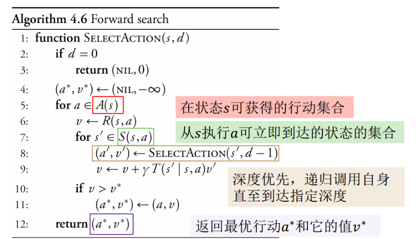
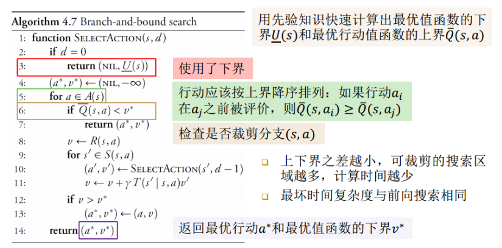
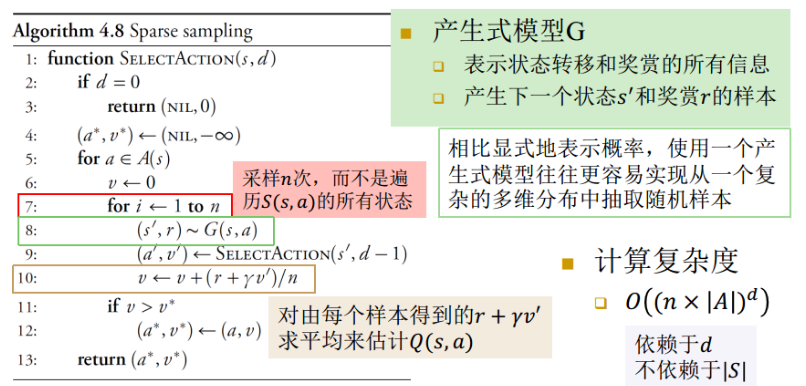
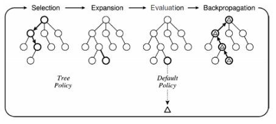
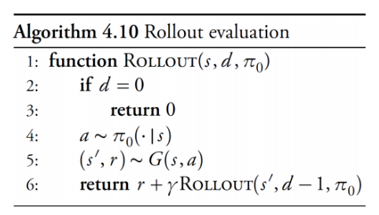
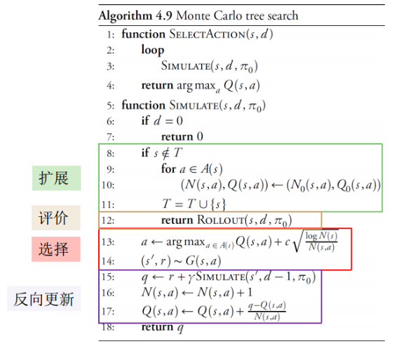

# 在线规划
## 离线方法与在线方法
+ 离线方法：在按策略执行行动之前，离线计算整个状态空间上的策略  
  
+ 在线方法：把计算限制在从当前状态可达的状态上
  + 可达状态空间比整个状态空间小很多  
  

## 前向搜索
+ 从某一初始状态$s$开始，先前look ahead直到某一个深度$d$，然后决定要采取的行动
+ 搜索方法为深度优先搜索
+ 计算复杂度为$O((|S|\times|A|)^d)$

## 分支限界搜索
+ 前向搜索的一种扩展：使用最优值函数的上界与下界来裁剪搜索树  
+ 需要一种关于状态$s$和行动$a$的行动值上界$\bar Q(s, a)$的先验知识
+ 最坏情况下的计算复杂度仍为$O((|S|\times |A|)^d)$

## 稀疏采样方法
+ 能够避免前向搜索和分支限界搜索在最坏情况下的指数复杂度
+ 不能保证得到最优行动，但在大多数时候能得到近似最优行动
+ 计算复杂度为$O((n\times|A|)^d)$，不再依赖与$|S|$，因而稀疏采样适合于解决状态空间较大的问题

---

## 蒙特卡洛树搜索
+ 最成功的基于采样的在线方法之一
+ 使用产生式模型
+ 计算复杂度不随深度而指数增长
+ 四个阶段
  + 选择（selection）
  + 扩展（expansion）
  + Rollout评价（evaluation）
  + 反向更新（back propagation）

+ 两种策略
  + 树策略（tree policy）：指导从搜索树$T$中的行动进行选择
  + 默认策略（default policy / rollout policy）：指导从新扩展节点到指定深度的行动选择

#### Selection
+ 从根节点开始，在搜索树T中前向搜索，直到到达一个不在$T$中的节点$s$
+ 搜索策略：选择具有最大$UCT$的行动分支
  $$UCT(a) = Q(s, a)+c\sqrt{\frac{\log N(s)}{N(s, a)}}$$
  + $Q(s, a)$为在$s$节点选择动作$a$之后，所得到累积rollout奖赏的平均值
  + $N(s, a)$表示在$s$节点选择行动$a$转移到$s'$的次数，而$N(s)$表示到达过$s$的总次数，因而有$N(s)=\sum_a N(s, a)$
  + $c$用于控制对探索的喜好程度

#### Expansion
+ 如果节点$s$不在搜索树中，则搜索终止，开始扩展
+ 遍历在$s$可用的行动，基于先验知识，把$N(s, a), Q(s, a)$初始化为$N_0(s, a), Q_0(s, a)$
+ 如果没有先验知识，把$N(s, a), Q(s, a)$初始化为0
+ 把节点s加入到搜索树中

#### Evaluation
+ 使用rollout policy $\pi_0$来选择行动直到到达指定深度  
  

#### Back Propagation
+ 根据evaluation结果，反向更新根节点到新扩展节点$s$沿线所有节点的$N(s, a)$和$Q(s, a)$

#### Decision
+ 循环执行上面4个阶段，直到满足某个终止条件，然后执行最大化当前状态处$Q$值 / 被选择次数最多的行动$a$

