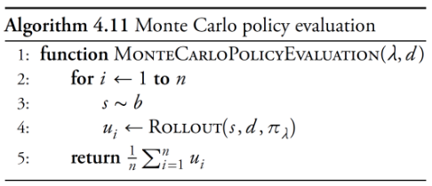
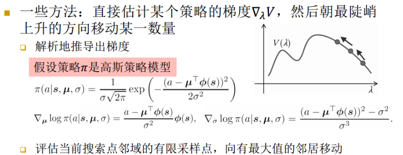
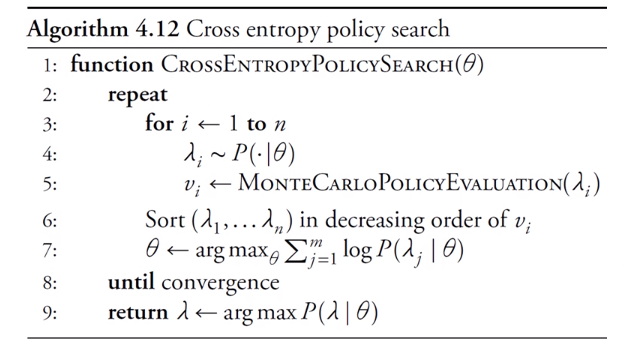

# 直接策略搜索
+ 之前介绍的精确动态规划和近似动态规划都是在计算出值函数后提取出最优策略
+ **直接策略搜索**不需要计算值函数，而是直接使用策略进行计算
  + 直接搜索策略空间：状态空间高维，策略空间低维时会有不错的效果
  + 定义：$\pi_\lambda(a|s)$为被参数化为$\lambda$的策略$\pi$在状态$s$选择动作$a$的概率

## 目标函数与策略评估
+ 给定一个初始状态$s$，设$u_i$为进行第$i$次rollout得到的值，则$U^{\pi_\lambda}(s)$可被看作对状态$s$的目标值估计
  $$U^{\pi_\lambda}(s)\approx\frac 1n\sum_{i=1}^nu_i$$
+ 直接策略搜索的目标：找到$\lambda$，最大化
  $$V(\lambda)=\sum_{s}b(s)U^{\pi_{\lambda}}(s)$$
  + 其中，$b(s)$为初始状态$s$的分布，$V(\lambda)$直观上可被看作在初始状态下采取参数为$\lambda$的策略$\pi$所得到的目标值期望
  + 可使用Monte-Carlo算法来对$V(\lambda)$进行估计  
  

## 策略搜索

### 局部搜索方法
+ **假设**：值$V(\lambda)$越大，$\lambda$距离最优值越接近
  + 容易受到局部最优解的影响  

### 进化搜索方法
+ 遗传算法
  + 用二进制的字符串表示策略
  + 基于适应性函数，通过杂交、变异产生新的个体，不断重复直到得到一个可悲满足的策略
+ 遗传编程
  + 使用树来表示策略
  + 杂交：交换子树
  + 变异：随机地修改子树

### 交叉熵搜索方法
+ 建立在最小化交叉熵损失函数的基础上

#### 信息量
+ 衡量一个事件的不确定性
+ 设$X$为$n$值离散型随机变量$X:\{1, 2, ..., n\}$
  + $P(x^1)$, ..., $P(x^n)$分别表示$X$取相应值的概率
+ 定义事件$X=i$的信息量为
  $$I(x^i)=-\log P(x^i)$$

#### 熵
+ 衡量系统的混乱程度，代表**系统中信息量的总和**
+ **熵是信息量的期望值**
  $$H(x)=\sum_{i=1}^n P(x^i)I(x^i)=-\sum_{i=1}^n P(x^i)\log P(x^i)= \mathbb{E}_{x\sim P}[I(x)]$$

#### 相对熵
+ **相对熵 / Kullback-Leibler散度**：表示同一个随机变量的两个不同分布之间的距离
  + 设$P(x), Q(x)$为随机变量$X$的两个概率分布
  + $P$对$Q$的相对熵为
  $$D_{\mathrm{KL}}(P \| Q)=\mathbb{E}_{\mathrm{x} \sim P}\left[\log \frac{P(x)}{Q(x)}\right]=\mathbb{E}_{\mathrm{x} \sim P}[\log P(x)-\log Q(x)]$$
+ **相对熵的性质**
  + $D_{\text{KL}}(P||Q)\geq 0$。等号仅在$P=Q$时成立，且$P$与$Q$差异越大，$D_{\text{KL}}(P||Q)$越大
  + 相对熵不具备对称性，即$D_{\mathrm{KL}}(P \| Q) \neq D_{\mathrm{KL}}(Q \| P)$

#### 交叉熵
+ **交叉熵**：使用分布$Q(x)$表示真实分布$P(x)$的差异程度
  $$H(P, Q)=-\mathbb{E}_{x\sim P}\log Q(x) $$
  + 结合
  $$H(P)=-\mathbb{E}_{x\sim P}[\log P(x)] $$
  $$D_{\text{KL}}(P||Q)=\mathbb{E}_{x\sim P}[\log P(x)-\log Q(x)] $$
  可得
  $$H(P, Q)=H(P)+D_{\text{KL}}(P||Q)$$
  + 因此，最小化$H(P, Q)$等价于最小化相对熵$D_{\text{K, L}}(P||Q)$

#### 交叉熵方法
+ $P(\lambda|\theta)$：$\lambda$的分布，用$\theta$参数化
+ **交叉熵方法**：使用交叉熵最小化，基于表现最好的策略来更新分布$P(\lambda|\theta)$
+ **算法过程**
  + **采样阶段**
    + 从样本中采样n个样本，使用策略评估算法评估性能
    + 对样本按照性能降序排列，使得$i<j\Leftrightarrow V(\lambda_i)\geq V(\lambda_j)$
  + **更新过程**
    + 使用性能最好的$m$个样本来更新$\theta$，更新公式为
    $$\theta \leftarrow \underset{\theta}{\arg \max } \sum_{j=1}^{m} \log P\left(\lambda_{j} | \theta\right)$$
    + 交叉熵体现在
      + 将求和式$\sum_{j=1}^m$看作$\lambda$关于$P$的分布
      + 将$P(\lambda|\theta)$看作$\lambda$关于$Q$的分布
      + 训练目标即为，调整$\theta$，使得$P(\lambda|\theta)$与性能最好的那一批样本中的$\lambda$的分布尽可能相似
  + **决策过程**
    + 上述过程收敛并得到$\lambda$后，决策为
        $$\lambda=\argmax_{\lambda}P(\lambda|\theta)$$
  + **算法如图所示**  
    
