# 部分可观察环境中的序贯决策

+ 在之前讨论的完全可观察环境中, 我们允许两种随机性: 行动效果的不确定性和奖赏的不确定性
+ 在部分可观察环境中, agent受制于传感器精度或噪声可能无法完美感知自己当前的状态
+ 部分可观察性的产生原因
  + 传感器缺陷: 多次测量同一个状态获得的传感器数据可能不同
  + 传感器局限: 传感器仅能感知部分状态, 导致多个真实状态往往对应于同一个观察结果
+ 部分可观察MDP (POMDP)
  + 有观察模型的MDP
  + 观察模型: 采取行动$a$到达状态$s'$后得到观察$o$的概率
  + 目标是计算最优策略

---
## 部分可观察的MDP

### 模型定义
+ POMDP
  + 状态空间$ \mathcal{S} $
  + 行动空间$ \mathcal{A} $
  + 状态转移函数$P(S_{t+1}|S_t, A_t)$
  + 奖赏函数$P(R_t|S_t, A_t)$
  + 观察空间$ \mathcal{O} $
  + 观察函数
    + 形式1: $P(O_{t+1}|S_{t+1}, A_{t})$
    + 形式2: $P(O_t|S_t)$

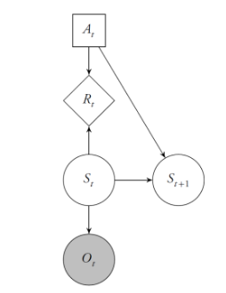

+ 稳态POMDPs
  + 指状态转移函数, 奖赏函数, 观察函数不随时间发生变化的POMDP问题
  + 状态转移函数
  $$T(s'|s, a)=p(s'|s, a)=P(S_{t+1}=s'|S_{t}=s, A_t=a)$$
  + 奖赏函数
  $$p(r|s, a)=P(R_t=r|S_t=s, A_t=a)$$
  + 给定状态和行动的期望奖赏函数
  $$R(s, a)=\sum_{r\in \mathcal{R} }r\cdot p(r|s, a)$$
  + 观察函数
  $$O(o|s', a)=P(O_{t+1}=o|S_{t+1}=s', A_t=a)$$
  或者
  $$O(o|s)=P(O_t=o|S_t=s)$$

### 相关概念
+ **信念状态**
  + 由于环境的状态不是完全可观察的, 最优行动并不能根据当前的观察直接得到. 因此往往需要根据过去观察序列和行动序列的完整信息.
  + 因此, 通过信念状态来表征与决策有关的过去行动和观察序列的完整历史信息
  + 假设状态空间$ \mathcal{S} $是离散的, 信念状态$b$是定义在状态空间$ \mathcal{S} $上的向量
    + 信念状态$b$在状态$s$上的分量定义为$b_t(s)$: 在$t$时刻, Agent在状态$s$的概率
    $$b_t(s)=P(S_t=s|O_t, A_{t-1},O_{t-1}, ..., A_0, b_0)$$
    + 其中$b_0$为初始信念状态, 表示Agent在时刻$t=0$时的初始状态概率分布
    + **信念状态本质上反映了我们的信念与观察之间的一致程度，所有的行动观察序列的历史信息都已经被压缩在了信念状态$b_t$中**
+ **信念状态空间**: $ \mathcal{B} $
  + 所有信念状态构成的状态空间
  + 如图是3个状态的POMDP问题的信念状态空间  
  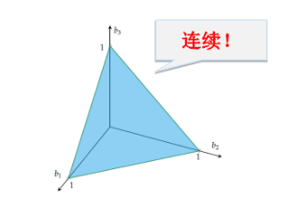
+ **信念状态MDPs**
  + POMDP可被视作状态为信念状态的MDP  
  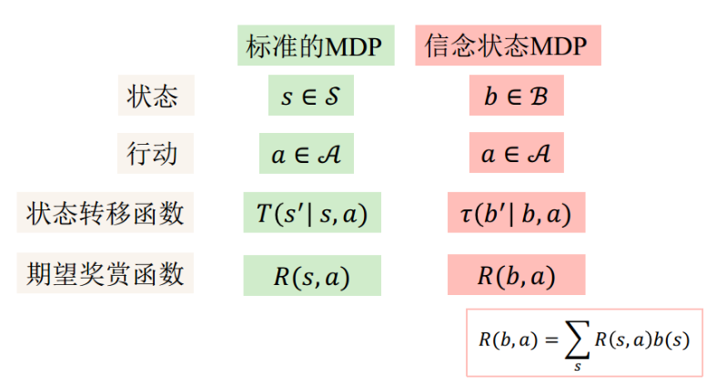
  <!-- + 带有信念状态的决策网络示意图 -->
  <!--  -->
  + 信念状态转移函数  
  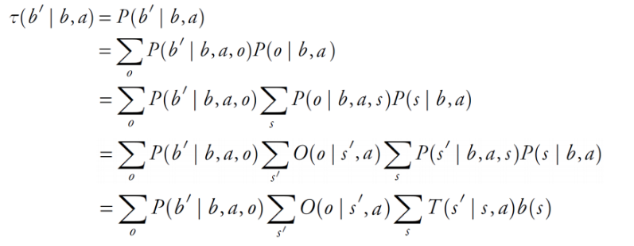
  + 奖赏函数
  $$R(b, a)=\sum_{s}R(s, a)b(s)$$

+ **策略**
  + 信念状态$ b\in \mathcal{B} $到行动$ a\in \mathcal{A} $的映射
  + 一个策略执行的小例子  
  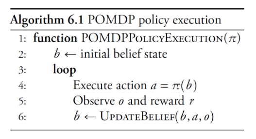

+ **值函数**
  + $U^\pi(b)$: 从信念状态$b$开始, 执行策略$\pi$所能得到的期望折扣回报
  $$U^{\pi}(b)=\mathbb{E}_{\pi}\left[\sum_{t=0}^{\infty} \gamma^{t} R\left(b_{t}, \pi\left(b_{t}\right)\right) | b_{0}=b\right]$$
+ **行动值函数**
  + $Q(b, a)$
+ **Bellman最优方程**
  $$U^*(b) = \max_{a\in \mathcal{A}}Q^*(b, a)$$
  $$Q^*(b, a)=R(b, a)+\gamma\sum_{o\in \mathcal{O}}P(o|b, a)\max_a Q^*(UpdateBelief(b, a, o), a)$$
  + 导出信念状态$b$处的最优行动
  $$\pi^*(b)\leftarrow\argmax_{a\in \mathcal{A}}Q^*(b, a)$$
+ 以上实际上均只是把MDP中的$s$置换成了信念状态$b$, 具体的各种条件概率的求法在之后的章节中会讨论.

---
## 信念状态的更新方法
+ 下面讨论三类POMDP问题的信念状态更新方法

### 离散状态空间POMDP
+ 更新公式
  $$b'(s')=\frac{O(o|s', a)}{P(o|b, a)}\sum_s T(s'|s, a)b(s)$$
  + 直观上很好理解, 首先遍历所有$s$计算转移到$s'$的概率, 然后计算由$s'$观察到$o$的概率, 即为信念状态
+ 推导过程  
  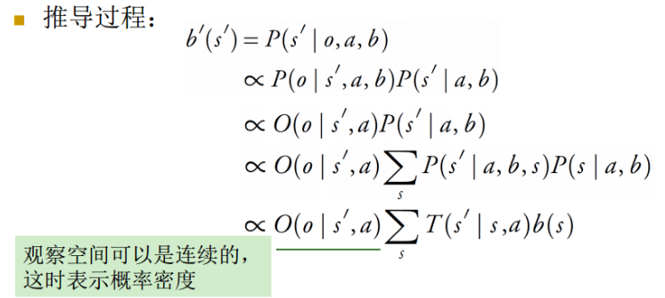

### 具有线性高斯状态转移和观察模型的POMDP: Kalman滤波
+ 连续状态空间中的信念状态更新公式
  $$b'(s')\propto O(o|a, s')\int T(s'|s, a)b(s)\mathrm{d}s $$
+ 假如连续的状态转移和观察模型的具有如下线性高斯形式
  $$T\left(\mathbf{s}^{\prime} | \mathbf{s}, \mathbf{a}\right)=\mathcal{N}\left(\mathbf{s}^{\prime} | \mathbf{T}_{s} \mathbf{s}+\mathbf{T}_{a} \mathbf{a}, \mathbf{\Sigma}_{s}\right)$$
  $$O\left(\mathbf{o} | \mathbf{s}^{\prime}\right)=\mathcal{N}\left(\mathbf{o} | \mathbf{O}_{s} \mathbf{s}^{\prime}, \mathbf{\Sigma}_{o}\right)$$
  $$b_0(\mathbf{s})=\mathcal{N}(\mathbf{s}|\mathbf{\mu}_b, \mathbf{\Sigma}_b) $$
  则更新信念状态的公式如下 (Kalman滤波)
  $$\mathbf{K} \leftarrow \mathbf{\Sigma}_{p} \mathbf{O}_{s}^{\top}\left(\mathbf{O}_{s} \mathbf{\Sigma}_{p} \mathbf{O}_{s}^{\top}+\mathbf{\Sigma}_{o}\right)^{-1}$$
  $$\boldsymbol{\mu}_{b} \leftarrow \boldsymbol{\mu}_{p}+\mathbf{K}\left(\mathbf{o}-\mathbf{O}_{s} \boldsymbol{\mu}_{p}\right)$$
  $$\mathbf{\Sigma}_{b} \leftarrow\left(\mathbf{I}-\mathbf{K O}_{s}\right) \mathbf{\Sigma}_{p}$$
  其中, $\boldsymbol{\mu}_{p} \leftarrow \mathbf{T}_{s} \boldsymbol{\mu}_{b}+\mathbf{T}_{a} \mathbf{a}$, $\Sigma_{p} \leftarrow \mathbf{T}_{s} \Sigma_{b} \mathbf{T}_{s}^{\top}+\Sigma_{s}$分别为得到一个观察前预测的均值和方差
+ 假如转移模型仅具备高斯形式而非线性, 即
  $$T\left(\mathbf{s}^{\prime} | \mathbf{s}, \mathbf{a}\right)=\mathcal{N}\left(\mathbf{s}^{\prime} | \mathbf{f}_T(\mathbf{s}, \mathbf{a}), \mathbf{\Sigma}_{s}\right)$$
  $$O\left(\mathbf{o} | \mathbf{s}^{\prime}\right)=\mathcal{N}\left(\mathbf{o} | \mathbf{f}_O(\mathbf{s'}), \mathbf{\Sigma}_{o}\right)$$
  则可以考虑使用一阶泰勒展开来局部线性近似非线性函数, 然后使用Kalman滤波更新信念状态  
  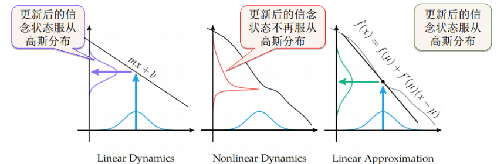
  
### 一般线性状态空间POMDP: 粒子滤波器
+ 当状态空间很大或连续, 且动力系统不能很好用线性高斯模型近似时, 可使用**基于采样的方法**来更新信念状态
+ **粒子滤波器**
  + 信念状态: 粒子的集合
  + 粒子: 状态空间中的样本
  + 随着粒子的增加, 用粒子集合表示的信念状态会接近真实的信念状态
  + 基于一个产生式模型G来更新b

#### 带拒绝的粒子滤波器
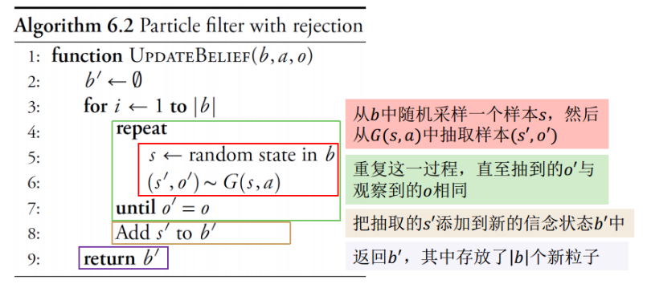

#### 不带拒绝的粒子滤波器
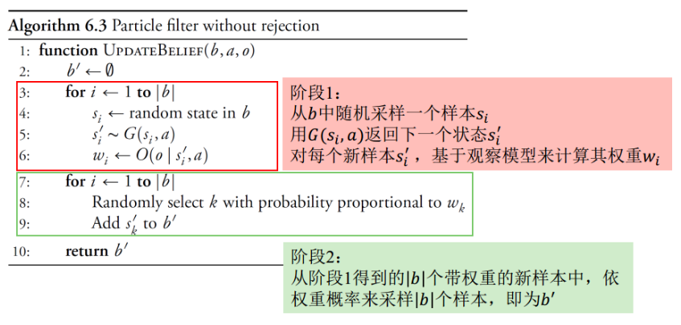

> 对比: 拒绝采样和不拒绝采样
> + 拒绝采样
>   + 产生式模型G需要同时给出状态和观察, 然后剔除与给定观察不一致的观察. 这导致大量的样本可能会被剔除, 采样效率低
> + 不拒绝采样
>   + 首先要求有一个观察模型$O$. 产生式模型G只需要给出状态$s'$, 然后根据观察模型给出状态$s'$的权重. 这一点也会有缺陷, 与似然加权采样是类似的, 即最终结果可能会被出现概率大, 似然程度低的样本所主导
> + **粒子滤波器的核心思想**
>   + 对比离散状态空间的更新公式, 逻辑链条是: 首先根据$s$出现的信念$b(s)$和转移模型得到$s'$出现的概率, 然后再根据观察给出$s'$的信念, 即$s'$与观察一致的可能性.
>   + 粒子滤波器算法中的第四行对应$s$的信念, 生成式模型采样$s'$对应转移概率模型, 拒绝采样/加权不拒绝采样则对应着判断$s'$与观察的一致性

---
## 精确求解方法

### $ \boldsymbol{\alpha} $向量
+ $ \boldsymbol{\alpha}_a $: $R(\cdot, a)$的向量表示, 长度为$|\mathcal{S}|$, 每一个分量都代表某个状态$s$处采取行动$a$的奖赏$R(s, a)$
> 在情节只有一步的离散状态POMDP问题中, 最优值函数为
> $$U^*(b)=\max_a\sum_s b(s)R(s, a)=\max_a \boldsymbol{\alpha}_a^\top \boldsymbol{b} $$
> 事实上, 每一个$ \boldsymbol{\alpha} $都对应了$U(b)-b$空间的一个超平面, 值函数是这些超平面的上界, 因而最优值函数是分段线性凸函数  
> 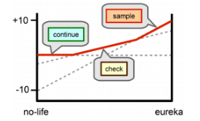

### 条件规划
+ 在多步POMDP中, 一个**策略**就是一个**条件规划**, 表示为一棵树  
  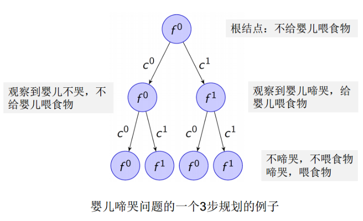
+ 条件规划$p$的值函数评估: 在$s$使用条件规划$p$的期望回报可使用下式递归计算
  $$U^p(s)=R(s, a)+\sum_{s'}T(s'|s, a)\sum_o O(o|s', a)U^{p(o)}(s')$$
  其中, $a$为与$p$的根节点关联的行动, $p(o)$为与观察$o$关联的子规划  
  进一步, 信念状态的期望回报为
  $$U^p(\mathbf{b})=\sum_s U^p(s)\mathbf{b}(s)=\boldsymbol{\alpha}_p^\top \mathbf{b} $$
  其中$ \boldsymbol{\alpha}_p $为$U^p$在各状态节点的向量表示
  如果最大化所有可能的给定步数的规划, 则有
  $$U^*(\mathbf{b})=\max_p \boldsymbol{\alpha}_p^\top \mathbf{b} $$ 
  **可见, 有限步数的最优值函数是分段线性凸函数, 而在当前信念状态的最优行动则是$\argmax_p \boldsymbol{\alpha}_p^\top \mathbf{b} $在根节点处的行动**
+ **讨论: 为什么在POMDP问题中的策略使用条件规划树的形式?**
  + 这是因为两点, 一是在POMDP中, 我们无法得知准确的状态信息, 而只能根据观察来进行决策, 可是观察是关于状态的一种残缺信息, 并不是我们直接作出决策的准确依据；而且在POMDP中, 决策往往需要借助历史信息和历史观察序列, 此时使用一个仅和当前观察或者信念状态有关的决策函数$\pi$就无法利用历史决策信息了
### 值迭代
+ 在POMDP中进行值迭代的想法
  + 遍历一步规划, 丢弃**在任意初始信念状态处**都不是最优的一步规划
    + **所谓“都不是最优的一步规划”，这里的意思是，对于某一个行动，它在整个信念状态空间上任意一点处都不能达到最优。但是只要它能在某个子空间上达到最优，那么这就是一个不应当被丢弃的1步规划。**  
    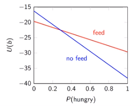
  + 用剩下的一步规划来产生可能最优的2步规划, 丢弃在任意信念处都不是最优的2步规划
  + 重复这一过程, 直到到达指定步数
+ 实际上是一个边迭代，边剪枝的过程

---
## 离线方法（off-line policy）

### QMDP：完全可观察的近似
+ Insight：假设所有状态的不确定性在下一个时刻消失
+ Method
  + 创建一个$\alpha$-向量的集合
    + 每个向量由完全可观察MDP的$Q(s, a)$构成，长度为$|\mathcal{S}|$
  + 使用值迭代来计算$\alpha$-向量
    + 初始化：对所有$s$, $\alpha_a^{(0)}(s)=0$
    + 迭代：
  $$\alpha_a^{(k+1)}(s)=R(s, a)+\gamma\sum_{s'}T(s'|s, a)\max_{a'}\alpha_{a'}^{(k)}(s')$$
  + 信念状态$b$的值函数：$\max_a\alpha_a^\top b$
    + 这提供了**实际最优值函数**的上界，即$\max_a\alpha_a^\top b\geq U^*(b)$
  + 提取近似最优行动：$\argmax_a\alpha_a^\top b$
+ Complexity
  + 每轮迭代的运算次数 $O(|\mathcal{A}|^2|\mathcal{S}|^2)$
+ Analysis
  + 不适合带有信息搜集行动的任务

### FIB
+ Fast Informed Bound，快速获知界
+ FIB一定程度上考虑了部分可观察性
  $$\alpha_a^{(k+1)}(s)=R(s, a)+\gamma\sum_o\max_{a'}\sum_{s'}O(o|s', a)T(s'|s, a)\alpha_{a'}^{(k)}(s')$$
+ 每轮迭代的运算次数：$O(|\mathcal{A}|^2|\mathcal{S}|^2|\mathcal{O}|)$
+ FIB得到的值函数是QMDP得到的值函数的下界，因而得到的函数最逼近真正的最优值函数

### 基于点的值迭代
+ Insight
  + 更新在信念状态空间中，与有限个点关联的阿尔法向量
  + 信念点的集合：$B=\{b_1, b_2, ..., b_n\}$
  + 与它们关联的$\alpha$向量的集合：$\Gamma=\{\alpha_1, ..., \alpha_n\}$(这里的$alpha$向量指示的是在各个状态$s$处最优行动的行动值)
  + 给定这些向量，使用下式估计任意信念点$b$处的值函数
  $$U^\Gamma(b)=\max_{\alpha\in\Gamma}\alpha^\top b=\max_{\alpha\in\Gamma}\sum_s \alpha(s)b(s)$$
+ Method
  + 将在$\Gamma$中的$\alpha$向量初始化，使得对所有$b$，都有$U^\Gamma(b)\leq U^*(b)$
    + 一种估计最优值函数下界的方法  
  
  + 基于初始的$\alpha$向量集合，可以更新在$b$处的值函数
  $$U(b) \leftarrow \max _{a}\left[R(b, a)+\gamma \sum_{o} P(o \mid b, a) U\left(b^{\prime}\right)\right]$$
  其中
  $$P(o \mid b, a)=\sum_{s} b(s) \sum_{s^{\prime}} O\left(o \mid s^{\prime}, a\right) T\left(s^{\prime} \mid s, a\right)$$
  $$b^{\prime}\left(s^{\prime}\right)=\frac{O\left(o \mid s^{\prime}, a\right)}{P(o \mid b, a)} \sum_{s} T\left(s^{\prime} \mid s, a\right) b(s)$$
  结合这几个方程可以得到更新公式
  $$U(b) \leftarrow \max _{a}\left[R(b, a)+\gamma \sum_{o} \max _{\alpha \in \Gamma} \sum_{s} b(s) \sum_{s^{\prime}} O\left(o \mid s^{\prime}, a\right) T\left(s^{\prime} \mid s, a\right) \alpha\left(s^{\prime}\right)\right]$$
  + 除了更新$b$处的值，还可以更新$b$处的$alpha$向量  
  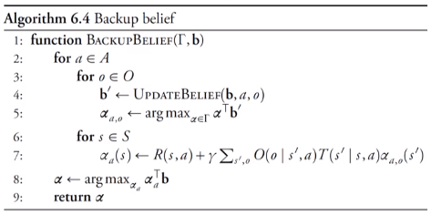
  + 基于值迭代的方法就是不断更新n个信念状态的$\alpha$向量直至收敛，然后使用这些$\alpha$向量近似信念状态空间中任意点的函数值

## 随机的基于点的值迭代