# 概率模型：概率推理
## 贝叶斯网络中的推理
+ 推理：由一组证据变量的值确定一个或多个查询变量的分布  
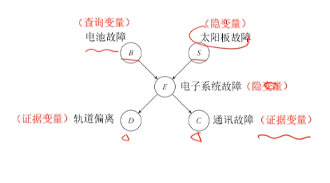
> **计算$Pr(B|d, c)$**
>   
> $Pr(b|d, c)=Pr(b, d, c)/Pr(d, c)=\sum_s\sum_ePr(b, s, e, d, c)/Pr(d, c)=\sum_s\sum_ePr(b)Pr(s)Pr(e|b, s)Pr(d|e)Pr(c|e)$

+ 总结：$P(\mathcal{Y})=\sum_{\mathcal{X}}\prod _iPr(X_i|Parent_{X_i})$
  + 其中$\mathcal{X}$为隐变量集合，$\mathcal{Y}$为查询变量和证据变量的集合
  + 求积号步骤被叫做因子相乘（实际就是链式法则）
  + 求和号步骤被叫做因子边际化
  + 最后对已知的证据变量进行赋值

### 因子相乘
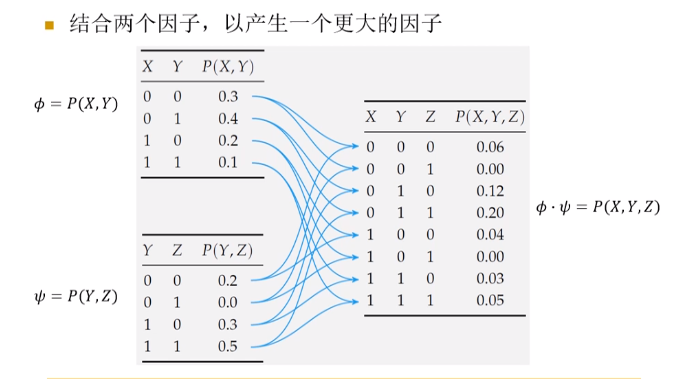
+ 类似于在表格$T(X, Y)$和表格$T(Y, Z)$上进行了联结操作，对应因子相乘

### 因子边际化

+ 将求和变量以外的变量一次固定得到一系列子矩阵，对子矩阵的元素求和
+ 不依赖求和变量的因子可提取到求和号之外

### 设置证据
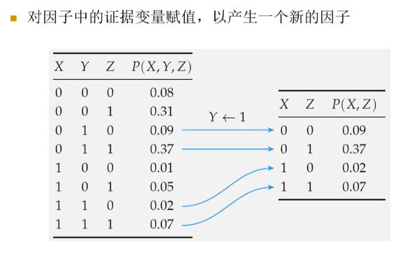

## 分类推理
+ 用于分类任务
### 朴素贝叶斯模型  
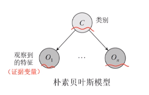
+ $O_1, ...,O_n$为证据变量，$C$为类别
+ 朴素贝叶斯假设：给定所属的类别，证据变量（即特征）之间条件独立：$O_i\perp O_j|C$
+ 如果假设不成立，可以在证据变量之间添加有向边表示特征之间的关系
+ 在朴素贝叶斯模型中，需要给出类别的先验概率分布$Pr(C)$和条件概率分布$Pr(O_i|C)$
> 若在朴素贝叶斯网络中求解条件概率$Pr(c|o_1, ..., o_n)$  
> $Pr(c, o_{1:n})=Pr(c)\prod _{i=1}^nPr(o_i|c)$  
> 而$Pr(o_{1:n})=\sum_c\prod _{i=1}^nPr(o_i|c)$，是一个常数，令该值等于$\frac 1{\mathcal{X}}$，则有$Pr(c|o_{1:n})=\mathcal{X}P(c, o_{1:n})$

## 时序模型中的推理
  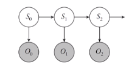
+ 在HMM模型上，常见的推理任务有
  + **滤波**：$\mathbf{Pr}(S_t|o_{0:t})$
  + **预测**：$\mathbf{Pr}(S_{t'}|o_{0:t})$, $t'>t$
  + **平滑**：$\mathbf{Pr}(S_{t'}|o_{0:t})$, $t'<t$
  + **最可能序列**：$\text{argmax}_{s_{o:t}}P(s_{0:t}|o_{0:t})$
+ 在单状态节点的HMM模型中，我们进行如下定义
  + $A_t$：时刻$t$的状态转移矩阵，$t_{ij}$表示从状态$i$转移到状态$j$的概率
  + $B_t$：时刻$t$的观察矩阵，$b_{ik}$表示从状态$i$观测到$k$的概率
  + $O_t$：时刻$t$的对角观察矩阵。由于在接下来的讨论中证据变量的取值是已知的，因此不需要考虑$B_t$，只需要考虑从某个状态观察带给定的证据$o_t$的概率即可。将这些概率放入一个矩阵$O_t$中，它的第$i$个对角元素是$P(o_t|S_t=i)$，其他元素是0.

### 滤波
+ 目标：求解$\mathbf{Pr}(S_t|o_{0:t})$
1. 由于$s_t$和$o_t$之间存在依赖关系，故可通过贝叶斯规则得到
   $$\mathbf{Pr}(S_t|o_{0:t})\propto \mathbf{Pr}(o_t|S_t, o_{0:t-1})\mathbf{Pr}(S_t|o_{0:t-1})$$
2. 由贝叶斯网络的条件独立性$(o_t\perp o_{0:t-1}|s_t)$，故
   $$\mathbf{Pr}(S_t|o_{0:t})\propto \mathbf{Pr}(o_t|S_t)\sum_{s_{t-1}}\mathbf{Pr}(S_t|s_{t-1}, o_{1:t-1})P(s_{t-1}|o_{1:t-1})$$
3. 进一步由$(s_t\perp o_{1:t-1}|s_{t-1})$，有
   $$\mathbf{Pr}(S_t|o_{0:t})\propto \mathbf{Pr}(o_t|S_t)\sum_{s_{t-1}}\mathbf{Pr}(S_t|s_{t-1})P(s_{t-1}|o_{1:t-1})$$
4. 进一步假设在滤波任务中状态转移分布和观察分布是稳态的，则有**递归贝叶斯估计算法**  
   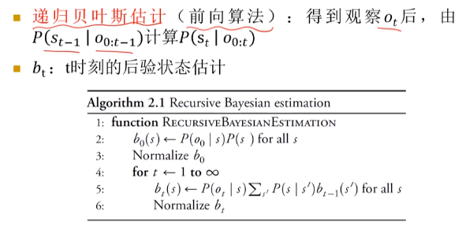
   + 注意代码第二行，根据算法我们要计算$P(s_0|o_0)$，而代码给出的实际上是$P(s_0, o_0)$。只要有第三行的归一化步骤，也是可以work的
   + 当观察连续时，$P(o|s)$变成概率密度函数，第五行变成求积分，$b$变成密度函数
5. 正如在之前所提到的，矩阵运算可以简明地表达**前向算法**的计算过程
   + 记 $f_{0:t}=\mathbf{Pr}(S_t|o_{0:t})$
   + $f_{0:0}$是可以直接通过$f_{0:0}= \mathbf{Pr}(S_0|o_{0:0})\propto\mathbf{Pr}(o_0|S_0)\mathbf{Pr}(S_0) $计算得出的
   + **前向算法的迭代公式**: $f_{0:t}\propto O_{t}A^Tf_{0:t-1}$

### 预测
+ 目标是求解$P(s_{t+k+1}|o_{0:t})$, $k\geq 0$
+ 分为两步求解
1. 单步预测（滤波）
   $$P(s_t|o_{0:t})\propto P(o_t|s_t)\sum_{s_{t-1}}P(s_t|s_{t-1})P(s_{t-1}|o_{1:t-1})$$
2. 没有增加新观察下的滤波，只涉及转移分布
   $$\mathbf{Pr}(S_{t+k+1}|o_{0:t})=\sum_{s_{t+k}}\mathbf{Pr}(S_{t+k+1}|s_{t+k})P(s_{t+k}|o_{0:t})$$

### 平滑
+ 目标是求解$\mathbf{Pr}(S_k|o_{0:t})$, $0\leq k<t$
1. $\mathbf{Pr}(S_k|o_{0:t})=\mathbf{Pr}(S_k|o_{0:k}, o_{k+1:t})\propto \mathbf{Pr}(S_k|o_{0:k})\mathbf{Pr}(o_{k+1:t}|S_k, o_{0:k})$
2. 第一个式子可使用前向算法进行求解，第二项可使用后向算法计算
3. 后向算法
  + 首先引入隐变量$s_{k+1}$
    $$\mathbf{Pr}(o_{k+1:t}|S_k)=\sum_{s_{k+1}}\mathbf{Pr}(o_{k+1:t}|S_k, s_{k+1})\mathbf{Pr}(s_{k+1}|S_k)$$
  + 再由马尔科夫性质，给定$s_{k+1}$后$(o_{k+1:t}\perp s_{k}|s_{k+1})$, 因此有
    $$=\sum_{s_{k+1}}P(o_{k+1:t}|s_{k+1})\mathbf{Pr}(s_{k+1}|S_k)$$
  + 再将$o_{k+2}$分离出来，有
    $$=\sum_{s_{k+1}}P(o_{k+1}|s_{k+1})P(o_{k+2:t}|s_{k+1})\mathbf{Pr}(s_{k+1}|S_k)$$
  + 综上所述，后向算法的迭代过程为 $\mathbf{Pr}(o_{k+1:t}|S_k)=\sum_{s_{k+1}}P(o_{k+1}|s_{k+1})P(o_{k+2:t}|s_{k+1})\mathbf{Pr}(s_{k+1}|S_k)$
  + 可以看到主要思想就是尽可能利用贝叶斯网络的条件独立性假设，将复杂的因子转化为已知的**转移分布或观察分布**。后向算法的第一步引入$s_{k+1}$分离了$o_{k+1:t}$和$s_k$，而最后一步利用了$o_{k+1}$和$o_{k+2:t}$被$s_{k+1}$分离的条件
4. 同理，矩阵运算可以简明地表示**后向算法**的迭代过程
   + 记 $b_{k+1:t}=\mathbf{Pr}(o_{k+1:t}|S_k)$
   + 定义$b_{t+1:t}=[1, 1, ..., 1]$为终止条件下的分布
   + **后向算法的迭代公式**: $b_{k+1:t}=AO_{k+1}b_{k+2:t}$

### 寻找最可能序列
+ 目标是求解$\text{argmax}_{s_{0:t}}P(s_{0:t}|o_{0:t})=\text{argmax}_{s_{0:t}}\prod_{i=0}^t P(s_i|s_{i-1})P(o_i|s_i)$
+ **维特比算法**

+ 维特比算法本质上是一种动态规划
  + 目标是计算到达最终节点的状态序列中满足观察序列的可能性最大的一种路径
  + 维特比算法采用的就是由下而上逐步构造计算的方式
+ 算法流程
  + 设每一时刻有k中可能的不同状态
  + 在0时刻，计算$\psi(S_0)=P(S_0|o_0)$, 得到k个状态关于$o_0$的条件分布，它表示从初始状态开始，由0时刻的观察，各个不同状态出现的概率
  + 假设在在时刻$t$，已计算得到从初始状态开始，逐渐演变到t时刻下的各个状态的概率分布$\psi(S_t)=\psi(S_t^0), \psi(S_t^1)...$
  + 在时刻$t+1$，对于每个状态$S_{t+1}^i$都计算$\psi(S_{t+1}^i)=\max_{j}P(S_{t+1}^i|S_t^j, o_{t+1})\psi(S_t^j)$，为每个$t+1$时刻下的状态保留选出的$t$时刻状态，并得到新的分布$\psi(S_{t+1})=\psi(S_{t+1}^0), \psi(S_{t+1}^1)...$
  + 直到计算到最后一个时刻，选择$\psi$概率最大的状态，逐步向前选择通向该路径的上一个状态，回溯出最优的状态路径即为所求
+ 算法分析
  + 维特比算法本质上是动态规划算法，原本在$t$时刻时我们要考虑之前的所有可能的$k^t$种路径，而在维特比算法中我们始终只保留到达前一时刻k个状态最优的k条路径
  + $\psi(S_t)=\psi(S_t^0), \psi(S_t^1)...$即为备忘录。可以考虑递推$\psi(S_{t+1}^i)=\max_{j}P(S_{t+1}^i|S_t^j, o_{t+1})$，其中$\max_jP(S_{t+1}^i|S_t^j, o_{t+1})\psi(S_t^j)\propto\max_jP(o_{t+1}|S_{t+1}^i)P(S_{t+1}^j|S_t^i)$，而这正是求解目标的积式$\prod_{i=0}^t P(s_i|s_{i-1})P(o_i|s_i)$中的一个因式！
  + 因此不断递推到最后一个时刻，所得结果正是待求结果，DP中经过的状态序列即最可能序列

## 精确推理
+ 计算查询变量的边际分布或条件分布的精确值

### 枚举推理
+ $P(\mathcal{Y})=\sum_{\mathcal{X}}\prod _iPr(X_i|Parent_{X_i})$
  + 其中$\mathcal{X}$为隐变量集合，$\mathcal{Y}$为查询变量和证据变量的集合
  + 求积号步骤被叫做因子相乘（实际就是链式法则）
  + 求和号步骤被叫做因子边际化
  + 最后对已知的证据变量进行赋值
  + 随着隐变量数目增加，求和项数目指数增长。$O(n\cdot 2^n)$
+ 这一部分的算法在《人工智能——一种现代的方法》pp438有详细的算法解释

### 变量消去法
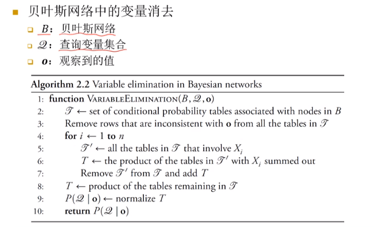
+ **$X_i$均为隐变量**
+ 图中的Tables即为我们所指的“因子”
+ 由此可见，贝叶斯精确推理的关键任务在于按一定顺序消去隐变量，因子相乘不考虑变量位置
+ 一方面，选择最优的消元顺序实际上是**NP-hard**问题，即在最坏情况下不能在多项式时间内求解；另一方面，即使得到了最优的消元顺序，变量消去法所需要的计算时间仍然可以是网络大小的指数级复杂度
+ **缺点**：若需要执行给定证据变量相同的多个不同的边际分布，反复使用变量消去法会有大量冗余计算

### 信念传播法
+ 将变量消去法中的求和操作看作一个消息传递过程  
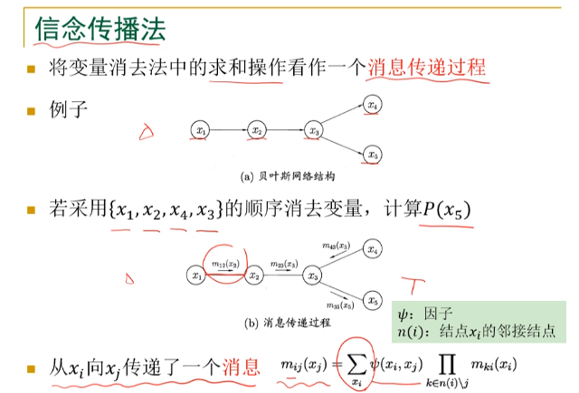
+ 定义message：$m_{ij}(x_j)=\sum_{x_i}\psi (x_i, x_j)\prod_{k\in n(i)\backslash j}m_{ki}(x_i)$, $\psi$实际上就是因子，每个节点的条件概率
+ 消息实际上是到达该节点的一种“**概率上的累积**”  
  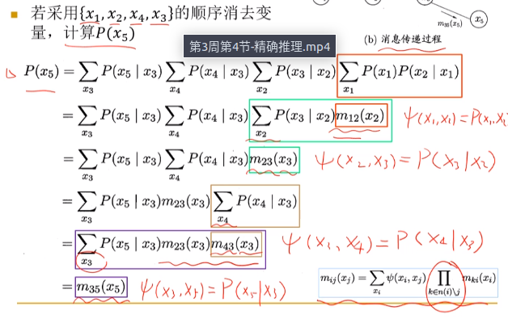

+ 一个节点只有在接收到来自其他所有节点的消息后才能向另一个节点发送消息
+ **节点的边际分布正比于它所接收的消息的乘积**
  $$P(x_i)\propto \prod_{k\in n(i)}m_{ki}(x_i)$$
  + 通过这个性质，可以两次遍历树，得到每条边上双向的消息，进一步计算每个节点上的边际概率

## 精确推理的复杂度
+ 证明一个问题Q是NP-hard
  + 将一个已知的NPC问题转化为Q的一个实例
+ 下面将任意3-SAT问题转化为贝叶斯网络  
  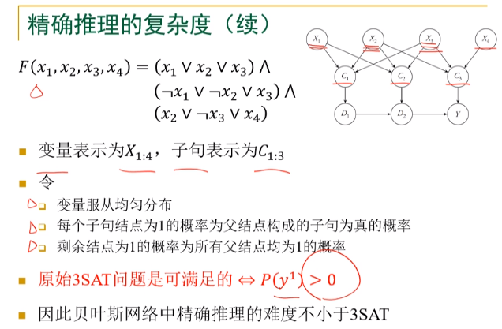

## 近似推理
+ 在单连通网络，即任意两个变量之间只有一条有向路径时，推理是可以在多项式时间解决的（不存在隐变量嵌套，只需沿着推理链顺次计算条件概率乘积即可）
+ 但是，在**大规模多连通网络**中的精确推理是不实际的，因为精确推理的时空复杂度都有可能达到指数量级(因为存在隐变量嵌套的情况)
+ 因此，我们有必要考虑一种近似推理算法，通过随机采样等手段来生成对查询变量分布的估计
+ **某种程度上，近似推理也可以被看作一种似然。我们通过对贝叶斯网络进行采样生成对条件概率的估计。因此，我们的估计需要满足一致性。**
+ 下面的例子中，均假设要计算条件概率$P(b|d, c)$

### 直接采样法

+ 从联合分布$\mathbf{Pr}(B, S, E, D, C)$中采样$N$个样本，然后采用下面的式子估计
  + $P(b|d, c) \approx \frac{\sum_i(b^{(i)}=1\land d^{(i)}=1\land c^{(i)}=1)}{\sum_i(d^{(i)}=1\land c^{(i)}=1)}$
  + 其中$b^{(i)}, s^{(i)}, e^{(i)}, d^{(i)}, c^{(i)}$是第$i$个样本
+ 采样方法
  + 首先对贝叶斯网络进行拓扑排序
    + 由于贝叶斯网络是DAG，因此只需在DAG上运行一次DFS，记录结束时间便可得到Topological Sort
    + 在每个变量上进行采样，实际上就是在对条件分布进行采样

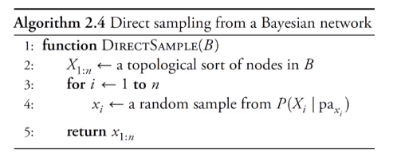
+ **然而，直接采样法浪费了很多时间用于产生与观察不一致的样本**

### 似然加权法
+ 设证据变量为$\mathbf{e}$(已确定)，其余变量为$\mathbf{Z}$
+ 与直接采样法不同，似然加权法直接固定证据变量$\mathbf{e}$的取值，然后对联合分布$\mathbf{Pr}(\mathbf{Z,e})$进行采样，采样步骤同上
+ 然而，这样一种采样分布$S_{WS}(\mathbf{z}, \mathbf{e})$与联合分布$P(\mathbf{z}, \mathbf{e})$并不相同。**因为当我们将证据$\mathbf{e}$固定时，我们忽视了$\mathbf{e}$在不同父变量取值组合下出现的概率的不同。**
+ 因此对于每个样本$S_{WS}(\mathbf{z}, \mathbf{e})$，赋予**权值**$w(\mathbf{z}, \mathbf{e})=\prod_{i=1}^mP(e_i|parents(E_i))$。证据出现概率越小的样本，权重越低。
+ 估计公式相应变成$P(b|d, c) \approx \frac{\sum_iw_i\cdot(\mathbf{Z}=\mathbf{z^{(i)}, \mathbf{E}=e^{(i)}})}{\sum_iw_i\cdot(\mathbf{E}=\mathbf{e})}$

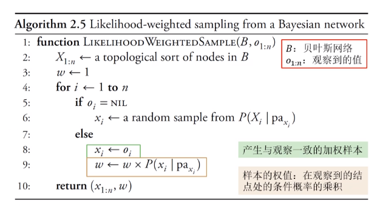
+ **然而，当证据变量出现位置靠后时，大量的非证据变量会因为没有父节点证据和祖先证据的指导而随机生成样本，导致采样生成的样本被相似度低的样本主导**
+ **同时，如果某一变量处的条件分布不均衡，或者证据变量数目过多，那么在大权重、概率低的样本出现前，估计将被小权重、概率大的样本主导**

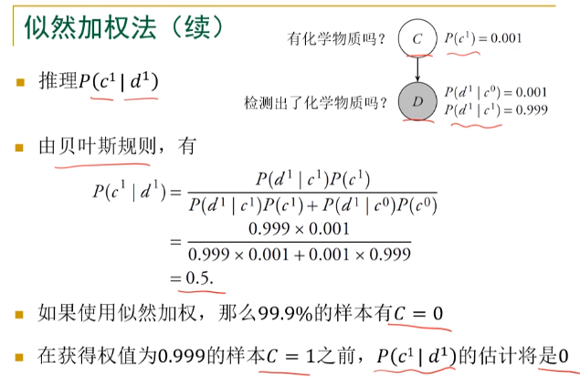

### 马尔科夫链蒙特卡洛 MCMC
+ 概率模型中最常用的采样技术
+ 构造一条马尔科夫链，使其收敛至稳态分布，这个稳态分布即为待估计参数的后验分布
+ 通过该马尔科夫链来随机产生符合后验分布的样本，并基于这些样本进行估计
+ 不同的MCMC采样方法决定了马尔科夫的转移概率构造方法的不同

#### Gibbs采样
+ 固定证据变量，从任意样本出发，对非证据变量逐个进行采样改变其取值，生成一个样本

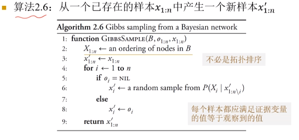
+ 在上面的算法中，一开始需要将证据变量初始化
+ 循环执行上述算法即可得到一条马尔科夫链，每执行一次得到一个节点
+ 对这条马尔科夫链中的所有状态进行计数，正则化即可得到需要求的条件分布$\mathbf{Pr}(\mathbf{Z}|\mathbf{e})$

+ 下面说明在算法第6行中，如何在已知其他变量取值情况下对变量$X_i$进行采样，提供两个算法：
  + 由于一个变量与不在它的马尔科夫毯中的其他变量相互独立，因此$\mathbf{Pr}(X_i|x'_{1:n\backslash i})=\mathbf{Pr}(X_i|markov(X_i))\propto \mathbf{Pr}(X_i|parent(X_i))\cdot \prod_{y:\ y\in children(X_i)} \mathbf{Pr}(y|parent(y))$
  + 或者使用因子相乘算法，将含有$X_i$的表格相乘，移除与$parent(X_i)$不一致的行，最后normalize表格。本质上和第一种方法是一样的。  
    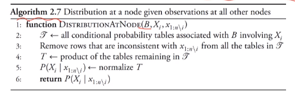
  + ***顺带一提，因子相乘是很厉害的一种思想***。 **贝叶斯网络结构保证了因子相乘在语义上不会出问题，而最终得到的因子语义是联合概率还是条件概率则取决于贝叶斯网络的具体结构。同时，只要经过一步正则化，因子就能称为真正的概率分布！**
+ 对Gibbs算法性能的讨论
  + 虽然看上去Gibbs算法仍然需要计算条件概率分布，和精确推理相似，但性能上还是有所提高的
  + 因为每次Gibbs-ask生成一个样本我们只需对所有非证据变量$X_i$计算一次它的条件概率分布。而这个条件概率分布牵扯到它的马尔科夫毯变量，并且这些变量都是给定取值的。因此，如果一个变量的马尔科夫毯变量数目小于常数c，则产生一个样本所需时间为$O(cn)$
  + 而精确推理中，如果是单连通贝叶斯网络（意味着没有隐变量嵌套），时间为$O(n)$; 而在多连通贝叶斯网络中，假设每个变量有至多$d$种取值，则时间为$O(d^n)$

### 近似推理方法对比
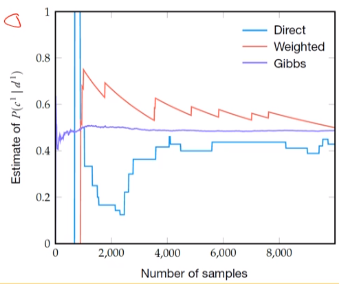
+ 直接采样法性能很差
+ 似然加权法会出现一个一个峰值，这些峰值即为化学物质检测网络中出现$C=1$的样本时的情况
+ Gibbs采样收敛最快
