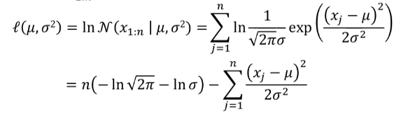
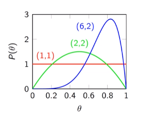
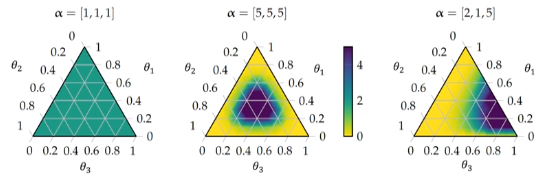
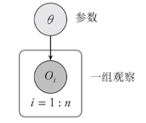
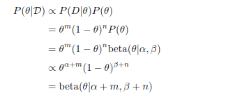
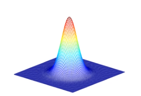
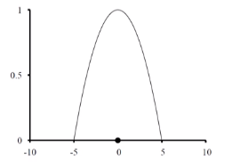

# 参数学习
+ 在贝叶斯网络中，进行推理的前提是已知网络的结构和参数。
+ 但是模型和参数未知的前提下，我们需要从给定的样例中学习参数和模型结构

## 极大似然参数学习：离散模型
### 二项分布
+ 二项分布只有一个参数$\theta=P(C=1)$
+ 假设D是一个数据集，是对该二项分布的一个**抽样**
+ 则似然为$\hat{\theta}=\argmax_\theta P(D|\theta)=\argmax_\theta C_n^m\theta^m(1-\theta)^n=\argmax_\theta L(\theta)$, $L(\theta)$即为**似然函数**
+ 实际上我们经常最大化**对数似然函数**$\ln L(\theta)\propto m\ln \theta+(n-m)\ln(1-\theta)$，求梯度即可
+ (很多情况下)如果有对待学习参量的约束，那么可看作带约束优化问题，拉格朗日乘子法即可

## 极大似然参数学习：连续模型
### 高斯分布
$\mathcal{N}(x|\mu, \sigma^2)=\frac 1{\sqrt{2\pi}\sigma}\exp(-\frac{(x-\mu)^2}{2\sigma^2})$
+ 则对数似然为  
  
+ 极大似然估计为
  $\hat{\mu}=\frac 1n\sum_{j=1}^nx_j$
  $\hat{\sigma}^2=\frac 1n\sum_{j=1}^n(x_j-\hat{\mu})^2$

### 线性高斯模型
$P(x|y) = \mathcal{N}(x|my+b, \sigma^2)$
+ 此时参数学习即为从数据集$(y_{1:n}, x_{1:n})$中学习参数$m, b, \sigma$

## 贝叶斯参数学习
+ 贝叶斯学习
  + 给定数据，计算每个假说的概率，用**所有假说**预测，而**不是使用单个表现最好的假说**（对概率取期望进行积分）
  + 把学习规约于概率推理
  + **不仅能利用我们对参数已有的先验知识（先验分布），同时能利用观测到的数据集对参数进一步估计（后验分布）**
+ 极大后验学习（Maximum A Posteriori）
  + 可考虑一个有限的假设空间$\mathcal{H}=\{h_1, h_2, ..., h_n\}$，其中各个假说出现的先验概率可能不一样  
  计算后验概率$P(h_i|D)=\frac {P(D|h_i)P(h_i)}{P(D)}$，选择最大的假说$h^*$作为对参数的学习
  + 基于**单个最可能假说**做预测
  + 当**假说先验均匀分布**时，规约为一个极大似然假说
  + 更容易，无需解决一个大规模求和/积分问题
+ 二者都能够**同时考虑到参数的先验分布和后验分布**，但是区别在于它们对待先验分布的方式：贝叶斯学习将**先验分布中的所有可能综合起来，最终给出的是参数的*概率分布***；而极大后验学习是在**计算$P(h_i|D)$的过程中利用了先验分布，而后直接选择最大的假设作为对参数的学习**

### $\Gamma$函数
$\Gamma(x) = \int_0^{+\infty}t^{x-1}e^{-t}\mathrm{d}t, (x>0)$

$\Gamma(x)=2\int_0^{+\infty}t^{2x-1}e^{-t^2}\mathrm{d}t$
+ Gamma函数是阶乘在实数域的广义形式
+ **性质**
  + $\Gamma(n)=(n-1)!\ \ \ \ \ n\in N^+$
  + $\Gamma(x+1) = x\Gamma(x)$
  + $\Gamma(1)=1, \Gamma(\frac 12)=\sqrt{\pi}$
  + **Stirling公式**：$\Gamma(x)\sim \sqrt{2\pi}e^{-x}x^{x-\frac 12}$

### Beta分布
如果变量$\theta$满足$f(\theta|\alpha, \beta)=\frac {\theta^{\alpha-1}(1-\theta)^{\beta-1}}{B(\alpha, \beta)}$，称$\theta$服从$\mathrm{Beta}(\alpha, \beta)$

+ 其中，$B(\alpha, \beta)$是一个归一化概率密度之和的函数
+ 积分可推出$B(\alpha, \beta)=\frac{\Gamma(\alpha+\beta)}{\Gamma(\alpha)\Gamma(\beta)}$
+ 期望$\mu=\frac {\alpha}{\alpha+\beta}$
+ 方差$\text{Var}(X)=\frac{\alpha\beta}{(\alpha+\beta)^2(\alpha+\beta+1)}$
+ Beta分布有一个很好的性质：**如果先验分布是Beta分布，那么后验分布依然是Beta分布**

### Dirichlet分布
+ Beta分布的广义形式
+ $dir(\theta_{1:n}|\alpha_{1:n})=\frac {\Gamma(\sum_{i=1}^n\alpha_i)}{\prod_{i=1}^n\Gamma(\alpha_i)}\prod_{i=1}^n\theta_i^{\alpha_i-1}$

### 二项分布中的贝叶斯学习

+ 假设需学习的参数为$\theta$，表示从状态转移到观察$O_i^1=True$的概率，可用于建模抛硬币的正面朝上的概率等。
+ 我们可根据一定的先验知识生成$\theta$的先验分布$\mathbf{Pr}(\Theta)$
  + 在二项分布问题中，先验分布可使用Beta分布，假设$\mathbf{\Theta}\sim \text{Beta}(\alpha, \beta)$.
  + 譬如如果是抛硬币问题，可假设$\mathbf{Pr}(\Theta)\sim \text{Beta}(1, 1)$
+ 设观测得到数据集$\mathcal{D}=\{o_1, o_2, ...\}$，设其中有$m$个正例，n个反例
+ 则有  
  
  + 最后一步为含有归一化步骤，因为给定数据集后$\theta$的条件概率之和为1
+ 因此在考虑数据集$\mathcal{D}$后，更新后的$\theta\sim \mathrm{Beta}(\alpha+m, \beta+n)$
+ *notation：事实上，Beta分布就是在先验为均匀分布的情况下如上定义出来的一种概率分布*

### 多项分布中的贝叶斯学习
+ 与二项分布类似
+ 首先给出先验$(\alpha_1, \alpha_2, ..., \alpha_n)$
+ 如果观测到的数据集为$(m_1, m_2, ..., m_n)$，则后验分布为$\text{Dir}(\theta_{1:n}|(\alpha+m)_{1:n})$

## 非参数化模型的密度估算
+ 参数化模型：用**固定数目**参数组成的集合概括数据的学习模型
  + 二项分布：1个独立的参数
  + 高斯分布：2个独立的参数
  + ......
+ 非参数化模型：不能用有限参数集合刻画的学习模型
  + 参数个数可随数据数量发生变化
  + 密度估算
    + KNN
    + 核函数

### KNN
+ 定义$NN(k, x_q)$为给定$x_q$，查找$k$个与$x_q$最接近的样本
+ 距离度量
  + Minkowski距离$L^p(x_j, x_q)=(\sum_i|x_{j, i}-x_{q, i}|^p)^{1/p}$
+ KNN分类
  + 略
+ KNN回归
  + 连接点方法，使用查询点左右的两个样本取均值
  + k-最近邻平均，$h(x_q)=\frac 1k\sum_{x\in NN(k, x_q)}x$
    + 对边界点的拟合较为糟糕
  + k-最近邻线性回归：寻找拟合$NN(k, x_q)$的最佳直线
+ **密度估算**：给定数据，估算查询点的概率密度

### 核函数
+ 通过一个非线性的变换，将输入空间映射到更高维的对称空间
+ 核函数一般是对称的，即$K(x)=K(-x)$
+ 球面高斯核
  + $K(\boldsymbol{x})=\frac 1{(\sigma^2\sqrt{2\pi})^d}\exp(-\frac{\boldsymbol{x}^2}{2\sigma^2})$
  + $\sigma$为核宽度，$d$为$\boldsymbol{x}的维度$
  
+ 二次核
  + $K(\boldsymbol{x})=\max(0, 1-(\frac {2|\boldsymbol{x}|}{k})^2)$
  
  + 限制了距离达到一定值后的影响为0

#### 球面高斯核的密度估算
+ 给定观察$\boldsymbol{o}_{1:n}$
+ 核密度估算表示的密度函数为$p(\boldsymbol{x})=\frac 1n \sum_{i=1}^nK(\boldsymbol{x}-\boldsymbol{o_i})$
  + 类似于根据数据集中每个样本对$\boldsymbol{x}$的影响（用核函数刻画）取平均