# 结构学习
+ **每个贝叶斯网络的结构都编码了一组条件独立假设**。从数据中学习结构，即为结构学习
+ **结构学习**：$\mathrm{maximize}\ P(G|D)$, 其中$D$是可获得的数据，$G$是图结构
+ 学习贝叶斯网络的结构是**NP-hard问题**
+ 一般步骤
  + 基于$P(G|D)$计算网络的贝叶斯得分
  + 在网络的解空间中寻找得分最高的贝叶斯网络

## 贝叶斯网络的贝叶斯得分
+ 问题描述与假设
  + 假设贝叶斯网络有$X_{1:n}$这n个变量，均为离散型变量
  + $r_i$：$X_i$的实例数
  + $q_i$：$X_i$的父节点的实例(即对$X_i$所有的父节点的一组赋值)数。若没有父节点，则$q_i=1$
  + $\pi_{ij}$：$X_i$的父节点的第$j$个实例
  + $\theta_{ijk}$：$P(X_i=k|\pi_{ij})$
  + $\boldsymbol{\theta}$：贝叶斯网络中所有参数的集合
  + $m_{ijk}$：在数据集$D$中，给定$\pi_{ij}$，$X_i=k$出现的次数
+ 几个结论
  + 贝叶斯网络$X_{1:n}$中参数的个数：$\sum_{i=1}^nr_iq_i$
  + 独立参数个数：$\sum_{i=1}^n(r_i-1)q_i$

### 计算贝叶斯得分
+ 给定结构和参数取值，数据集的似然函数$P(D|\boldsymbol{\theta}, G)=\prod_{i=1}^n\prod_{j=1}^{q_i}\prod_{k=1}^{r_i}\theta_{ijk}^{m_{ijk}}$
+ 令$\boldsymbol{\theta}_{ij}=(\theta_{ij1}, ..., \theta_{ijr_i})$，则$P(\boldsymbol{\theta}|G)=\prod_{i=1}^n\prod_{j=1}^{q_i}P(\boldsymbol{\theta}_{ij})$
  + 进一步假设$\boldsymbol{\theta}_{ij}$的先验概率分布服从参数为$\alpha_{ij1}, ..., \alpha_{ijr_i}$的狄利克雷分布（TODO：怎么得到这个先验分布？基于什么先验知识？）：  
    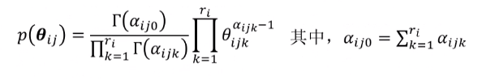
  + 从而有$P(\boldsymbol{\theta}|G)$满足  
    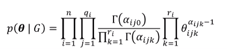
+ 因而有  
  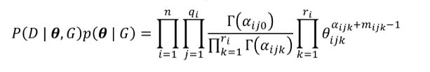  
  对$\boldsymbol{\theta}$进行积分  
  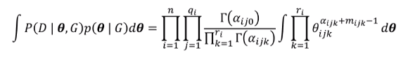
  将右侧看做参数是$a_{ijk}+m_{ijk}$的狄利克雷概率密度函数，最终得到  
  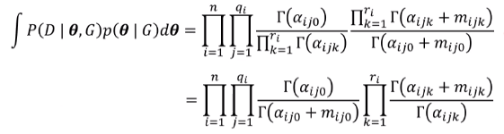
+ 最终再由贝叶斯规则和全概率法则
  $P(G|D)\propto P(G)P(D|G)=P(G)\int P(D|\boldsymbol{\theta}, G)P(\boldsymbol{\theta|G})\mathrm{d}\boldsymbol{\theta}$  
  得到  
  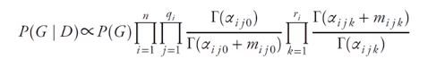
+ 定义**贝叶斯得分**：$\ln P(G|D)$  
  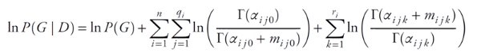

### 贝叶斯得分的属性
+ 可以看到，在确定模型结构后，贝叶斯得分对所有的参数组合项进行积分，因而最终的贝叶斯得分只与网络结构有关，而**贝叶斯得分中的先验项$\alpha$其实就是网络结构的体现**：与当前节点条件无关的变量的$\alpha$可被看做零。
+ 贝叶斯得分在模型复杂度和可获得数据之间合理均衡
+ 一个例子
  + 假设真实模型如下图所示，根据这个模型产生了数据集$D$  
    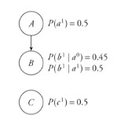
    + 四个独立参数
  + 提出完全连接模型和完全不连接模型  
    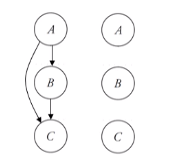
    + 完全连接模型有7个独立参数
    + 完全不连接模型有3个独立参数
  + 两种模型相对真实模型的贝叶斯得分随数据量大小的变化如图所示  
    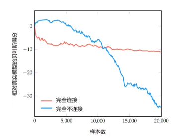

## 有向图搜索

### 贝叶斯网络结构的数量
+ 当网络中有n个节点时，不同的有向无环图有$G(n)=\sum_{k=1}^n(-1)^{k+1}C_n^k2^{k(n-k)}G(n-k)$个
+ 呈现超指数级增长

### K2搜索算法
+ 多项式时间，不能保证找到全局最优结构
+ 从没有有向边的图开始，根据一个假定好的节点顺序进行迭代，每次根据得分变化给一个节点不停添加父节点
  
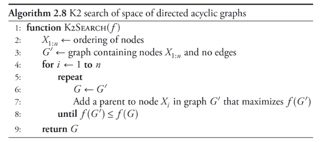

### 局部搜索算法
+ 从一个初始图开始，向得分最高的邻居移动

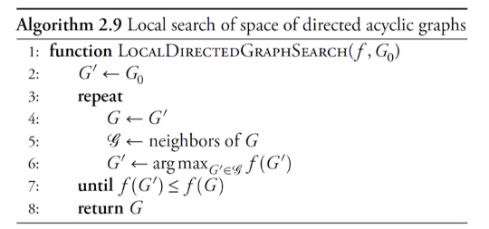

+ **邻居**：一个有向图的邻居由与改图相差一个基本图操作的图构成。其中图操作包含
  + 如果A，B之间没有边，则加入A->B
  + 如果A->B，则移除该边
  + 如果A->B，则改变边的方向得到A<-B
  + 前提是这些操作不会给图引入环
+ **评价**
  + 局部搜索算法会陷入到局部最优解中
+ **解决局部最优的方法**
  + **随机重启**
    + 一旦找到局部最优，简单重置为搜索空间中的随机点
  + **模拟退火**
    + 允许以某种随机探索策略向值比当前点低的方向搜索，但随着搜索的进行，允许的可能性逐渐降低
  + **禁忌搜索**
    + 维护一张禁忌表，存储最近使用过的操作，并且在每一步时都不考虑使最近所用操作的效果产生反转的操作。（不会违背最近采取的操作）
  + **遗传算法**  
    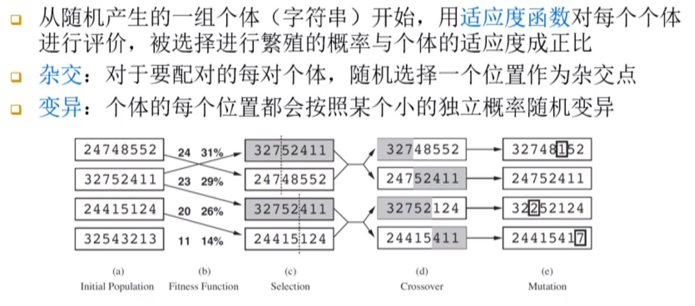
  + **文化基因算法**
    + 又称遗传局部搜索，把遗传算法和局部搜索结合

## 部分有向图搜索

### 马尔科夫等价
+ 如果两张图编码了同一组条件独立假设，则这两张图**马尔科夫等价**
  + 如下图，条件独立假设集合均为空集，它们的区别只是在于条件概率的值不同  
  
+ **判定**
  + 两张图是马尔科夫等价的当且仅当它们有
    + 相同的边（不考虑方向）
    + 以及相同的V型结构

### 马尔科夫等价类
+ 马尔科夫等价类：由所有彼此马尔科夫等价的有向无环图构成的集合
+ 贝尔斯网络先验与等价类得分的关系
  + 通常采用贝叶斯得分作为得分函数
  + BDe先验
    + 假设先验是参数为$\alpha_{ijk}$的狄利克雷分布，且对于所有节点$X_i$有$\chi=\sum_{j}\sum_{k}\alpha_{ijk}$为常数，则马尔科夫等价的两个图有相同的贝叶斯得分
  + BDeu先验
    + 在BDe先验的基础上，要求$\alpha_{ijk}=\frac \chi{q_ir_i}$
  + 均匀先验
    + $\alpha_{ijk}\equiv 1$，此时马尔科夫等价的两个图的贝叶斯得分不见得相同
  + 如果一个得分函数会给相同等价类中的所有结构相同的得分，则称该函数为**得分等价的**

### 部分有向图
+ 可以把一个马尔科夫等价类表示为部分有向图
  + 其中只保留V型结构的有向边，其余结构均移除边的指向  
  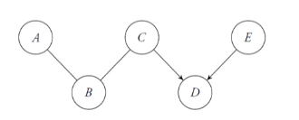
+ 一个有向无环图$G$是用部分有向图$G'$编码的马尔科夫等价类成员当且仅当
  + $G,G'$有相同的边（不考虑方向）
  + $G,G'$有相同的V型结构
  + trivial，根据马尔科夫等价即可自然推出该结论

### 部分有向图搜索
+ 在**马尔科夫等价类空间**中搜索，而不是在所有有向无环图的空间中搜索
+ 任何有向图的搜索方法都可以用于部分有向图搜索
+ 如果需要计算一个马尔科夫等价类的得分，则可以将部分有向图**在不引入新的V型结构**的前提下实例化为一个有向无环图，用有向无环图的得分代表等价类的得分
+ **部分有向图的邻居**
  + 如果A B之间没有边，加入A-B或A->B
  + 如果A-B或A->B，移除它们之间的边
  + 如果A->B，则改变边的方向得到A<-B
  + 如果A-B-C，则加入A->B<-C
