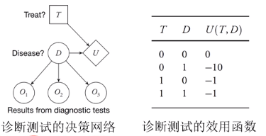

# 决策网络
+ **决策网络（影响图）**：由贝叶斯网络+行动和效用构成
+ 三种节点
  + 机会节点（椭圆）：随机变量
  + 决策节点（矩形）：在该节点上决策制定者有一个对行动的选择
  + 效用节点（菱形）：Agent的效用函数  
  
+ 三种有向边
  + 条件边：指向机会节点，表明机会节点的不确定性依赖于其父节点的值
  + 信息边：指向决策节点，表明该节点的决策由其父节点提供的信息决定
  + 功能边：指向效用节点，表明效用节点由其父节点的取值决定
+ 把决策问题表示为决策网络，然后利用网络结构计算基于效用函数的最优决策

## 评价决策网络
+ 给定观察$o$，采取行动$a$的期望效用为
  + $E U(a | o)=\sum_{s^{\prime}} P\left(s^{\prime} | a, o\right) U\left(s^{\prime}\right)$
  + 其中$s'$是决策网络中的任意机会节点，而$o$是给定的证据节点
+ 一个例子：计算治疗疾病的期望效用  
  
  + 假设给定第一次诊断结果$o_1^1$
  + 有$EU(t^1|o_1^1)=\sum_{o^3}\sum_{o_2}\sum_{d}P(d, o_2, o_3|t^1, o_1^1)U(t^1, d, o_1^1, o_2, o_3)$
  + 由于效用节点只和$t, d$有关，再根据条件独立性可得
  + $EU(t^1|o^1)=\sum_{o^3}P(o_3|d)\sum_{o_2}P(o_2|d)\sum_{d}P(d|t^1, o_1^1)U(t^1, d)=\sum_{d}P(d|t^1, o_1^1)U(t^1, d)$
  + 同样可计算$EU(t^0|o_1^1)$，与$EU(t^1|o_1^1)$比较即可得到最佳行动

## 评价决策网络的算法
+ 把观察到的机会节点实例化为证据
+ 对决策节点的每个值
  + 把决策节点设为该值
  + 对效用节点的父节点，使用概率推理算法计算后验概率
  + 为该行动计算结果效用
+ 返回最高效用的行动
+ **改进**：如果行动节点和机会节点在决策网络中没有由边定义的子节点，则可将它们移除
