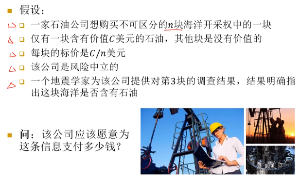
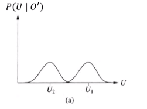
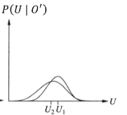
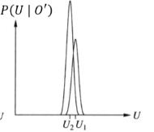

# 信息价值

+ 给定信息的价值：获取该信息之后和之前的最优行动的期望价值之间的差

## 信息价值理论
+ 涉及到在决策节点进行决策之前，使Agent要去获取什么信息
+ 涉及序贯决策的一种简化形式，即观察行动只影响Agent的**信念状态**，而不是外在的物理状态

## 一个实例
> 

+ 分情况来讨论
  + 如果以$\frac 1 n$的概率指出第三块海洋含有石油，则获利$\frac{(n-1)C}n$
  + 如果以$\frac {n-1}n$指出不含石油，则期望获利变成$\frac{C}{n-1}-\frac{C}{n}=\frac{C}{n(n-1)}$
+ 综合上述讨论，可以发现获得这条信息之后期望利润变为$\frac Cn$，因此公司至多愿意支付这么多

## 信息价值的通用公式
+ $EU^*(\boldsymbol{o})$: 给定一组观察$ \boldsymbol{o} $，最优行动对应的期望效用，即$EU^*(\boldsymbol{o})=\max_{a} \sum_{\boldsymbol{s'}}P(\boldsymbol{s'}|a, \boldsymbol{o})U(\boldsymbol{s'})$，这里$ \boldsymbol{s'} $为给定观察$ \boldsymbol{o} $并**采取行动$a$后**其他机会节点的状态向量
+ 给定一组观察$ \boldsymbol{o} $，观察到变量$O'$的期望价值为  
  $\operatorname{VOI}\left(O^{\prime} | \boldsymbol{o}\right)=\left(\sum_{\boldsymbol{o}^{\prime}} P\left(o^{\prime} | \boldsymbol{o}\right) E U^{*}\left(\boldsymbol{o}, o^{\prime}\right)\right)-E U^{*}(\boldsymbol{o})$
+ 只有在$O'$的观察会导致不同的最优决策时，$VOI(O'|\boldsymbol{o})$才会大于0。换言之，只有$O'$和决策相关时才有观察的必要。

## 信息价值的三种一般情况
+ 问题描述
  + 考虑两个行动$a_1, a_2$，当前的期望效用为$U_1',U_2'$
  + 信息$O'=o'$将为行动带来新的期望效用$U_1',U_2'$
+ 三种一般情况: (横轴描述了效用的可能的分布范围)
  + $a_1$几乎肯定的一直好于$a_2$，因此不需要信息  
  
  + 选择并不清楚，但是信息至关重要  
  
  + 选择也不清楚，但因为$a_1$和$a_2$的效用没有多少差别，所以信息价值小  
  

## 信息价值的属性
+ **【Thm】: 信息的期望价值是非负的**
  $VOI(O_j|\boldsymbol{o})\geq 0\ \ \forall \boldsymbol{o}, O_j $
+ 信息价值是不可叠加的，因为观察变量之间可能存在相互决定、依赖或排斥的关系
  $VOI(O_i, O_j|\boldsymbol{o})\not = VOI(O_i|\boldsymbol{o})+VOI(O_j|\boldsymbol{o})$
+ 信息价值是独立于次序的
  $VOI(O_i, O_j|\boldsymbol{o})=VOI(O_i|\boldsymbol{o})+VOI(O_j|O_i,\boldsymbol{o})=VOI(O_j|\boldsymbol{o})+VOI(O_i|O_j,\boldsymbol{o})$

## 信息价值的成本
+ 获得一个变量的观察是需要成本的，因此选择测试方案时，既要考虑信息价值，也要考虑成本

## 信息收集Agent
1. 把观察到的机会节点实例化为证据变量
2. 计算未观察变量的信息价值和成本
3. 选择价值和成本之差最大的未观察变量为下一个观察
4. while 所选观察的信息价值与成本之差大于0，重复执行 1~3
5. 用评价决策网络的算法选择最优行动
+ 由于信息价值的不可叠加性，这里的**贪心**选择方法得到的观察序列不一定是最优观察序列