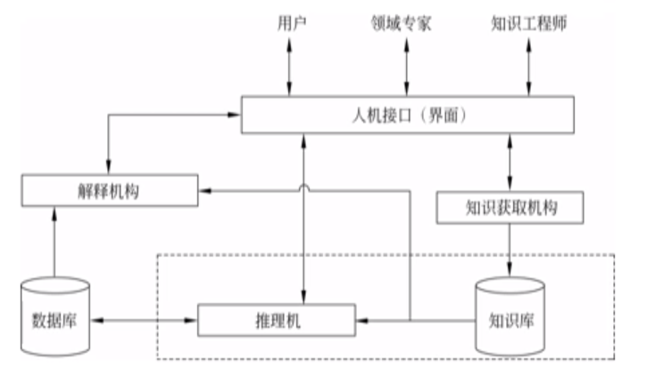

# 专家系统

## 专家系统概述
+ 一类具有专门知识与经验的计算机智能程序系统
+ 模拟人类专家解决领域问题的能力
+ 结构
  + 知识库 + 推理引擎
+ 要素
  + 某个应用领域的专家知识（知识库）
  + 模拟专家的思维（推理模式）
  + 达到专家的解题水平（推理能力）

### 专家系统特点
+ 启发性：专家系统能运用专家的知识与经验进行推理、判断
+ 透明性/可解释性：能解释本身的推理过程
+ 灵活性：能不断增长知识，修改原有知识，知识库中的知识与推理引擎相互独立

### 专家系统类型
+ 解释型专家系统：对已有信息和数据的分析与解释，决定它们的含义
+ 预测型专家系统：通过对过去和现在已知状况的分析，推断未来的情况
+ 诊断型专家系统：根据观察到的情况推断某个对象功能失常的原因
+ 设计型专家系统：根据设计要求，求出满足设计问题约束的目标配置
+ 规划型专家系统：寻找某个能达到目标的动作序列或步骤
+ 监视型专家系统：不断观察系统行为，并把观察与应有的行为比较，达到预警的功能
+ 控制型专家系统：自适应地管理一个受控对象或客体的全面行为
+ 教学型专家系统：根据学生的特点、弱点和基础知识，以最适合的教案和教学方法对学生进行教学
+ 决策型专家系统：引入决策网络，推荐能反映出Agent偏好和可得到证据的最优决策

## 专家系统的结构
+ 知识库
  + 问题求解所需要的领域知识集合
+ 推理引擎
  + 问题求解的核心执行机构
+ 数据库
  + 反映当前问题求解状态的集合，存放中间运算过程（推理出的结果）和初始条件，可能对解释机构的解释过程有帮助
+ 知识获取机构
  + 负责建立、修改、扩充知识库，执行Knowledge Acquisition操作
+ 解释机构
  + 对求解过程进行解释，回答用户的提问
  + 记录得到问题的解的过程中使用的Axioms，以序号标定
+ 人机接口

## 决策专家系统
+ 决策专家系统给出的决策同时考虑**概率**和**效用**
  + 在癌症检测专家系统中，尽管癌症的概率为5%，但是一旦得了癌症却未能提示，后果将是灾难性的。换言之，检测出癌症的效用更高。
+ 决策专家系统：决策网络
  + 贝叶斯网络
    + 从证据产生可靠推理
  + 效用、行动
    + 反映Agent偏好（效用函数）
    + 推荐最优决策
  + 同时考虑似然性和重要性

### 创建决策专家系统
+ **识别可能的行动的空间**
  + 避碰系统：爬升/下降/什么都不做
+ **识别与问题相关的观察到的和未观察到的变量**
+ **识别机会节点和决策节点之间的关系**
  + 专家判断，结构学习
+ **选择用于表示条件概率分布的模型**
  + 选用适合的模型对参数建模，然后使用参数学习方法学习参数
+ **加入效用节点，添加功能边，连接与效用节点关联的机会节点和决策节点**
  + 人类专家判断
  + 调参方法，使得决策网络的最优决策与专家决策一致
+ **由人类专家进行验证和精化**
  + 检查决策网络是否与人类专家的决策一致
  + 执行敏感性分析，检查最优决策对参数和效用的微小变化是否敏感
    + 若是，则应当收集更多更好的数据