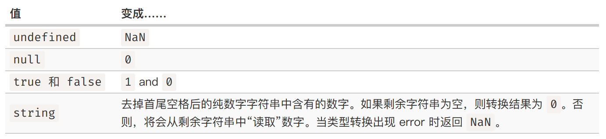

# JS语法

## 注释
注释的语法和C语言完全一致，`//`为单行注释，`/* .. */`为多行注释

## 变量
### 声明变量
```javascript
let user = 'John'
  , age = 25
  , message = 'Hello';
```
+ 一个变量只能被声明一次
+ 在不开启严格模式时，可以在不let一个变量的前提下直接对变量进行复制。但是开启严格模式后，这种行为将出错

## 常量
```javascript
const myBirthDay = '00.05.31'
```

## 数据类型
+ J是一种动态类型语言，虽然编程语言中有不同的数据类型，但是定义的变量不会在被定义后被限制为某一数据类型

### Number
+ 支持的运算：加减乘除
+ 除了常规数字还有：`Infinity`和`NaN`
  + `NaN`是一个不正确或者未定义的数学操作所得到的结果

### BigInt
+ Number类型的范围：$-(2^{53}-1)\sim (2^{53}-1)$
+ 在整数字段末尾添加`n`可以创建`BigInt`值

### String
+ 包裹在引号中
  + 单引号和双引号都是简单引用
  + 反引号是功能扩展引号，可以在其中计算表达式/变量的值以嵌入字符串中
```javascript
let name = 'John'; 
console.log(`Hello, ${name}!`); 
```

### Boolean
```javascript
let nameFieldChecked = true // or false
let is Greater = 4>1
```

### 'null'
+ `null`值不属于上面任何一种类型，在JS中表示对一个不存在的对象的引用或指针

### 'undefined'
+ 'undefined'也不属于上面任何一种类型，在一个变量已经被声明但未赋值时，它的值即为`undefined`

### object and sumbol
+ 之前的数据类型都是原始类型，object则为用于存储数据集合和更复杂的实体的数据类型
+ symbol用于创建对象的唯一标识符

## 简单数据类型的类型转换
+ 字符串转换
```javascript
let value = 3
console.log(typeof(String(value)))
```
+ 数字型转换
  + **在算术表达式中，会自动进行number类型转换，除非是加法运算符+。因为+会优先被解释为字符串拼接**
  ```javascript
  alert("6" / "2")
  ```
  + 各种类型的转换规则如下  
  
+ 布尔型转换
  + 在逻辑运算或者显式调用Boolean强制类型转换时会发生
  + 转换规则为
    + 0、空字符串、null、undefined、NaN将变为false，其他为true

## IO
```javascript
alert("Hello, world!")
prompt(title, [default])
confirm(question)
```
+ 这些方法都是**模态**的，会暂停脚本的执行，不允许用户与该页面的其他部分进行交互，直到窗口被接触
+ 这些方法有几个限制
  + 互动窗口的确切位置由浏览器决定
  + 窗口的确切外观也取决于浏览器

---

## 基础运算

### 数值运算
+ 基础数学运算：`+ - * / % ** ++ --`
  + 对于`+`号，只要参与运算的任意一个运算元为字符串，则将会将其他运算元同样视作字符串进行字符串的拼接
  + 可见**Javascript是一种弱类型语言**
+ 作为单元运算符的`+`，会将非数字类型的值类型转化为数字类型
  ```javascript
  let apple = "2"
  let orangle = "3"
  console.log(apple+orangle) // "23"
  console.log(+apple + +orange) // 5
  ```
+ 赋值运算`=`和c一样，会返回赋的值作为返回值
+ 自增`++`/自减`--`操作符：只能作用于变量
+ 逗号`,`运算符用于处理多个表达式，但只有最后一个表达式的值会被返回
```javascript
let a = (1+2, 3+4)
console.log(a)  // 7
```
  + 上面的式子中需要使用括号语法，因为**逗号的优先级非常低，不加括号会导致赋值运算先执行**。

### 比较运算
#### 不同类型之间的比较
在**对比不同类型的前提下**，操作数都首先被转化为**数字**再判断大小。
```javascript
alert( '2' > 1 ); // true，字符串 '2' 会被转化为数字 2
alert( '01' == 1 ); // true，字符串 '01' 会被转化为数字 1
alert( true == 1 ); // true
alert( false == 0 ); // true
```
```javascript
// 有时进行强制类型转换和不进行强制转换的结果是不一样的
let a = 0;
alert( Boolean(a) ); // false

let b = "0";
alert( Boolean(b) ); // true

alert(a == b); // true!
```
#### 严格判等
`===`操作符，不会进行任何类型转换，如果发现类型不一样直接返回false
```javascript
alert( 0 == false ); // true
alert( 0 === false ); // false

alert( '' == false ); // true
alert( '' === false ); // false
```

#### null和undefined的比较
+ **当使用严格判等`===`时**
  + 它们不相等，会返回false
+ **当使用`==`时**
  + `null == undefined`会返回true
  + `null`/`undefined`与其他任何值的等于比较都会返回false
+ **当使用`>= <= > <`比较时**
  + `null`会被转化为数字`0`，`undefined`会被转化为`NaN`
  + `NaN`与任何数字（甚至包括`NaN`）的对比（无论是等于/不等对比）都会返回false

#### 避免问题的方法
+ 对任何可能为`null`/`undefined`的变量，不要使用不等操作，而是在之前先判断它们是否为`null`/`undefined`。

## 流程控制语句

### 条件分支控制
+ `if (...) {...;} else if (...) {...;}  else (...)`语句：和C语言完全相同
+ 三目操作符`? : `与C语言中完全相同
  + JS中的三目操作符还可以执行命令
    ```javascript
    let company = prompt('Which company created JavaScript?', '');

    (company == 'Netscape') ?
      alert('Right!') : alert('Wrong.');
    ```
+ 逻辑操作符`&& ||`
  + 除了C语言中已经有的功能以外，逻辑操作符还有类似Bash中的特性
  ```javascript
  (x>0) && alert('Greater!')
  ```
  如果x不为正数，那么就不会执行`alert`。
+ 空值合并操作符`??`
  + `a ?? b`的含义是，如果`a`既不是`null`也不是`undefined`，则返回`a`，否则返回`b`；功能是为可能未定义的变量`a`提供默认值`b`
  + 类似`|| &&`，空值合并操作符也可以进行传递。看起来`??`与`||`的功能相近，但实际上`??`返回的是第一个**已被定义的值，包括false和0**，但是`||`返回的是第一个布尔逻辑为真的值。
+ `switch case`：基本语法与C语言中相同 ，但是JS中判定是否属于某个case使用的是严格判等`===`操作符
### 循环控制
```javascript
let i = 0
while (++i < 10) {
  console.log(i); 
}

i = 0
do {
  console.log(i); 
} while( ++i < 10)

for (i=0; ++i < 10; )
  console.log(i)
```
+ 上面是JS中用于循环流程控制的三种语法
+ 跳出循环可以使用`break`
+ 继续循环可以使用`continue`

循环标签与`break`：当使用标签标识循环时，可以使用`break label_name`直接跳出对应循环
```javascript
outer: for(let i=0; i<10; i++) {
  for (let j=0; j<3; j++) {
    let input = prompt(`Value at ${i}, ${j}:`, '');
    if (!input) break outer;
  }
}

alert('Done!')
```

## 函数
+ JS中的函数和C++中的函数基本完全相同，同时还有默认值
```javascript
function showMessage(text='Default Message') {
  if (text)
}
```
  return的值缺省时，返回的是`undefined`
+ JS中的函数

### 函数声明与函数表达式
```javascript
function f() {
  // ...
  return; 
}

let f = function() {
  // ...
  return; 
};

let f = () => undefined;

let f = () => {
  // ...
  return; 
};

```
+ JS中函数存在两种定义方式
  + 函数声明：此时函数的符号会直接释放到当前的代码块中（如果是全局的函数则为全局作用域），并且函数声明会立即创建这个函数
  + 后三种方式为函数表达式，函数的符号也会释放到当前的代码块中，但是只有在第一次使用到这个函数时才会创建这个函数

