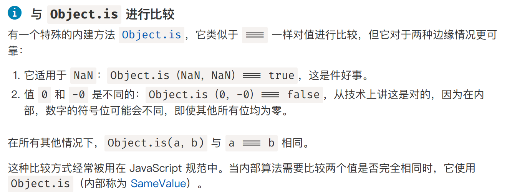
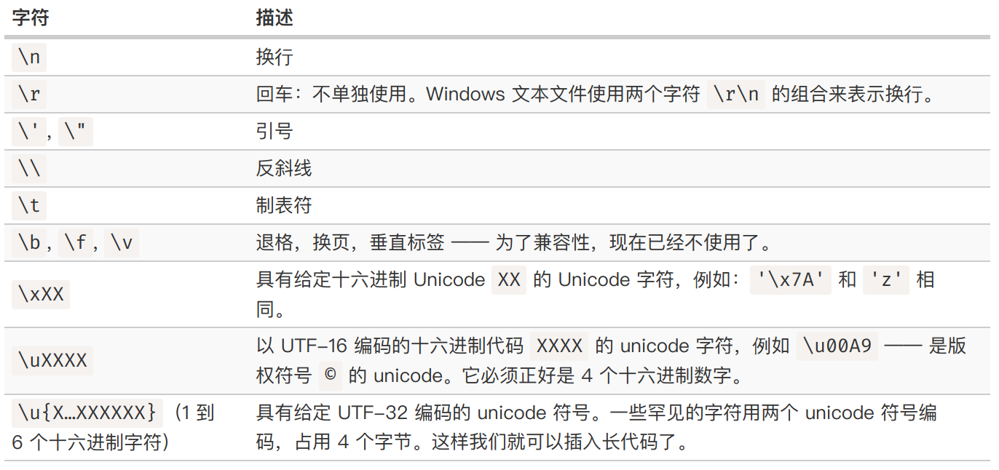

# JS数据类型
+ JS中总共有七种原始数据类型
  + `string, number, bigint, boolean, symbol, null, undefined`
  + 原始类型的意义在于，当对象之间需要进行运算时可以统一转换为原始类型进行运算
  + 因此，JS的原始类型必须尽可能的简单轻量
+ Object对象不是原始数据类型，比原始类型更重，需要额外的成本来维护

## 被当作对象的原始类型
+ 有的时候我们希望原始数据类型也能有一些“方法”，为此JS为原始数据类型实现了Object Wrapper，它们为`String, Number, Boolean, Symbol`
+ 比如，如果我们想要把一个字符串转为大写`str.toUpperCase()`，在这个过程中实际发生的情况为
  + JS为`str`创建一个包含字符串字面值的特殊对象，类型为`String`
  + 调用这个特殊对象的方法，比如`toUpperCase`
  + 打印方法返回的字面量
  + 特殊对象被销毁，只剩下原始类型`str`
+ **一般来讲，在JS中你可以使用`new String()`的方法显式创建对象包装器。不过这么做在JS中是不推荐的，除了在类型转换和创建时使用对象包装器外，不要显式使用对象包装器。**

## 数字类型
+ `isFinite`和`isNaN`可以检测一个给定的number是不是无穷/NaN
  + `Infinity`和`-Infinity`是一个特殊的数字，比任何给定的数值都大/小
  + `NaN`代表一个error
  + 如果给定的是`NaN`，那么`isFinite`的返回结果仍然是`False`。因此`isFinite`可以被用于检测结果是否为常规数字


+ `parseInt`和`parseFloat`：提供了一种比`+`号转换更加宽松的从字符串中解析数字的方式
  + 它们会从给定字符串的第一个字符位置开始读取数字，直到遇到非预期的字符位置。此时会发生error，然后返回之前收集到的数字
  ```javascript
  alert( parseInt('100px') )    // 100
  alert( parseFloat('12.5em') ) // 12.5
  alert( parseInt('12.3') )     // 12
  alert( parseFloat('12.3.4') ) // 12.3
  ```

## 字符串
+ 补充一些之前的文章中没有涉及的关于JS的知识点
+ 反引号除了允许嵌入`${}`字符之外，还允许字符串跨行
  ```javascript
  let guestList = `Guests:
  * John
  * Pete
  * Mary
  `; 
  ```
+ 特殊字符  

+ 字符串的方法和属性
  + `str.length`
  + `str.toLowerCase()/toUpperCase()`
  + `str[idx]`
  + `str.indexOf(substr, pos)`: 从给定的pos位置开始查找`substr`，没有找到返回`-1`，否则返回匹配成功的位置
    + 利用按位取反运算可以快速对子串匹配进行检测，因为只有`-1`的按位反是`0`
  + `str.lastIndexOf(substr, pos)`: 从字符串的末尾搜索到开头
  + `str.includes(substr, pos)`: 检测从`pos`位置开始的子串中是否包含`substr`，返回布尔值
  + `str.startsWith()`
  + `str.endsWith()`
  + `str.slice(start [, end])`: 获取切片，左闭右开
  + `str.substr(start [, length])`: 返回字符串从`start`开始的长度为`length`的那部分
  + `str.trims()`: 删除字符串前后空格

## 数组
+ 创建数组
```javascript
let arr = Array();
let arr = []; 
let arr = ['Apple', 'Orange', 'Plum']; 
```
  + 如果使用一个数字参数来创建数组，例如`new Array(2)`，则会创建一个长度为2，元素为`[undefined, undefined]`的数组
+ 索引元素
```javascript
alert(arr[2]); 
```
+ 方法和属性
  + `arr.length`: 获取数组长度
  + `arr.shift()`: 将`arr`视作队列，从队列开头取出元素
  + `arr.unshift()`: 在`arr`的开头位置插入元素
  + `arr.push()`: 将`arr`视作队列/栈，从队列/栈末尾加入元素
  + `arr.pop()`: 将`arr`视作栈，从栈末尾弹出元素6
  + `arr.splice(start [, deleteCount, elem1, elem2, ...])`: 可以完成数组元素的删除和添加操作
  + `arr.slice([start], [end])`: 返回数组从`start`到`end`的索引 
+ 要注意数组也是一种对象，支持添加新的属性
  ```javascript
  arr.age = 25
  ```
+ 遍历数组可以使用`for`循环
  ```javascript
  let fruits = ["Apple", "Orange", "Plum"]
  for (let fruit of fruits) {
    alert( fruit ); 
  }
  ```
  + 注意，`for in`语法会遍历一个对象的所有属性，如果对数组使用`for in`，则会遍历到很多例如`length`等不需要的属性

## 数组的其他方法
+ `arr.concat(arg1, arg2, ...)`: 将参数中的对象和arr拼接在一起形成新的数组返回。如果参数中的对象的`Symbol.isConcatSpreadable`属性为`true`，则该对象就会被当作数组进行处理。
  ```javascript
  ler arr = [1,2]; 
  let obj = {
    0: "Something", 
    1: "Else", 
    [Symbol.isConcatSpreadable]: true, 
    length: 3
  };
  console.log(arr.concat(obj))
  ```
+ `arr.forEach(function)`: 为数组的每一个元素都运行一个函数。默认情况下，`forEach`会向后面的函数最多传递三个参数`item, index, array`。该函数的结果会被抛弃和忽略
  ```javascript
  ["Bilbo", "Gandalf", "Nazgul"].forEach(
    (a) => console.log(a)
  )

  ["Bilbo", "Gandalf", "Nazgul"].forEach(
    (a, b, c) => console.log(`${a} is at index ${b} in ${c}.`)
  )
  ```
+ `arr.indexOf(item, from)`: 从from向右搜索item，返回第一个匹配的索引。若无匹配则返回-1
  + `arr.lastIndexOf(item, from)`: 逆序搜索
  + `arr.includes(item)`: 若找到则返回true
+ 根据条件筛选数组元素
  + `arr.find(function(item, index, array))`: 对每个元素作用这个函数，如果函数`function`返回true则最后返回这个元素并终止迭代，如果没有元素为true则最终返回undefined
  + `arr.findIndex(function(item, index, array))`: 返回找到的元素索引，未找到时返回-1
  + `arr.filter(function(item, index, array))`: 将数组中所有满足条件（function返回true）的元素筛选出来形成数组
+ 排序数组`arr.sort()`