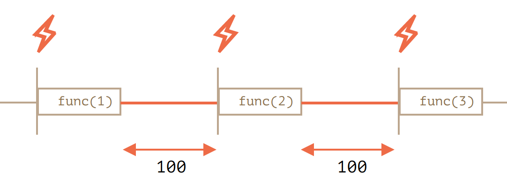
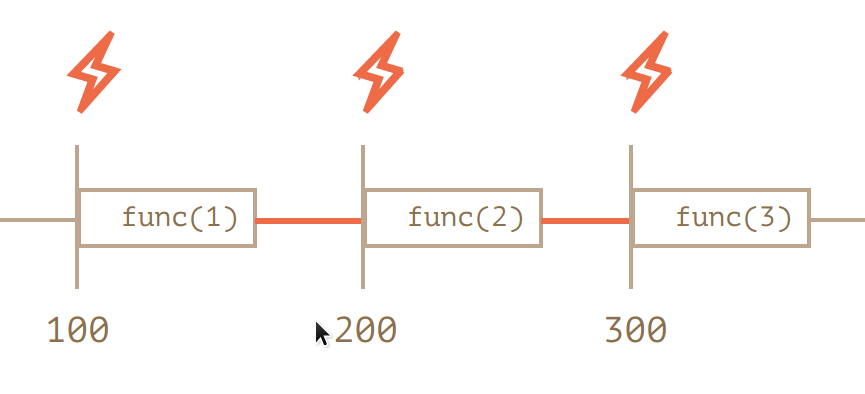

# 函数进阶
## Rest参数和Spread语法
+ **在JS中，无论函数是如何定义的，都可以使用任意数量的参数调用函数**

### Rest参数
+ Rest参数可以通过使用三个点`...`来收集所有的剩余参数
    ```javascript
    function sumAll(...args) {
        let sum = 0; 
        for (let arg of args) sum += arg;
        return sum;
    }

    console.log(sumAll(1))
    console.log(sumAll(1, 2))
    console.log(sumAll(1, 2, 3))
    ```
    Rest参数必须至于函数参数列表的末尾。

### arguments变量
+ Javascript内置了一个名为`arguments`的类数组变量，该变量包含所有提供给函数的参数
  ```javascript
  function showName() {
      console.log(arguments.length); 
      console.log(arguments[0]); 
      console.log(arguments[1]); 
  }
  showName("Julius", "Caesar"); 
  showName("Ilya");
  ```
  **箭头函数是没有`arguments`参数的，如果在箭头函数中访问`arguments`，访问到的是属于箭头函数外部的普通函数的`arguments`。**注意箭头函数中同样没有`this`指针，会被绑定为`undefined`

### Spread语法
+ 其实就是数组的解包，对可迭代对象使用`...`会将可迭代对象中的对象解包成多个对象
  ```javascript
  let arr = [3, 5, 1]; 
  console.log(Math.max(...arr));
  ```
  还可以使用Spread语法合并数组
  ```javascript
  let arr1 = [3, 5, 1]; 
  let arr2 = [8, 9, 15]; 
  let merged = [0, ...arr1, 2, ...arr2]; 
  console.log(merged)
  ```
+ 使用spread语法可以快速创建一个数组变量或对象的浅拷贝
  ```javascript
  let arr = [1, 2, 3]; 
  let arrCopy = [...arr]; 

  let obj = {a: 1, b: 2, c: 3}; 
  let objCopy = {...obj}
  ```

## 闭包
+ 关于变量作用域，JS和Python不同，内部作用域中定义的变量在外部一定是不可见的，而不像python，在for循环/if条件语句中定义的变量在外部仍然可见。
+ Lexical Environment
  + JS中，每个运行的函数、代码块`{...}`和整个脚本都有各自的词法环境，用于维护当前上下文中的关联对象
  + Lexical Environment由两部分组成：**环境记录**，存储所有局部变量作为其属性；**对外部词法环境的引用**，与外部代码相关联
  + 当代码要访问某一个变量时，首先会搜索内部词法环境，然后搜索外部环境，递归进行这一过程
  + 在函数被创建时，函数会具备名为`[[Environment]]`的隐藏属性，这个隐藏属性保存了对创建该函数的词法环境的引用。从而，在后续执行该函数的内部的代码时，会直接根据这个`[[Environment]]`属性创建一个新的Lexical Environment，并将这个Lexical Environment的outer引用指向这个被记住的环境
+ **So，what is closure？**
  + 闭包是指内部函数总是可以访问其所在的外部函数中声明的变量和参数，即使在其外部函数被返回（寿命终结）了之后。在某些编程语言中，这是不可能的，或者应该以特殊的方式编写函数来实现。但是如上所述，在 JavaScript 中，所有函数都是天生闭包的。
  + 因此，JS中的垃圾收集是和Lexical Environment相关的：即使闭包中的外层函数已经返回，由于返回的内层函数的`[[Environment]]`属性依然保存了对对外层函数的Lexical Environment的引用，因此外层函数中的词法环境并不会被销毁。
    ```javascript
    function f() {
    let value = 123;

    return function() {
      alert(value);
    }
    }

    let g = f(); // g.[[Environment]] 存储了对相应 f() 调用的词法环境的引用
    ```

## var关键字
+ `var`声明的变量没有块级作用域，要么在当前函数内可见，要么全局可见
+ `var`变量的声明在函数开头就会被处理，但是赋值不会
  ```javascript
  var phrase; // 声明
  var phrase = "John" // 既有声明也有赋值，其中声明会被提升，赋值要等到后面才会执行
  ```

## 全局对象
+ 全局对象提供在任何地方都可以使用的变量和函数，默认情况下这些全局变量内置于语言或环境中。在浏览其中，全局对象是`window`，Node.js中是`global`，但是现在的JavaScript标准使用`globalThis`作为全局对象的标准名称
+ 在浏览器或Node.js中，使用var声明的变量会被作为全局对象的属性。或者你也可以使用`globalThis.varName=value`的方式来声明一个全局对象的值
  ```javascript
  // 将当前用户信息全局化，以允许所有脚本访问它
  globalThis.currentUser = {
    name: "John"
  };

  // 代码中的另一个位置
  alert(currentUser.name);  // John

  // 或者，如果我们有一个名为 "currentUser" 的局部变量
  // 从 window 显式地获取它（这是安全的！）
  alert(globalThis.currentUser.name); // John
  ```
## 函数对象
+ 函数在JavaScript中也是一个对象，具有一些独有的方法和属性
  + `func.name`: 函数的名字，一般是由javascript自身根据实际情况赋予的函数的名字
  + `func.length`: 函数入口参数的个数，其中rest参数不计入数量
    + 例如在下面的例子中，根据question的回答会调用两种callback函数，其中没有参数的回调函数会直接被调用，另一种是具有一个入口参数的回调函数
    ```javascript
    function ask(question, ...handlers) {
      let isYes = confirm(question)l

      for (let handler of handlers) {
        if (handler.length == 0) {
          if (isYes) handler()
        } else {
          handler(isYes);
        }
      }
    }
    ```
+ 添加自定义属性
  ```javascript
  function example() {
    example.counter ++;
  }
  example.counter = 0;
  example();
  example();
  example();
  console.log(example.counter); // 3
  ```
  实际上用函数闭包更好，因为能实现变量的隔离，外部代码无法访问`example.counter`
+ Named Function Expression（函数命名表达式）
  + 在函数表达式中，有时需要加上函数名，以便在函数体内部进一步调用自身。
    ```javascript
    let sayHi = function func() {
      console.log(`Hi`);
      func();
    }

    console.log(sayHi)
    ```
    只有在函数内部`func`才是可使用的，在外部`func`这个字段无法使用。同时，注意这么做的话，函数`sayHi`的名字`sayHi.name`将为`func`，而如果我们不使用NFE，改用如下的经典定义的话，函数`sayHi`的名字为`sayHi`。
    ```javascript
    let sayHi = function () {
      console.log("Hi");
    }
    ```

## `setTimeout`和`setInterval`
+ `setTimeout`和`setInterval`分别可用于设置执行函数的延迟/周期。这里的延迟和周期都是指在当前脚本执行完之后开始计算的时延/周期
+ 相应地，`clearTimeout`和`clearInterval`函数可以取消原本设定的时延/周期函数
```javascript
let timerID = setTimeout(func|code, [delay], [arg1], [arg2], ...);
clearTimeout(timerID);

let timerID = setInterval(func|code, [delay], [arg1], [arg2], ...);
clearInterval(timerID);
```
+ 事实上，使用`setTimeout`也可以用于设置周期执行的函数
```javascript
let timerID = setTimeout(function tick() {
  console.log('tick');
  timerID = setTimeout(tick, 100)
}, 100)
```
  + 这个方式与之前`setInterval`的方式有所不同，这个方式是等待函数执行结束之后才开始计时的
  
  + 而`setInterval`则在调度之后立即开始计时，如果函数本身执行的时间超过了100ms，则将立即再次执行它
  
+ 零延时的`setTimeout`
  + 我们提到`setTimeout`是在当前脚本执行结束后才开始计算时间，因此可以使用零延时的`setTimeout`，来注册只有在当前脚本执行完成后才会执行的函数。
  
## 装饰器模式和转发

### 装饰器与call方法
+ 使用装饰器可以对函数进行快速封装
  + 装饰器是可以重用的，可以应用到另一个函数
  + 装饰器的代码是完全独立的，便于维护
  + 如果需要，可以快速封装多个装饰器
+ 使用装饰器的例子如下。为函数添加透明缓存
```javascript
function addDecoration (func) {
  let cache = new Map();
  return function(x) {
    if (cache.has(x)) {
      return cache.get(x);
    }
    let result = func(x);
    cache.set(x, result);
    return result;
  };
}
```
+ 但是在上面的例子中，如果需要被装饰的函数是一个方法，且方法中使用了`this`，那么上下文就会丢失
```javascript
let worker = {
  someMethod() {
    return 1;
  }, 
  slow(x) {
    console.log("Called with "+ x);
    return x*this.someMethod();
  }
};
```
  + 在上面的例子中，如果要对`worker.slow`方法进行装饰，那么中间`let result = func(x)`一处`func`并非以`obj.method`的方式被调用，因此会损失this信息，this变成undefined。为了避免这种情况，可以使用Javascript中所有的函数对象都具有的方法`Function.call(this, ...args)`为函数手动指定需要的上下文。
```javascript
function cachingDecorator(func) {
  let cache = new Map();
  return function(x) {
    if (cache.has(x)) {
      return cache.get(x);
    }
    let result = func.call(this, x); // 现在 "this" 被正确地传递了
    cache.set(x, result);
    return result;
  };
}
```
  + 我们的调用语句替换为`let result = func.call(this, x)`，即将当前的上下文this作为`func`的上下文。

### apply方法
+ apply方法与call方法的唯一不同就是call方法接收两个参数：第一个为上下文this，第二个参数为真正的参数数组
```javascript
func.call(this, ...arguments);
func.apply(this, arguments);
```

### 方法借用
+ 利用call/apply改变上下文的特性，我们可以借用一些已经实现好的方法，比如对于类数组对象和可迭代对象使用“只有数组对象才具有的方法`.join`”
```javascript
[].join.call(arguments)