# Prerequisites

## Satisfiability
for formula $A$
+ If $A$ is true in $I$, then $I$ satisfies $A$ and $I$ is **a model of** $A$, denoted by $I\models A$
+ $A$ is **satisfiable** iff there exists a model for $A$
+ $A$ is **unsatisfiable** iff $A$ is false in all interpretations
+ $A$ is **valid** or **tautology** iff $A$ is true in all interpretations. (denoted by $\models A$)
+ formula $A$ **entails** $B$, (denoted by $A\models B$), iff all models of $A$ are momdels of $B$
+ formual $A$ is **equivalent** to $B$, (denoted by $A\equiv B$) iff models of $A$ are the same as the models of $B$

#### Lemma
for formula $A$ and $B$
+ $A$ is valid iff $\neg A$ is unsatisfiable
+ $A$ is satisfiable iff $\neg A$ is not valid
+ $A$ is valid iff $A\equiv true$
+ $A\equiv B$ iff $A\leftrightarrow B$ is valid
+ 检测可满足性是NP问题
+ 检测有效性是co-NP问题

## Reasoning Methods
+ to prove validity/satisfiability

### Refutational Reasoning Method
**Idea**: no algorithms can directly decide A is valid or not, while there exsis algorithms that can easily decide $\neg A$ is unsatisfiable or not
+ **soundness**
  + 如果推理算法$RM$对公式集$\Phi$是正确的，则
    + 若$RM$判定$\Phi$的任意子集$S$为satisfiable，则该子集的确是satisfiable
    + 若$RM$判定$\Phi$的任意子集$S$为unsatisfiable，则该子集的确是unsatisfiable
    + 换言之，$RM$能得到和实际情况一致的结果
+ **completeness**
  + 如果推理算法$RM$对公式集$\Phi$的任意子集$S$是（拒绝意义上）完备的，则
    + 若$S$是unsatisfiable的，那么$RM(S)$一定能终止并且返回unsatisfiable

### Resolution
#### Normal Form
+ **literal**: atom $p$ or its negation $\neg p$
+ **Clause**: a disjuction of literals $L_1 \lor L_2...\lor L_n$, or $\{L_1, L_2,..., L_n\}$
+ **CNF**: conjunction of clauses
+ **CNF of a formula**: A formula $B$ is **a CNF of a formula** $A$ if $A\equiv B$ and $B$ is CNF
+ **原始公式的可满足性转换为Clauses的可满足性检测**

然而，将原始公式使用**基于规则**的方法转换为CNF范式可达到指数级复杂度，因此我们使用结构化的转换方法(Structual Tranformation).

#### Structual Transformation
+ [Thm]: $F[G]$ is *satisfiable* iff $F[n_G]\land (n_G\leftrightarrow G)$ is *satisfiable*
  + $n_G$ is a fresh propositional variable. (So $n_G$ can be seen as a name for $G$)
+ Introduce names recursively for every non-literal subformula in the original formula
+ Increasing the size by an additional **constant** factor
+ New formula is only *equiv-satisfiable* as the original formula, while **the model changes**!
+ 如下图，逐步裂开
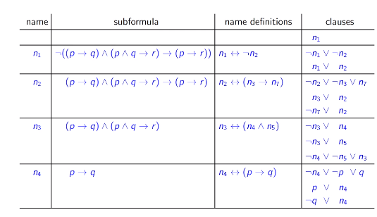
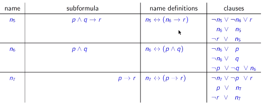

**与基于规则的转换方法的不同之处**
+ 基于规则的方法在model上保持一致，而Structual Transformation不确定model保持一致
+ 复杂度不同，一个是指数级，一个是线性的

#### Propositional Resolution
+ Propositional Resolution inference system $\mathbb{BR}$, consists of the following inference rules
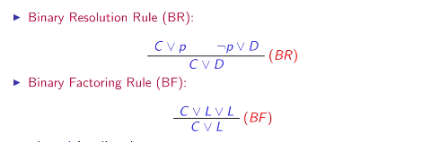
+ 想法
  + 证明原公式集不可满足
  + 在CNF情况下，如果需要找到一个model，则必须clauses同时为True
  + 通过上述两公理，不断进行消解直到最后，若得到False则推出矛盾
+ 例子如下，注意，根据老师的说法，这里的横线代表的是语义上的推导而非语法上的公理
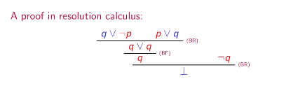

#### Soundness
+ An inference is sound if the conclusion of this inference logically follows from the premises
+ An inference rule is sound if all its inference are sound
+ An inference system is sound if all its inference rules are sound
+ **【Soundness】**: An inference system $\mathbb{I}$ is sound if for any set of formulas $S$ we have
$$S\vdash_{\mathbb{I}}\perp\ \  implies\ \ S\models \perp$$

#### Completeness
An inference system $\mathbb{I}$ is refutationally complete if for any set of formulas $S$ we have
$$S\models\perp \ \  implies \ \ S\vdash_{\mathbb{I}}\perp$$

#### Simplication rules
+ 化简律在饱和过程中将不影响正确性和完备性的子句去除
+ **【Tautology Elimination】(TE)**: $S\rightarrow S-{T}$
+ **【Subsumption Elimination】(SE)**: $S\rightarrow S-{D}$ where there is $C\in S$ such that $C\subset D$ (消去大的)
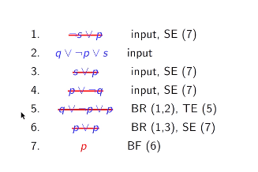

### DPLL
+ Rules
  + Unite Propagate
  + Decide
  + Backtrack
  + Unsat
  + Eager unit propagation
#### Unit Propagation
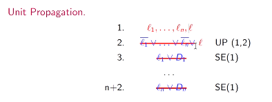
+ 首先要有unit
+ 实际上是对于已知的式子，将相反的式子直接划去
+ 如果不存在unit或需要的unit不够，则使用下面的Decide和Backtrace
+ Example
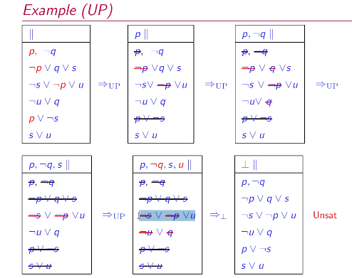
#### Horn Clauses
+ A clause is called Horn if it contains at most one positive literal
+ Unit Propagation is a polinomial-time decision procedure for the fragment of *Horn clauses*

#### Decide and Backtrance
+ 假设某个unit为1/0 （Decide）
+ 如果Decide结果后推出False，则Backtrace假设为相反量
+ 类似于树搜索，decide是在原来的公式集$S$上增加了条件

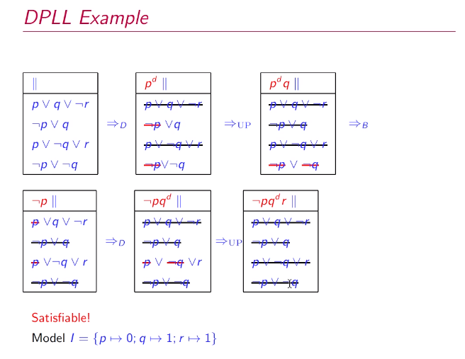

#### DPLL Backjump
+ 太多的Decide literal会导致回溯搜索时的效率太低
+ DPLL Backjump的思想就是根据回溯前得到的无法被满足的式子，分析其中literal之间的相互决定关系，然后回溯到第一个产生矛盾的变量处，这样可以一次跨越多个decide literal层级
+ 在这里给出一个形而上的例子

首先，只有我们随机选择进行决定的literal才是decide literal，而根据decide literal的取值为了满足某公式为真而被决定的赋值并不是decide literal，它们只是与decide literal有依赖关系。因此在书写决定顺序时我们可以顺便记录下这种依赖关系(方括号内内容)
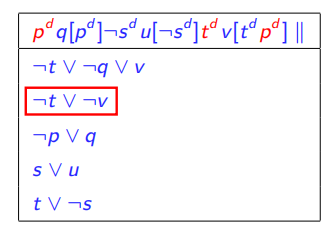
按照如上决定顺序进行决定，则最终会发现$\neg t\lor\neg v$推导出$\bot$

分析可知，$\neg t$和$\neg v$中起到作用的decide literal有$p$和$t$
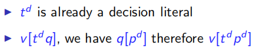
由于decideliteral可以被视作在原公式集$S$上添加了新的原子公式，可以看作
$S\land p\land t\models \bot$
即
$S\land p\models \neg t$
因此,在$p$被决定为真的情况下$t$只能被决定为假，backjump回去变成$\neg t[p^d]$即可
#### Lemma Learning
+ 或者，我们也可以将decide literal之间的相互决定关系通过公式表达出来，backjump然后重新计算

---

## First-order Logic
+ extension of propositional logic, with **quantifiation** over individuals
+ very, very expressive

一阶逻辑引入了：
+ **Predicate**: statements about objects can be expressed
  + *Between(b, a, c), Even(1)*
+ **Constant, Variable and Function**: symbols denoting functions and constrants are allowed
  + *b, a, c*, *1*, *father_of(ann)*
+ **Quantification**
  + $\exists$: 一定存在至少一个
  + $\forall$: 如果有，则一定是（不保证一定存在）

### Alphabet
+ logical symbols (*domain independent*)
  + logical connectives and quntifiers
    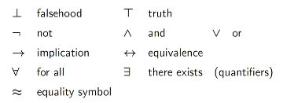
  + variables
    + A countable infinite set $\mathcal{X}$ of symbols $x_1, x_2,...$
  + auxiliary symbols
    + (, )...
+ non-logical symbols (*domain specific*)
  + functions
    + A finite or countably infinite set $\mathcal{F}$ of symbols $f_1, f_2, ...$ with *arity* $n\geq 0$
  + constants
    + $c_0, c_1, ...$
    + can be seemed as 0-arity functions
  + predicates
    + A finite or countably infinite set $\mathcal{P}$ of symbols $p_1, p_2, ...$ with *arity* $m\geq 0$
  + we refer to $\Sigma(\mathcal{F}, \mathcal{P})$ as signature of this domain

### definitions
+ **Term**
  + variables, constants and functions are all terms
  + by $T_{\Sigma}(\mathcal{X})$ we denote the set of $\Sigma$-terms over $\mathcal{X}$
  + A term not containing any variable is called *ground term*
    by $T_{\Sigma}$ we denote the set of ground $\Sigma$-term
+ **Atomic formulae**
  + $P(s_1, s_2, ...,s_n)$ and $s\sim t$
+ **Formulae**
  + $\bot$
  + $\top$
  + Atomic formulae
  + $\neg F$
  + $(F\star G)$ where $\star\in\{\lor,\land,\to, \leftrightarrow\}$
  + $\forall xF$
  + $\exists xF$
  + $F_{\Sigma}(\mathcal{X})$ denotes the set of all first-order formulae over $\Sigma$ and $\mathcal{X}$
  + formulae without variables are *ground*

### Free & bound variables
+ 如果一个变量作为量词的约束变量出现，那该变量就是*bound*的，否则为*free*.
+ 如果一个公式中没有free variables，那该公式为闭合公式（**closed formulae**）
+ 如果某公式中含有变量的自由出现，则为**open formulae**
+ 如果$x_1,x_2,...,x_n$是$F$的自由变量，则称$\forall x_1\forall x_2,...,\forall x_nF$为$F$的**closure formulae**

### Substitution

+ 如果$x$不在替换$\sigma$的作用变量域内，则不发生替换

### Interpretation
+ $\Sigma$上的解释$\mathcal{I}$被定义为$(U, .^{\mathcal{I}})$
  + $U$是一个非空集合，为$\mathcal{I}$的论域
  + $.^{\mathcal{I}}$是一个映射，它将
    + 每个常量映射到$U$中的元素
    + 每个函数映射到$U$中的函数
    + 每个谓词映射到$U$中的关系
+ A *variable assignment* relative to $\mathcal{I}$ is a function
$\mathcal{\beta}:\mathcal{X}\rightarrow U$
that assigns the variables to elements of the domain
+ term在模型下的解释：对应到$U$中的元素
+ formulae在模型下的解释：若两个term在$U$中的解释满足谓词指明的关系，则解释为真；否则为假

### Satisfiability， models and validity
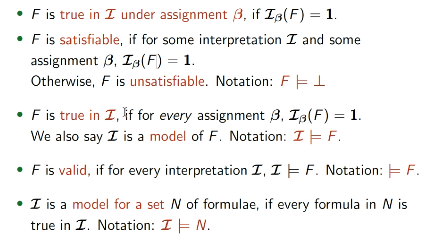

### Semantic entailment and equivalence
+ 如果公式集$N$的所有model都是公式$F$的model，那么$N\models F$
+ 如果$F\models G, G\models F$，则$F\equiv G$

### Duality between validity and satisfiability
+ $F$ is valid iff $\neg F$ is unsatisfiable
+ $N\models F$ iff $N\cup{\neg F}$ is unsatisfiable
+ **所以对于validity和inference的检测全部可以转化为对unsatisfiability的检测**

### Normal Forms
+ 为什么要转化为范式？因为系统中存在大量相互等价的符号，转化为范式有助于
  + 简化公式，固定到有限的patterns中
  + 更方便地进行判定
  + 可以提出更高效的自动推理算法

#### Prenex Normal Form
+ PNF 前缀范式
+ 形式：$Q_1x_1...Q_nx_nF$，$F$中不含量词
+ 转化为PNF范式的规则

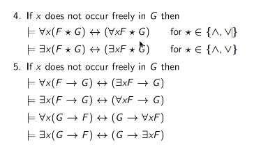
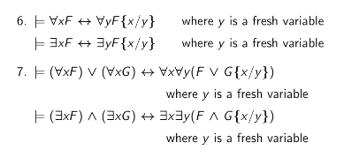
+ 通过rename和提取量词过程，可将任意公式转换为PNF范式
+ 一般的转换步骤如下
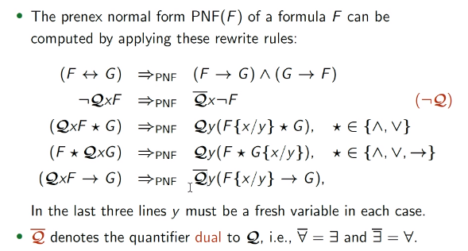

#### Skolem Normal Form
+ 消除$\exists$
  $\forall x_1...\forall x_n\exists yF$ 转化为 $\forall x_1...\forall x_nF{y/f(x_1...x_n)}$
  + $f$为Skolem Function
  + $f(x_1...x_n)$为Skolem Term
  + 该转换规则的证明依赖于选择公理

#### Conjunction Normal Form
+ 获得Skolem范式后，省略所有量词$\forall$，得到一个不含量词的公式$C$
+ 此时**公式$C$中所有的变量一定都是受$\forall$约束**的，这也正是Skolem范式转化步骤的意义

#### Normal Form Transformation Chain
+ $F\Rightarrow^\star_{\text{PNF}}G\Rightarrow^\star_{\text{Sk}}H\Rightarrow^*_{\text{CNF}}C$
+ $F$和$G$是等价的
+ $F$和$H$不等价，只有$H\models F$. (model有变)
+ 但是，$G$可满足当且仅当$H$可满足 (考虑Axiom of Choice)
+ 因而$C$ **可满足 iff $F$ 可满足**