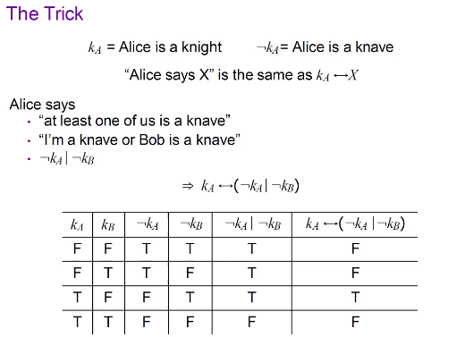

# Knowledge Representation
## Semantics
To many real-world objects, machine is *processible*, but not *understandable*. Thus we need to add 'Semantics'
+ 对于一系列实体的共同认识（agreement）
+ 数据（Web of Data）语义网的四项原则
  + Give all things a name
  + Build relationships between the objects
  + Things are named uniquely on the Web
  + Explicit, Formal Semantics

+ **Semantics is the connection between representation and object**

## KR - ontologies - OWL
+ Since the conception of the *Semantic Web*, people use
  + knowledge base
  + ontolody (本体，知识图谱): often denoted as knowledge graph
+ OWL (网络本体语言) is one language for writing ontologies

## protege usage

See [HERE](assets/KR&P-protege_tutorial.pdf)
---
## Reading Material
***What is a Knowledge Representation?***
### Terms
+ *inference*: any way to get new expressions from old
+ *knowledeg representation technologies*: equivalent to a set of terms -- rules, logic, semantic nets, etc 

### Knowledge Representation

## Surrogate
+ **Role 1: A KR is a Surrogate**
  + Knowledge Representation is a surrogate of the real-world object. Reasoning is an internal process, while the things taht we wish to reason
  + Surrogates can serves for tangible and intangible objects
  + From this perspective, reasoning itself is a surrogate for action in the real world.
  + All representations are imperfect approximations to reality.
  
> Example: A puzzle.
> On an island people are devided into two groups, Knights and Knaves. Knights always tell truth, while Knaves always tell lies. Alice and Bob are the only native people living on the island.  
> 
> That means Alice is a knight. Intuitively, Knowledge can be represented by symbols (such as k_A), rather than real-world objects. Also, reasoning is performed on these symbols.

+ **Role 2: A KR is a Set of Ontological Commitments**
  + Ontological Commitments are a set of notions we choose to comment on the world.
  + Our choice of KR (as discussed above, KR reflects part of the object attributes so we have multiple choice of KR), is in effect a strong pair of glasses that determine what we can see, bringing some part of the world into sharp focus, at the expense of blurring other parts.