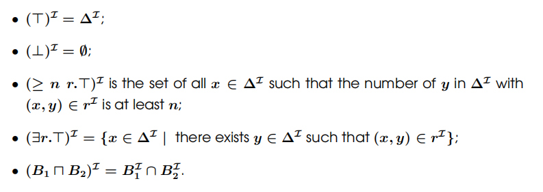
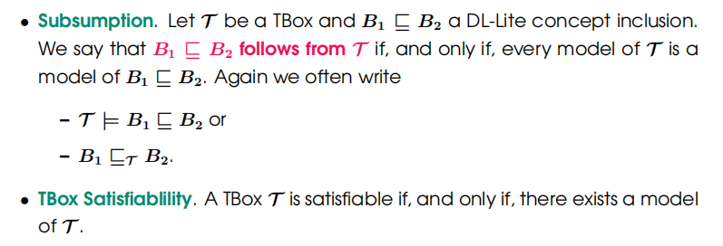

# DL-Lite

## Syntax

### Definition
+ Concept names: $A_0, A_1...$
+ Role names: $r_0, r_1...$
+ The concept $\top$
+ The concept $\bot$ (stands for the empty class)
+ Concept constructor $\sqcap$
+ Concept constructor $\sqcup$
+ Concept constructor $\exists$
+ Concept constructor $\geq _n$
+ role constructor $.-$

### Extension
+ A **role** is either a role name or the inverse $r^-$ over a role name $r$
+ **DL-Lite conceptes** are defined as follows
  + All concept names, $\top$ and $\top$
  + $\exists r.\top$ is a DL-Lite concept, for every role $r$
  + $\geq_n r.\top$ is a DL-Lite concept, for every role $r$
  + If $B_1$ and $B_2$ are DL-Lite concepts, then $B_1\sqcap B_2$ is a DL-Lite concept
+ **DL-Lite concept inclusion**
  + $B_1\sqsubseteq B_2$ where $B_1$ and $B_2$ are DL-Lite concepts
+ **Domain restriction**
  + $\exists r.\top \sqsubseteq C$
+ **Range restriction**
  + $\exists r^-.\top \sqsubseteq C$
+ **Disjoint statement**
  + $A\sqcap B\sqsubseteq \bot$
+ **DL-Lite TBox**
  + a finite set of DL-Lite concept inclusions

> "everybody who manages something is a manager"
> $\rightarrow\exists \text{manages}.\top\sqsubseteq \text{Manager}$
> "ecerything that is managed by something is a project"
> $\rightarrow\exists\text{manages}^-.\top\sqsubseteq \text{Project}$

## Semantic
+ **Interpretation**: $ \mathcal{I}=(\Delta^\mathcal{I}, \cdot^\mathcal{I}) $
  + same as $ \mathcal{EL} $
  + $ (r^-)^\mathcal{I}=\{(d, e)|(e, d)\in r^\mathcal{I}\} $

+ Let $ \mathcal{I} $ be an interpretation, $B_1\sqsubseteq B_2$ a DL-Lite inclusion, and $ \mathcal{T} $ a DL-Lite TBox
  + $ \mathcal{I}\models B_1\sqsubseteq B_2 $ iff $B_1^\mathcal{I}\subseteq B_2^\mathcal{I} $
  + $ \mathcal{I}\models \mathcal{T} $ iff $ \mathcal{I}\models B_1\sqsubseteq B_2 $ for all $B_1\sqsubseteq B_2$ in $ \mathcal{T} $

## Reasoning

+ **这里并未提到关于Concept Satisfiability的推理问题。个人认为，在DL-Lite中并没有CLass Definition和Class Primitive Definition，仅有Concept Names，因此没有关于非空集合检查的推理问题。**

+ **[Theorem]**: For DL-Lite, there exists polytime algorithm deciding subsumption and TBox satisfiability

### DL-Lite with or
+ an extension of DL-Lite by adding the concept constructor $\sqcup$
+ **[Theorem]**: Checking satisfiability in DL-Lite with or is NPC. Checking subsumption is co-NPC

---
