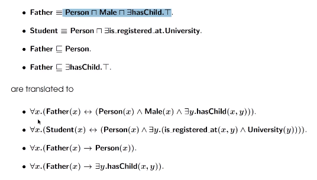

# Ontology Language Based on First-order Predicate Language (FOPL)
The following stardized languages are based on FOPL
+ Common Logic
+ CycL
+ KIF

They are more expressive than DL, but typically they are unable to decide. 

+ Upper Level Ontology
  + domain-independent ontologies that fix concepts across domains
  + function: to provide inter-operability on ontologies across multible domains
  + An example: DOLCE (see pdf)

## Syntax of FOPL

### Signature
+ signature for FOPL consists of 
  + a set $ \mathcal{V} $ of variables
  + a set $ \mathcal{P} $ of predicate symbols each of which comes with a positive number as its arity
  + a special binary relation symbol "$=$"

### Terms and Formula
+ Terms are
  + constant
  + variable
  + function
+ Formulas are
  + $P(x_1, x_2, ...)$
  + $x_1=x_2$
  + $\neg F$ where $F$ is a formula
  + $F\land G, G\lor G$ where $F, G$ are formulas
  + $\forall x.F, \exists x.F$ where $F$ is a formula and $x$ is a variable

### Transition of concept inclusions into FOPL: idea

## Semantics of FOPL
+ An interpretaion $ \mathcal{I} $ for FOPL consists of 
  + a non-empty set $\Delta^\mathcal{I} $, aka domain
  + every k-ary predicate symbol $P$ is mapped to a k-ary relation over domain
+ a variable assignment $\alpha$ that maps every variable to an element in the domain
+ We define satisfaction relation $ \mathcal{I}, \alpha\models F $ as in the pdf
+ free variables : see pdf. We denote $F$ as $F(x_1, x_2, ..., x_k)$ if the free variables among $F$ are $x_1, ...$. To test whether $ \mathcal{I}, \alpha\models F $, it is enough to know the $\alpha(x_1), ..., \alpha(x_k)$. Thus we write $ \mathcal{I}\models F(\alpha_1, ..., \alpha_k) $ if $\mathcal{I}, \alpha\models F$ holds for $\alpha_i=\alpha(x_i)$

## Reasoning
+ $ \mathcal{I}\models \mathcal{T} $ iff $ \mathcal{I}\models \mathcal{F} $ for all $ \mathcal{F} $ in $ \mathcal{T} $
+ An FOPL sentence $ \mathcal{F} $ follows from a FOPL ontology $ \mathcal{T} $, in symbols $ \mathcal{T}\models \mathcal{F} $
+ **For FOPL, whether $ \mathcal{T}\models \mathcal{F} $ is undecidable**

## Query
+ **Ground sentence** $ \mathcal{F} $ is of the form $ P(c_1, c_2, ...) $ where $P$ is predicate and $c$ are individual symbols
+ **Database Instance** is a finite set $ \mathcal{D} $ of ground sentences. The set $ \mathbf{Ind}(\mathcal{D}) $ denote the set of individual symbols in $ \mathcal{D} $
