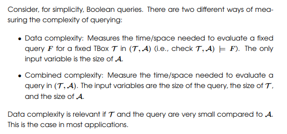
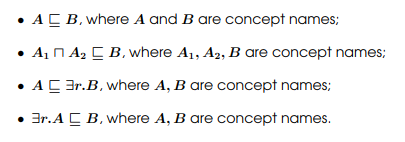
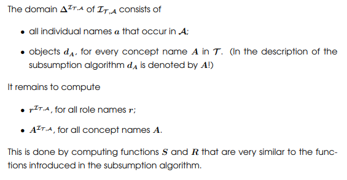
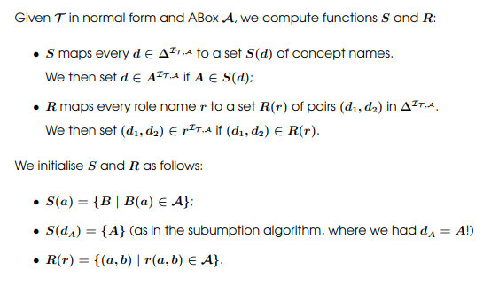

# OBDA: Ontology Based Data Access
+ Ontologies acts like metadata or schema for the data, and it exposes query interface to the users.
+ Not only the data itself but also the relationship between the data are considered in OBDA. 

## Knowledge Base (Ontology with database instance)
+ **Knowledge Base** $ \mathcal{K}=(\mathcal{T}, \mathcal{A}) $ consists of a TBox $ \mathcal{T} $ and a simple ABox $ \mathcal{A} $
+ An Interpretation $ \mathcal{I} $ satisfies a knowledge base $(\mathcal{T}, \mathcal{A})$, in symbols $ \mathcal{I}\models (\mathcal{T}, \mathcal{A}) $, iff it satisfies both $ \mathcal{T} $ and $ \mathcal{A} $
  + The set of models of $(\mathcal{T}, \mathcal{A})$ is denoted by $ \mathbf{Mod}(\mathcal{T}, \mathcal{A}) $

## Certain Answers
+ Given a knowledge base $ \mathcal{K}=(\mathcal{T}, \mathcal{A}) $ and a FOPL query $F(x_1, ..., x_k)$, we say that $(a_1, ..., a_k)$ is a **certain answer** to $F$ by $ \mathcal{K} $, in symbols $ \mathcal{K}\models F(a_1, a_2, ..., a_k) $, iff
  + $a_1, a_2, ..., a_k$ are individual names in $ \mathcal{A} $   (to ensure that our KB knows something about $a_1, ..., a_k$)
  + for all Interpretation $ \mathcal{I} $, $ \mathcal{I}\models K\Rightarrow \mathcal{I}\models F(a_1, a_2, ..., a_k) $
+ For Boolean Query
  + the certain answer given by $ \mathcal{K} $ is "yes" if $ \mathcal{I}\models F $, for all Interpretation $ \mathcal{I} $ satisfying $ \mathcal{K} $
  + the certain answer given by $ \mathcal{K} $ is "no" if $ \mathcal{I}\not\models F $, for **all interpretation $ \mathcal{I} $** satisfying $ \mathcal{K} $   (open world assumption!)
+ Certain answers to $ \mathcal{I}_ \mathcal{A} $, $ \mathcal{A} $ and $ \mathcal{K} $ tend to be different, for concepts have their relations!
  + the difference between $ \mathcal{I}_ \mathcal{A} $ and $ \mathcal{A} $ is, $ \mathcal{I}_ \mathcal{A} $ deploys closed world assumption, while $ \mathcal{A} $ deploys open world assumption

## Complexity of Query

+ $ \mathcal{T} $ is often fixed, and we may have a comparatively wide $ \mathcal{A} $

## $ Answering \mathcal{EL} $ Queries in KB
+ FOPL itself is undecidable

### From $(\mathcal{T}, \mathcal{A})$ to $ \mathcal{I}_{\mathcal{T}, \mathcal{A}} $
+ First, $ \mathcal{T} $ must be in the normal form

## Answering conjective query by rewriting query in DL-Lite
