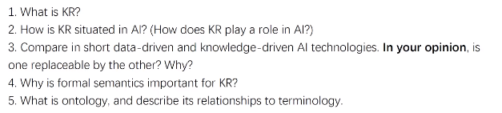
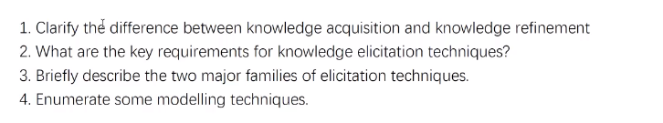
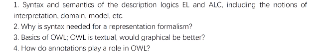
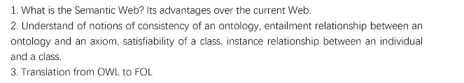

# 复习课
+ Week 1

pay attention to the reading materials!

+ Week 2

+ Week 3

+ Week 4

先有interpretation，然后才有domain

注意练习Translation from OWL to FOL

+ Week 5

1. Patterns of axioms
2. The PWR and transitivity

+ Week 6

1. CQ and its role in ontology modelling/engineering

+ Week 7

1. OWL API, and why build an OWL API

+ Week 8 & 10 (**very important**)

1. Types of inferences in OWL, and the transformations
2. The Tableau Algorithm

+ Week 9

