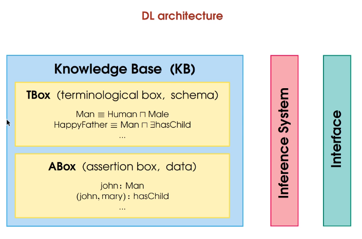

# Knowledge Acquisition
+ KA is the transfer of declarative statements from "source" to "sink"
+ Two different ways
  + Fully manual
  + Fully automation

## Source and Sink
+ Source
  + Domain Experts
  + know a lot about the domain
  + highly reliable about the domain
  + know how to articulate domain knowledge
  + have good metaknowledge
+ Immediate Sink
  + A document encoded in natural language or semi-NL
+ Ultimate Sink
  + A document encoded in formal KR language form

## Eliciting Knowledge
+ Proposal 1: Ask the expert to nicely write knowledge down
  + experts know to much
  + much of what they know is tacit
    + their knowledge can be discovered on demand, but cannot be sensed spontaneously
  + experts also know too little
    + their knowlegde is not full-pictured
    + representation constraints
  + expense as well

## Knowledge Base

+ TBox: 框架性的知识，描述的是一个群体的知识，往往恒定不会变化
+ ABox: 个体性的知识，描述的是个体的性质，可能随时间变化

## The Descriptional Logics
+ Description Logics是一阶逻辑中可被判定的那些子集。Description Logics的表达能力稍弱于一阶逻辑。
+ 下面的部分我们讨论其中一种语言$\mathcal{EL}$.
---
## $\mathcal{EL}$
### Syntax
+ definitions
  + **concept names** $A_0, A_1...$. (Person, Female...)
  + **role names** $r_0, r_1...$ (hasChild, loves) can be seen as *binary-relations*
  + $\top$
  + concept constructor $\sqcap$
  + concept constructor $\exists$
+ $\mathcal{EL}$ **concepts**: represents sets of elements and can be view as *unary-predicates* 
  + all concept names are $\mathcal{EL}$ concepts
  + $\top$ is a $\mathcal{EL}$ concept
  + if $C$ and $D$ are $\mathcal{EL}$ cncpepts and $r$ is a role name, then $(C\sqcap D), \exists r.C$ are $\mathcal{EL}$ concepts

Attension： $\exists r.C$中的$C$是修饰$r$的

### Concept Definition Formats in $\mathcal{EL}$
Let $A$ be a **concept name** and $C$ a $\mathcal{EL}$ **concept**
+ $A\equiv C$ is a $\mathcal{EL}$ concept definition. $C$ describes necessary and sufficient conditions for being $A$.
+ $A\sqsubseteq C$ is a primitive $\mathcal{EL}$ concept definition. $C$ describes necessary conditions for being A. 
+ newly-defined concept names can be used to define other concepts, inductively.

### $\mathcal{EL}$ Terminology
