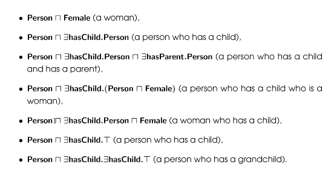
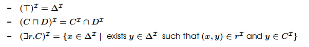
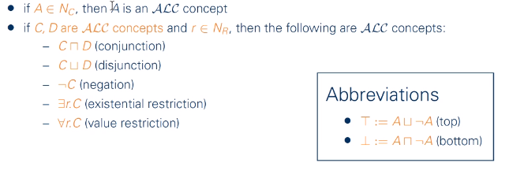
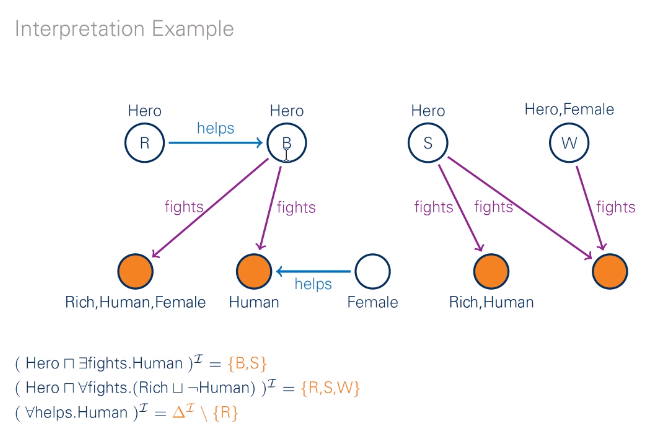
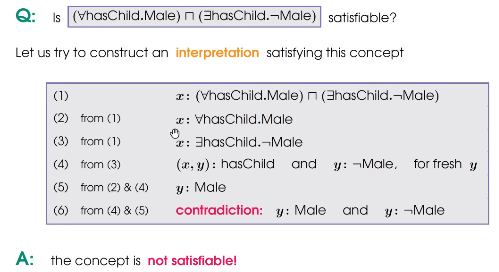
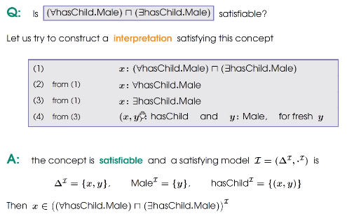

# The Descriptional Logics
+ Description Logics是一阶逻辑中可被判定的那些子集。Description Logics的表达能力稍弱于一阶逻辑。
+ 下面的部分我们讨论其中两种种语言$\mathcal{EL}$和$\mathcal{ALC}$.
---
# $\mathcal{EL}$
## Syntax
+ definitions
  + **concept names** $A_0, A_1...$. (Person, Female...)
  + **role names** $r_0, r_1...$ (hasChild, loves) can be seen as *binary-relations*
  + $\top$, often called "thing"
  + concept constructor $\sqcap$
  + concept constructor $\exists$
+ $\mathcal{EL}$ **concepts**: represents sets of elements and can be view as *unary-predicates* 
  + all concept names are $\mathcal{EL}$ concepts
  + $\top$ is a $\mathcal{EL}$ concept
  + if $C$ and $D$ are $\mathcal{EL}$ cncpepts and $r$ is a role name, then $(C\sqcap D), \exists r.C$ are $\mathcal{EL}$ concepts

Attension： $\exists r.C$中的$C$是修饰$r$的

### Concept Definition Formats in $\mathcal{EL}$
Let $A$ be a **concept name** and $C$ a $\mathcal{EL}$ **concept**
+ $A\equiv C$ is a $\mathcal{EL}$ **concept definition**. $C$ describes necessary and sufficient conditions for being $A$.
+ $A\sqsubseteq C$ is a **primitive $\mathcal{EL}$ concept definition**. $C$ describes necessary conditions for being A. 
+ newly-defined concept names can be used to define other concepts, inductively.

### $\mathcal{EL}$ Terminology
+ $\mathcal{EL}$ terminology is a finite set of definitions of the form $A\equiv C$ and $A\sqsubseteq C$, such that no concept name occurs more than once on the left
+ So in terminology a concept cannot have two distinct definitions

### $\mathcal{EL}$ concept inclusion
+ $C\sqsubseteq D$ is called a $\mathcal{EL}$ concept inclusion, or C is subsumed by D, or D subsumes C
+ $C\equiv D$ is called a $\mathcal{EL}$ concept equation
+ actually it is generalised from subsume and equation, for the concept on the left can be complex. 
+ **GCI**

### $\mathcal{EL}$ TBox
+ A $\mathcal{EL}$ TBOX is a finite set $T$ of $\mathcal{EL}$ concepts inclusions $C\sqsubseteq D$
+ Note: acyclic terminology $\subseteq$ terminology $\subseteq$ TBox

## Semantics
### Interpretation
+ An **interpretation** is a structure $\mathcal{I}=(\Delta^\mathcal{I}, \cdot^\mathcal{I})$
  + $\Delta^\mathcal{I}$ is the domain
  + $\cdot^\mathcal{I}$ is a map function
    + **concept name** A is mapped to a subset $A^\mathcal{I}$ of $\Delta^\mathcal{I}$
    + role name $r$ is mapped to a binary relation $r^\mathcal{I}$ over $\Delta^\mathcal{I}$
+ other inductive definitions  
  

### Truth value of a concept inclusion
+ suppose 
  + $\mathcal{I}$ an interpretation
  + $C\sqsubseteq D$ an inclusion
  + $\mathcal{T}$ a TBox
+ $\mathcal{I}\models C\sqsubseteq D$ iff $C^\mathcal{I}\sqsubseteq D^\mathcal{I}$
+ $\mathcal{I}\models C\equiv D$ iff $C^\mathcal{I}=D^\mathcal{I}$
+ $\mathcal{I}\models \mathcal{T}$ iff $\mathcal{I}$ is a model for all inclusions in $\mathcal{T}$

### followship between inclusion and TBox
+ suppose 
  + $\mathcal{I}$ an interpretation
  + $C\sqsubseteq D$ an inclusion
  + $\mathcal{T}$ a TBox
+ We say $C\sqsubseteq D$ follows from $\mathcal{T}$ when every model of $\mathcal{T}$ is a model for $C\sqsubseteq D$
  + denoted by $T\models C\sqsubseteq D$ or $C\sqsubseteq_\mathcal{T}D$

---
# $\mathcal{ALC}$
Attributive language with complement

## Syntax
+ $N_C$: set of concept names
+ $N_R$: set of role names
+ *$\mathcal{ALC}$ concept*:  
  
+ alias
  + concept names are also called *atomic concepts*
  + all other concepts are called *complex*
  + $A,B$ for atomic concrpts, $C,D$ for complex

## Semantics
+ An **interpretation** is a structure $\mathcal{I}=(\Delta^\mathcal{I}, \cdot^\mathcal{I})$
  + $\Delta^\mathcal{I}$ is the domain
  + $\cdot^\mathcal{I}$ is a map function
    + all **concept name** $A\in N_C$ is mapped to a subset $A^\mathcal{I}$ of $\Delta^\mathcal{I}$
    + role name $r$ is mapped to a binary relation $r^\mathcal{I}$ over $\Delta^\mathcal{I}$
+ inductive definitions
  + $(C\sqcap D)^\mathcal{I} := C^\mathcal{I}\cap D^\mathcal{I}$
  + $(C\sqcup D)^\mathcal{I} :=C^\mathcal{I}\cup D^\mathcal{I}$
  + $(\neg C)^\mathcal{I} := \neg C^\mathcal{I}$
  + $(\exists r.C)^\mathcal{I}:= \{d\in \Delta^\mathcal{I}|\text{there is }e\in\Delta^\mathcal{I}\text{ with } (d, e)\in r^\mathcal{I} \text{ and } e\in C^\mathcal{I}\}$
  + $(\forall r.C)^\mathcal{I}:= \{d\in \Delta^\mathcal{I}|\text{for all }e\in\Delta^\mathcal{I}: (d, e)\in r^\mathcal{I} \text{ implies }e\in C^\mathcal{I}\}$
+ model
  + model是使得Ontology中所有Axiom均为真的解释$ \mathcal{I} $

例子  

## Concepts Inclusions and TBoxes

## Reaonsing without TBox
+ Two Tasks
  + Subsumption
    + To prove the inclusion $C\sqsubseteq D$, iff to prove $\forall$ interpretations $ \mathcal{I} $, we have $ C^\mathcal{I}\subseteq D^\mathcal{I} $, i.e.$ \models C\sqsubseteq D $
  + Concept Satisfiability
    + Concept $C$ is satisfiable iff $\exists \mathcal{I} $, $C^\mathcal{I}\not =\emptyset$
  + Relationship
    + $\models C\sqsubseteq D$ iff $C\sqcap \neg D$ is satisfiable, thus in $ \mathcal{ALC} $, subsumption is reducible to satisfiability.
+ To decide whether an $ \mathcal{ALC} $ concept is satisfiable is **NPC** question. 

### Example： Trivial Method
  

+ 注：
  + TBox中的知识是Universally True的，这里我们没有进行TBox的推理，而只是利用了TBox中的知识
  + ABox中的内容是推理的内容
+ 最终什么时候终止（饱和）

---
## Extended $ \mathcal{ALC} $ by Qualified Number Restrictions
### Number Restriction
$$\leq_n r.C\quad\quad \geq_n r.C$$
+ $(\leq _n r . C)^{x}=\left\{x \in \Delta^{x}||\left\{y \in \Delta^{x} |(x, y) \in r^{x} \text { and } y \in C^{x}\right\} | \leq n\right\}$
+ $(\geq _n r . C)^{x}=\left\{x \in \Delta^{x}||\left\{y \in \Delta^{x} |(x, y) \in r^{x} \text { and } y \in C^{x}\right\} | \geq n\right\}$

### Unqualified Number Restriction
+ $\leq_n r.\top$, don't pose restriction on the concept of the range

### Inverse Role
+ $(r^-)^ \mathcal{I}=\{(y, x)\in\Delta^\mathcal{I}\times \Delta^\mathcal{I}|(x, y)\in r^\mathcal{I}\} $

### Transitive Role
+ One can all transitive(r) to a TBox to state that the relation $r$ is transtive. Thus, 
+ $ \mathcal{I}\models\text{transtive}(r) $ iff $r^ \mathcal{I} $ is transtive, i.e. for all $x, y, z\in\Delta^ \mathcal{I} $ such that $(x, y)\in r^\mathcal{I} $ and $(y, z)\in r^\mathcal{I} $ we have $(x,z)\in r^\mathcal{I} $

### Hierarchy Role
+ like concept hierarchy, role name can have hierarchy as well. 

### Nominal
+ **nominal**: concept that contain single individuals
+ In $ \mathcal{ALC} $ extended with nominals we can use the $\{a\}$ or $ \{a_1, a_2, ...\}= \{a_1\}\cup\{a_2\}\cup... $ to represent concept