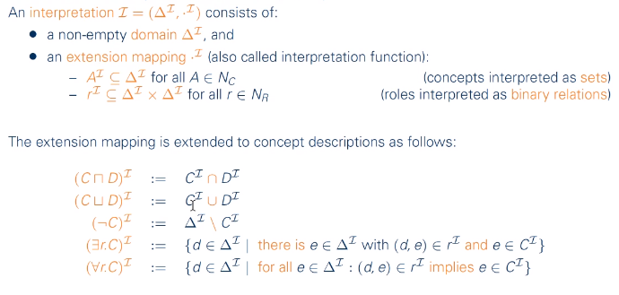
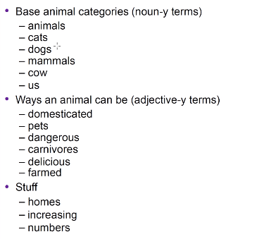
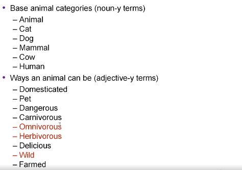
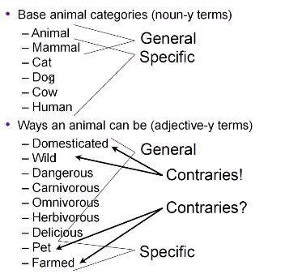

# The Descriptional Logics
+ Description Logics是一阶逻辑中可被判定的那些子集。Description Logics的表达能力稍弱于一阶逻辑。
+ 下面的部分我们讨论其中两种种语言$\mathcal{EL}$.
---
# $\mathcal{EL}$
## Syntax
+ definitions
  + **concept names** $A_0, A_1...$. (Person, Female...)
  + **role names** $r_0, r_1...$ (hasChild, loves) can be seen as *binary-relations*
  + $\top$
  + concept constructor $\sqcap$
  + concept constructor $\exists$
+ $\mathcal{EL}$ **concepts**: represents sets of elements and can be view as *unary-predicates* 
  + all concept names are $\mathcal{EL}$ concepts
  + $\top$ is a $\mathcal{EL}$ concept
  + if $C$ and $D$ are $\mathcal{EL}$ cncpepts and $r$ is a role name, then $(C\sqcap D), \exists r.C$ are $\mathcal{EL}$ concepts

Attension： $\exists r.C$中的$C$是修饰$r$的

### Concept Definition Formats in $\mathcal{EL}$
Let $A$ be a **concept name** and $C$ a $\mathcal{EL}$ **concept**
+ $A\equiv C$ is a $\mathcal{EL}$ concept definition. $C$ describes necessary and sufficient conditions for being $A$.
+ $A\sqsubseteq C$ is a primitive $\mathcal{EL}$ concept definition. $C$ describes necessary conditions for being A. 
+ newly-defined concept names can be used to define other concepts, inductively.

## $\mathcal{EL}$ Terminology
+ $\mathcal{EL}$ yerminology is a finite set of definitions of the form $A\equiv C$ and $A\sqsubseteq C$, such that no concept name occurs more than once on the left

---
# $\mathcal{ALC}$
attributive language with complement

## Syntax
+ $N_C$: set of concept names
+ $N_R$: set of role names
+ *$\mathcal{ALC}$ concept*:  
  
+ alias
  + concept names are also called *atomic concepts*
  + all other concepts are called *complex*
  + $A,B$ for atomic concrpts, $C,D$ for complex

## Semantics

例子  

---
## Formalization
### Term Extraction (词汇提取)
+ 每个词语都有不同的泛用程度，并且它们的单复数形式也不同

### Grouping

+ **Representations are context sensitive & interest relative**

### Normalise Terms
+ 将文本中的base term规范化，比如将animals重写为`Animal`，将us根据语义重写为`Human`
+ 将文本中animal具体的形式转化为形容词
+ 根据背景知识再增添一些形容词

### Organise Terms

> What is a definition?
> + a statement that describes/fixes the meaning of a term
> + 可以用两种方法给出一个定义
>   + 描述法（extensional）
>   + 列举法（intensional）：列举法给出的描述必须是判定定义的充要条件

