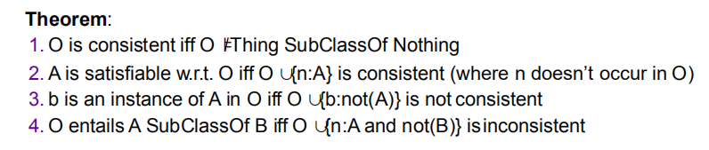
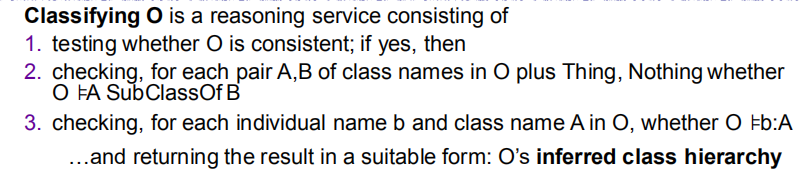

# OWL FOL Patterns, and OWL Semantics
## OWL Semantics：Interpretation

+ 显然，O中的Axiom越多，能够满足O的模型越少
  
### 一个例子，展示模型匹配

## OWL Semantics: Entailmants
+ 设$O$为Ontology，$\alpha$为Axiom，$A，B$为classes，$b$为individual name
  + $O$ is **consistent** if there exists some model of $O$
    + i.e. there is an interpretation that satisfies all axioms in $O$
    + i.e. $O$ isn't contradictory itself
  + $O$ **entails** $\alpha$ if $\alpha$ is satisfied in all models of $O$
    + written as $P\models \alpha$
  + $A$ is **satisfiable** w.r.t. $O$ if $O\not \models A\ SubclassOf\ Nothing$
    + i.e. there is a model $I$ of $O$ s.t. $A^I\not =\emptyset$
  + $b$ is an **instance** of $A$ w.r.t. $O$ if $b^I\in A^I$ for evert model $I$ of $O$
    + written as $O\models b:A$

+ 关于Classifying的工作  
