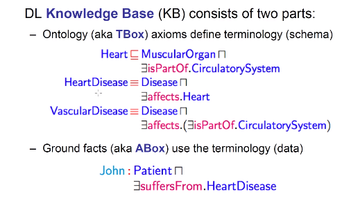
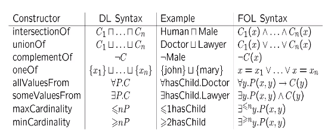
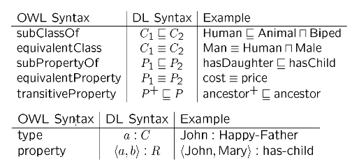
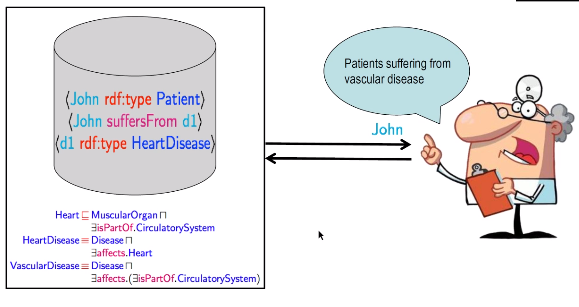

# Ontology

## Semantic Web
+ Web 1.0: 公司发布，data之间存在一定的关联，用户只是可读模式
+ Web 2.0: 允许用户之间产生交互行为，用户可以“创造”出联系，可读可写
+ Web 3.0: 将结构化的知识上传到网络来，构成一个广泛意义上的巨大的网络
  + A platform for distributed applications and sharing data
+ Semantic Web 关注的是实体和关系的语义，而非网络结构，这在某些场景下很有用
+ **RDF：资源描述框架**
  + 描述了数据的语义结构
  + RDF与OWL有一定区别，RDF只支持三元组的形式，主语，谓语，宾语，不支持TBOX类型的知识，即概念与概念之间的关系
+ **OWL：**
  + 用于描述、组建我们创造出来的本体
  + **OWL是基于描述语言的，但不等同于描述语言**
  + OWL实际上可以被看做是RDF在TBOX上的扩展
  + 对应到数据库，填充的数据实际上是ABOX，而表格的Schema是TBOX，反映了Attributes之间的联系
+ **SPARQL**
  + 提供了一种查询语言
  + provide standard query language

## Ontology
+ 世界某一个方面的建模
  + 首先会定义论域上所有涉及到的词汇
  + 指明属于的含义和定义
  + 使用类似一阶逻辑的逻辑语言对上述属于进行描述

## Web Ontology Language： OWL
+ 首先，能够用于书写Ontology的语言不只是OWL，但是OWL是最完备的一个
+ OWL有一定的工具和基础设施
  + APIs
  + 开发环境
  + 推理系统
+ OWL基于Description Logics （$\text{SHOIN SROIQ}$）

## Description Logics
+ OWL语言是要基于DL的
+ DL是FOL的属性子集
+ 拥有一些良好的性质
  + 可被判定
  + 复杂度低
+ 没有变量，只有concepts和连接符  

## Class/Concepts Constructors Diffs in OWL and DL

+ 这也说明DL语法可以被翻译成FOL语法
+ Constructor是DL Syntax基础上的一个包装，wrapper，**不同的DL是对OWL的实例化和符号化**

## Ontology Axioms

## 工作原理
+ OWL、RDF、SPARQL是协同工作的
+ RDF描述数据条目的特征
+ OWL既能描述数据的信息，也能描述Schema之间的关系
+ SPARQL是查询语法  

