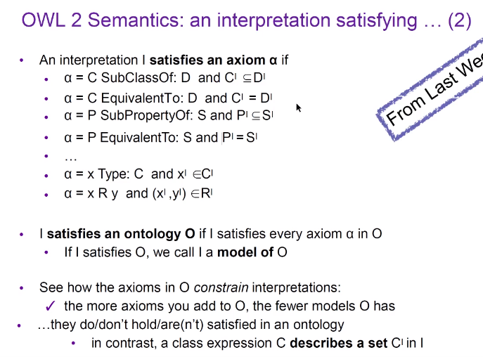
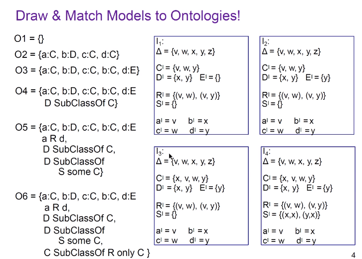

# OWL2 Semantics
## OWL2 Semantics：Interpretation

+ Attention, here axiom can be both TBox Axioms and ABox Axioms
+ 显然，O中的Axiom越多，能够满足O的模型越少
  
### 一个例子，展示模型匹配

## OWL2 Semantics: Entailmants
+ 设$O$为Ontology，$\alpha$为Axiom，$A，B$为class names，$b$为individual name
  + $O$ is **consistent** if there exists some model of $O$
    + i.e. there is an interpretation that satisfies all axioms in $O$
    + i.e. $O$ isn't contradictory itself
      + A contradictory example: A SubClassOf: $\perp$, b: A
  + $O$ **entails** $\alpha$ if $\alpha$ is satisfied in all models of $O$
    + written as $P\models \alpha$
  + $A$ is **satisfiable** w.r.t. $O$ if $O\not \models A\ SubclassOf\ Nothing$
    + i.e. there is a model $I$ of $O$ s.t. $A^I\not =\emptyset$
  + $b$ is an **instance** of $A$ w.r.t. $O$ if $b^I\in A^I$ for evert model $I$ of $O$
    + written as $O\models b:A$

+ Theorem
  + O is consistent iff O $\not\models$ Thing SubClassOf: Nothing
  + A is satisfiable w.r.t. O iff O$\cup${n:A} is consistent
  + b is an instance of A in O iff O$\cup${b:not(A)} is not consistent
  + O entails A SubClassOf: B iff O$\cup${n:A and not(B)} is not consistent

+ Classify: Classifying O us a reasoning service consisting of
  + testing thether O is consistent
  + checking, for each pair A, B of class names in O plus Thing, Nothing whether O$\models$A SubClassOf: B
  + checking, for each individual name b and class A, whether O$\models$b:A

---

## OWL and FOL
+ We can translate an OWL ontology O into FOL using $t$ as follows
  + Assume all the axioms is O is repleced in form of C SubClassOf: D
  + $t(O) = \{\forall x.t_x(C)\rightarrow t_x(D)|C \text{ SubClassOf: }D\in O\}\cup\{t_x(C)[x/a]|a:C\in O\}\cup\{r(a, b)|(a, b):r\in O\}$
+ What is $t_x(C)$ ?
  + Here C is a class in OWL, possibly composed by class names and constructors. 
  + $t_x(A)=A(x)$
  + $t_x(not\ C)=\neg t_x(C)$
  + $t_x(C\ and \ D)=t_x(C)\ and\ t_x(D)$
  + $t_x(C\ or D)=t_x(C)\ or\ t_x(D)$
  + $t_x(r\ some\ D)=\exists y.r(x, y)\land t_y(C)$
  + $t_x(r\ only\ D)=\forall y.r(x, y)\rightarrow t_y(C)$

## KR System Assumptions
+ Unique name assumption
  + Different names are always interpreted as different elements
+ Closed domain assumption
  + Domain consists only of elements named in the DB
+ Minimal models
  + Extension are as small as possible
+ Closed world assumption
  + What isn't entailed by O isn't true
+ **Open world assumption**
  + an axiom can be such that
    + it's entailed by O, or
    + it's negation is not entailed by O, or
    + none of the above

## Pattern of Axioms
+ Here we focus on syntactic patterns, i.e.
  + how the axioms are written
+ term normalisation
  + Class name
    + sigular form
    + initial capital letter
    + space via CamelCase
  + Individual name
    + all lower case
    + space indicated by _
  + Property name
    + initial lower case letter
    + spaces via CamelCase
    + usually starts with "is", or "has"