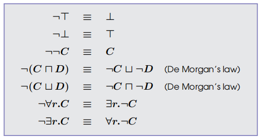
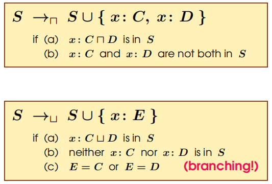
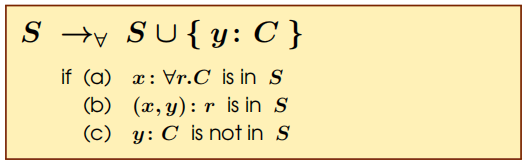
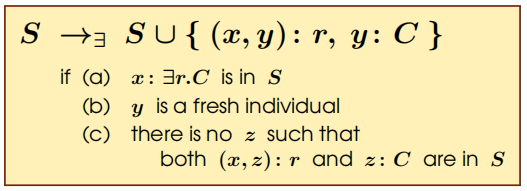
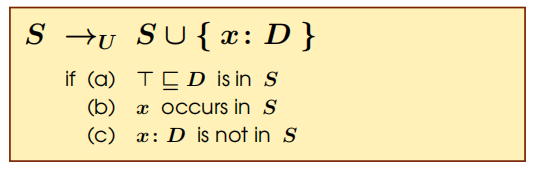

# Reasoning

## Reasoning without TBox
+ Two Types of Reasoning
  + **Subsuption**: A concept inclusion $C\sqsubseteq D$ follows from the empty TBox iff $\forall \mathcal{I} $, we have $C\subseteq D$. We often note this as $\emptyset \models C\sqsubseteq D$
  + **Concept Satisfiability**: A concept $C$ is satisfiable iff there exists an interpretation $ \mathcal{I} $ such that $C^ \mathcal{I}\not = \emptyset $
+ We have $\emptyset \models C\sqsubseteq D$ iff $C\sqcap \neg D$ is not satisfiable. Thus reasoning in $ \mathcal{ALC} $ can be reduced to concept satisfiability. 
+ Satisfiability Problem is not tractable (whether a question can be solved within polynomial time). Complexity is between NPC and ETC. The algorithm we present here requires exponential time. 

## Tableau Method
+ Set if completion rules operating on constraint systems
+ procedure
  + tranform a given concept into Negation Normal Form
  + apply completion rules in arbitrary orders as long as possible
  + the concept is satisfiable, iff a **clash-free** tableau can be devived to which no completion rules is applicable

### NNF
+ Tranformation Rules  

### Constraint, System and Clash
+ **Constraint**: expression of the form $x:C$ or $(x, y):r$
+ **Constraint system**: a finite non-empty set $S$ of constraints
+ **Clash**: S contains clash if $\{x:A, x:\neg A\}\subseteq S$, for some $x$ and $A$

### Completion Rules

+ Clashes eliminate branched from the OR tree

+ Only applicable if role sucessors can be found

+ The only rule that creates new individuals in a constraint system

### Analysing the Tableau Calculus
+ Soundness
+ Termination
+ Completeness
+ TODO

## Reasoning with TBox
+ Subsumption: We say that a concept inclusion $C \sqsubseteq D$ follows from a TBox $T$ iff for $\forall \mathcal{I} $ that is model of $T$, $ \mathcal{I} $ is a model of $C\sqsubseteq D$. We denote this as $T\models C\sqsubseteq D$
+ Satisfiability: similarly. 
+ TBox Satisfiability/Consistency: A TBox $T$ is satisfiable iff there exists a model of $T$
+ Reductions
  + $T\models C\sqsubseteq D$ iff $C\sqcap \neg D$ is not satisfiable w.r.t $T$
  + $T$ is satisfiable iff, $A$ is satisfiable w.r.t. $T$, $A$ is fresh concept name

## Tableau Method (cont.)
### Extended Completion Rule
+ An TBox subsume axiom $C \sqsubseteq D$ can be transformed into $\top \sqsubseteq \neg C\sqcup D$, and then we use the following rule

+ So, if we're to check satisfiability for a concept w.r.t a TBox, we need to transform the TBox axioms into the format $\top \sqsubseteq \neg C\sqcap D$ and the do the tableau calculus. 

### Blocking
+ The selection of $a: \exists r.C$ in the tableau path $T$ is blocked, if there is already an individual $b$ with $\{C|a:C\in T\}\subseteq \{C|b:C\in T\}$
+ Thus, the termination of a tableau tree is
  + all branches are unsatifiable
  + exists some non-blocked branch, and it is satisfiable