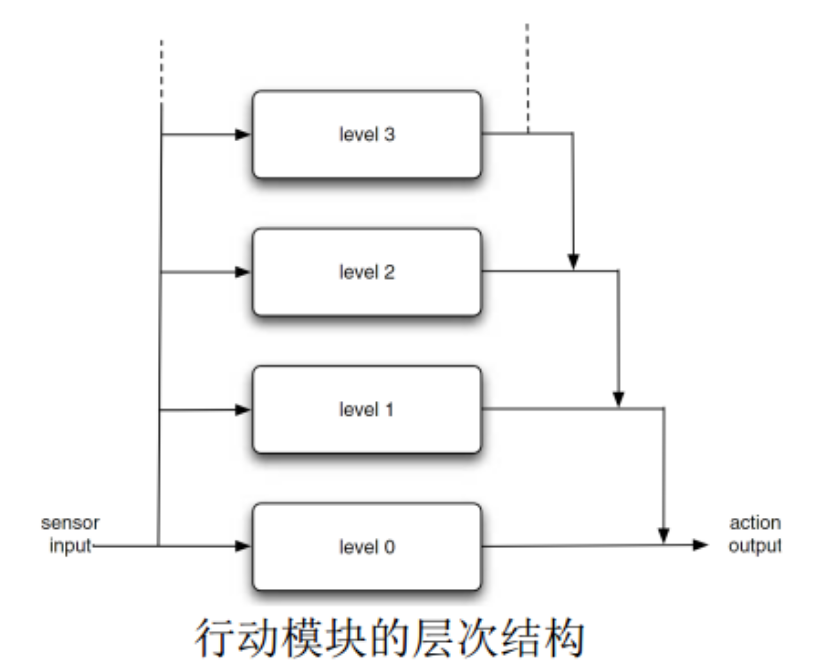
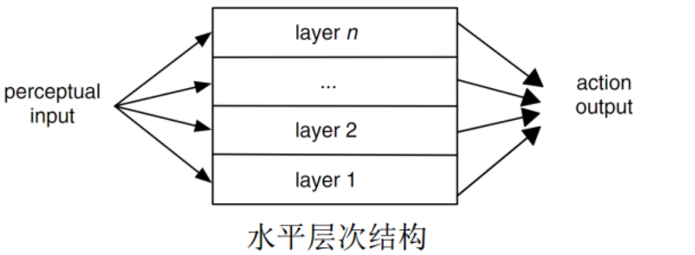
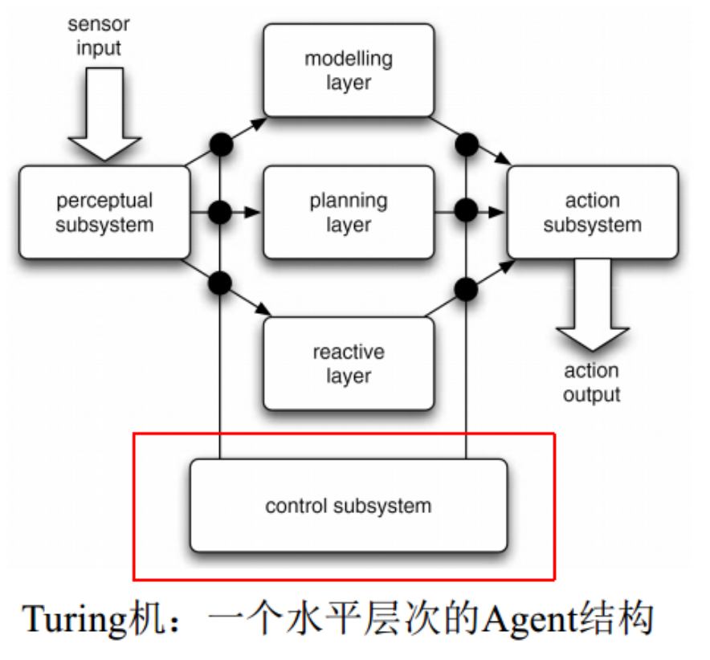
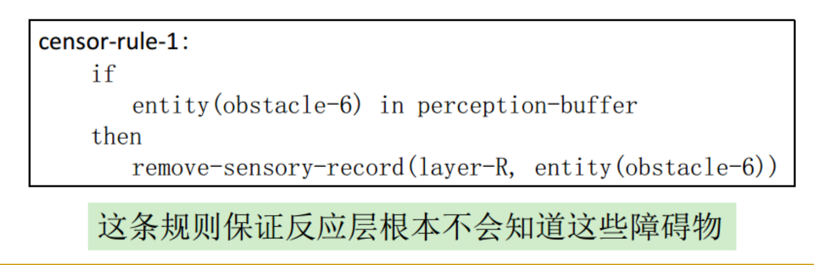
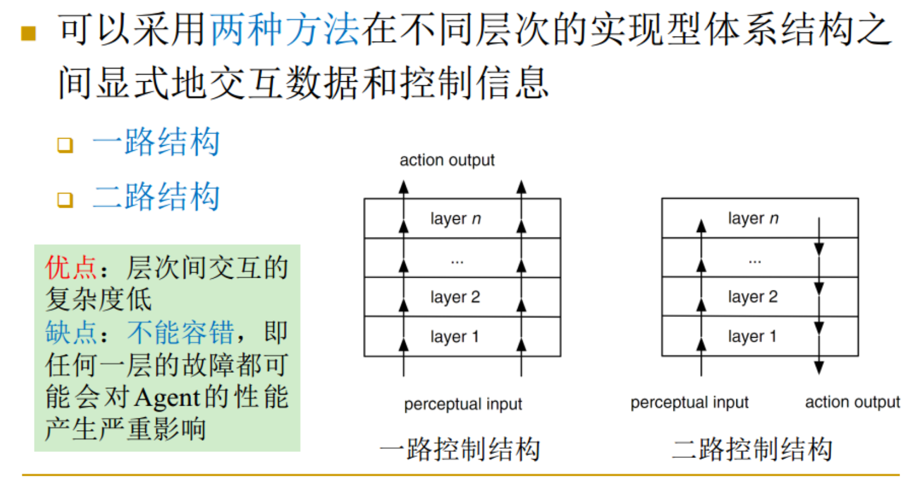
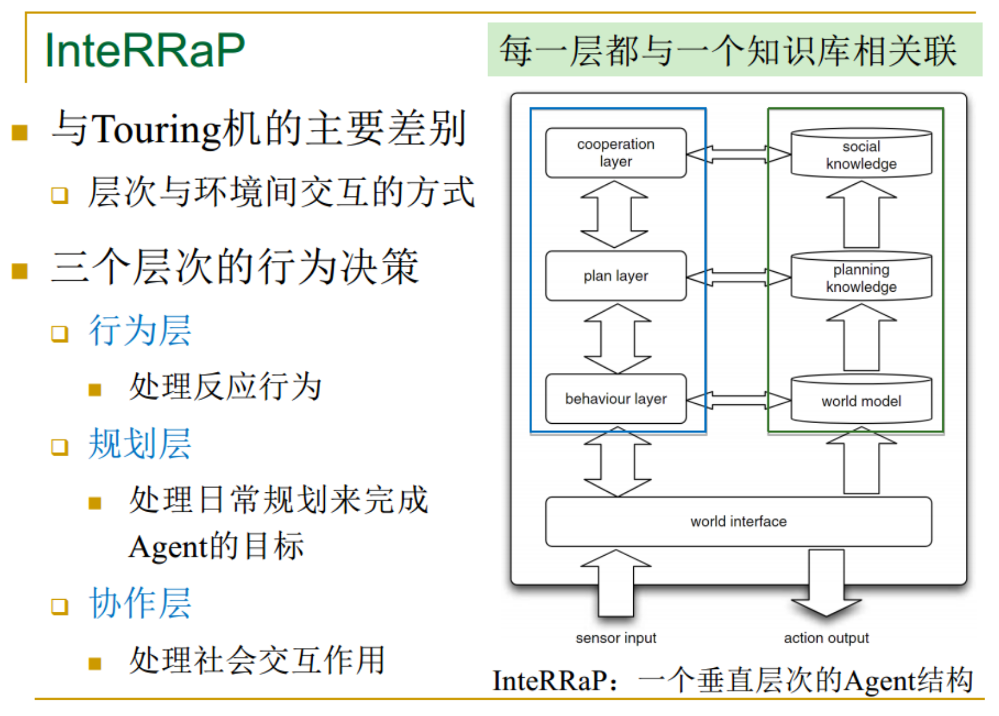

# 反应式Agent
+ 使用符号/逻辑的方法来构建Agent遇到了很多难以解决的问题
  + 主要问题是：Agent的行为决策基于复杂和耗时的计算，不能确保Agent对环境作出适时的反应

## 归类式体系结构
+ 特点
  + Agent做决策，通过一个完成任务的行为集合来实现
    + 每一种行为是一个动作选择函数
    + 每个行为模块都力图完成一些特定的动作
    + 模块不包括任何复杂的符号表示方式，不进行符号推理
  + 具有层次结构，层次越低，优先级越高  
  

## 反应式Agent的评价
+ 优点
  + 原理简单，容易理解，容易计算，容易实现
+ 局限性
  + 在局部环境中需要有充分的可用信息来决定可以接受的动作
  + 反应式Agent总是使用局部信息进行决策，天生短视
  + 从工程上来讲，反应式Agent完成特定任务非常难
  + 虽然只要少量Agent就可以生成有效的Agent，但是要构建行为的层次结构非常难

---

# 混合式Agent
+ 使用至少两个子系统来构造Agent
  + 慎思式子系统和反应式子系统
+ 各个子系统被排列成层次间相互交互的体系结构
  + 水平层次结构：Turing机
  + 垂直层次结构：InteRRaP

## 水平层次结构
+ 每个软件层都和传感器的输入和动作输出直接相连
+ 从效果上来说，每一层都扮演一个Agent决策
+ 一般还包括一个仲裁函数，来决定在给定时间内由哪一层来控制Agent  
  
+ **优点**：概念简洁；**缺点**：仲裁部件的交互复杂度比较高

### Turing Machine
+ 包含三个动作的产生层
  + 模型层
  + 规划层
  + 反应层
+ 三个控制层嵌入到控制子系统中  
  
+ 反应层
  + 反应层使用情景-动作规则集来实现，能对环境中产生的改变提供迅速的反应
+ 规划层
  + 为了实现目标，需要从规划库中找到合适的规划
+ 模型层
  + 代表世界上的各种实体
  + 可以预言Agent之间的冲突，并且产生需要完成的新目标
  + 新目标下传到规划层，借助规划层来进行实现
+ 控制子系统是一个动作仲裁部件  
  

## 垂直层次结构
+ 每个传感器的输入和动作输出最多和一层相关  

### InteRRaP

