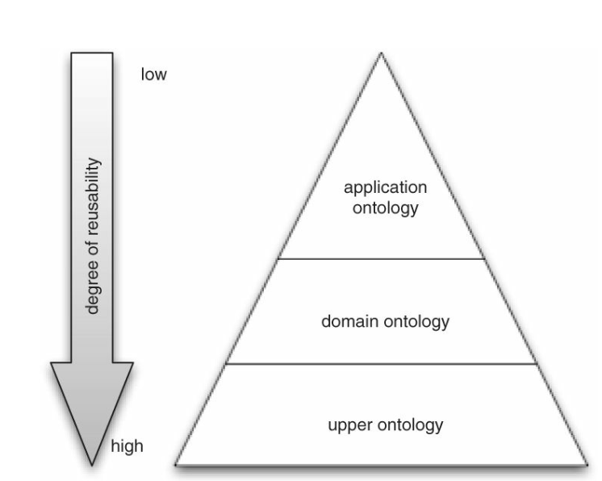
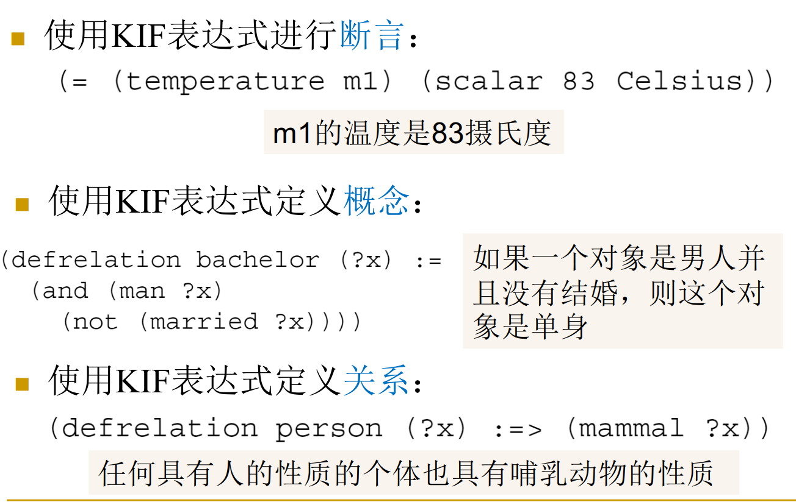

# 通信与合作

## 本体论基础
+ 本体描述层次
  + 应用本体
  + 领域本体
  + 上层本体
+ 一个本体越具体，它的可复用性就越低  

## 本体描述语言

+ XML
  + 相比于HTML语言，XML语言额外定义了本体和语义信息
    + 例子：Maven
+ OWL：网络本体语言
+ KIF：知识交换格式
  + KIF严格基于一阶逻辑
  + 使用KIF语言，Agent可以表示
    + 事物性质、关系和领域中的事物的一般性质  
    

## 构建本体
**步骤**
+ 确定领域和范围
  + 理解用户需求
+ 考虑复用
  + 一些开源的本体实例
+ 列举关键术语
  + Brainstorm，3-card方法
+ 定义类和类的层次结构
+ 定义属性（其实就是property）
  + 一个类可以具有以下形式的属性：固有属性、外在属性、组件、关系
+ 定义属性上的约束
  + 势约束：一个人只有一个出生日期
  + 类别约束：人的年龄为正整数
  + 范围约束：母亲的属性为Female
  + 领域约束
+ 创建实例