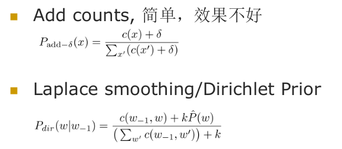
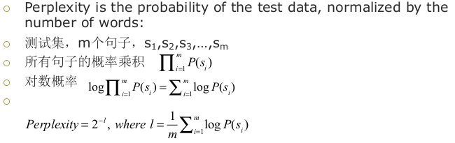

# 语言模型
+ 语言模型是用来刻画一个句子（词串序列）存在的可能性的概率模型
  $P(S)=P(w_1, w_2, ..., w_3)$

## N-Gram模型
+ 令$W$代表词串$(w_1w_2w_3w_4...w_n)$，则在统计语言模型下，有
  $$P(W) = P(w_1w_2w_3...w_n)=P(w_1)*P(w_2|w_1)*...*P(w_n|w_1w_2...w_{n-1})$$
+ *History Based Model*: predicting following things from past things

### Markov Assumption
+ 有限视野假设：当前词出现的概率只和它前面的k个词相关
  $$P(W)=\prod_{i=1,...,n}P(w_i|w_{i-k}, ..., w_{i-1})$$
  该世也被称为$k$阶马尔可夫链

### N-Gram
+ N-1阶马尔可夫链被称为N元语言模型
+ 参数估计（以2-Gram为例）
  $$P(w_i|w_{i-1})=\frac {P(w_iw_{i-1})}{P(w_{i-1})}=\frac {Count(w_iw_{i-1})}{Count(w_{i-1})}$$
  此处使用的实际上是最大似然估计。注意最大似然估计并不一定等于相对频率，此处是因为使用二项展开并求导后，最大似然估计恰好等于相对频率。

## 数据稀疏问题
### Zipf Law
+ Zipf Law: 如果按照词频排序，词频和排位的乘积是一个常数
  + **这意味着，绝大部分的词都很稀有，语言中频繁出现的词是有限的，数据稀疏问题一直存在**

### 解决数据稀疏：Smoothing
+ 平滑是指给没关查到的N元组合赋予一个概率值，以保证词序列总能通过语言模型获得一个概率值
+ Smooth Methods  
  
  + 简单线性插值
  $$P(w_i|w_{i-2}w_{i-1})=\lambda_1 P(w_i|w_{i-2}w_{i-1})+\lambda_2 P(w_i|w_{i-1})+\lambda_3 P(w_i)$$
  + [Katz Smoothing, Kneser-Ney Smoothing](http://www-2.cs.cmu.edu/~sfc/html/publications.html)

## 模型评价
### 统计语言模型数据集分类
+ 训练集
  + 用于训练模型，获得模型参数
+ 测试集
  + 从训练集外独立采样，反映系统在面对真实世界时的处理能力
+ 交叉确认集
  + 独立采样，用来帮助做设计决策和参数设定

### 评价方法
+ 直接放入需要语言模型的任务中，观察效果
+ **困惑度（Perplexity）**：观察测试集存在的概率  
  