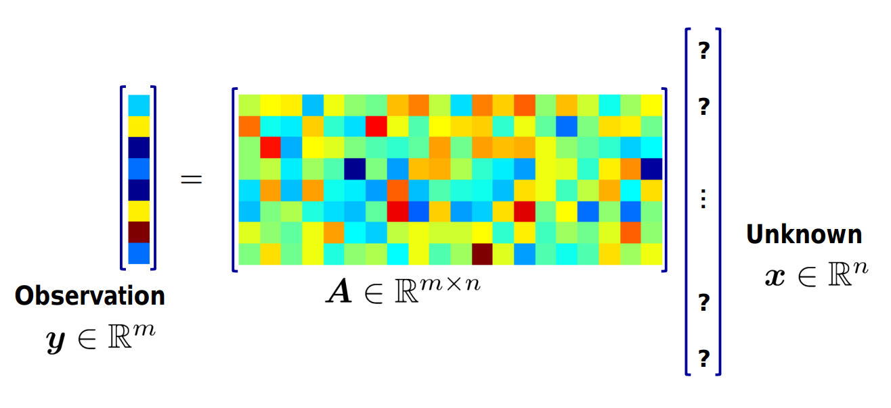
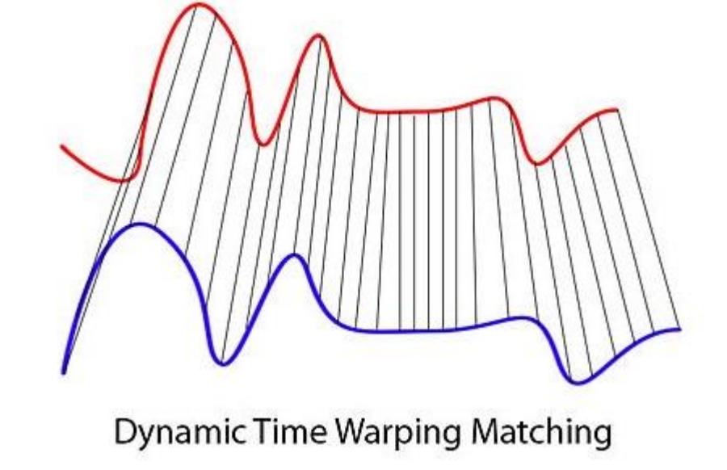
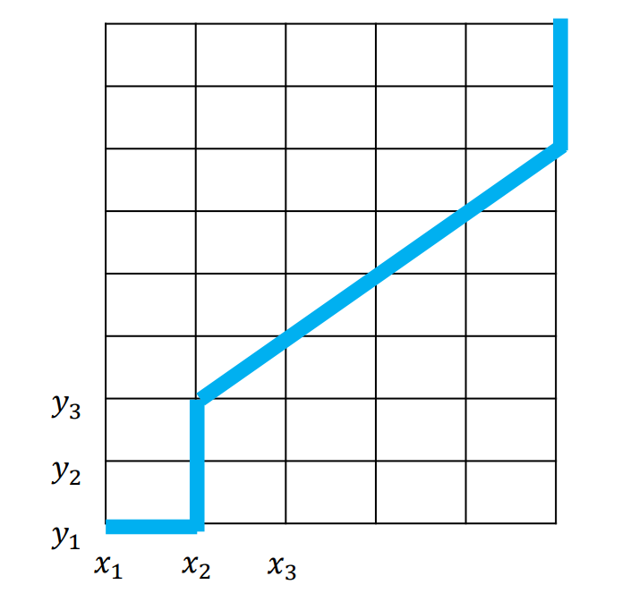
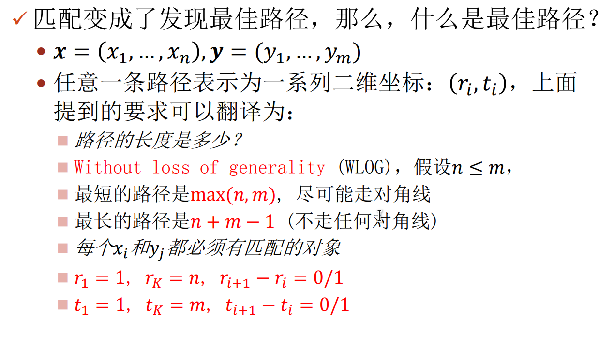

# 稀疏数据和未对齐数据

## 稀疏数据

+ 我们考虑一个使用$A \boldsymbol{x} $来重构Observation $ \boldsymbol{y} $的例子
+ 如果$n<m$，此时为一个Over-determined Linear System，PCA就是一个例子
+ 如果$n>>m$，此时为一个Under-determined Linear System，稀疏表示就是这种情况

### 稀疏性定义
+ 当我们谈论稀疏时，往往不是在原来的特征空间，而是在某种更有效的（通常高维但稀疏的）表达方式上

> 阅读建议：  
> 
> 注意：$l_1$范数是$l_0$范数的凸近似（书上有推导）
TODO

---

## 时间序列数据
### Dynamic Time Warping
+ 假设有两组（顺序的）数据$ \boldsymbol{x}=(x_1, x_2, ..., x_n) $，$ \boldsymbol{y}=(y_1, y_2, ..., y_m) $
  + 存在一个定义在各分量上的距离函数$d(x_i, y_j)$
  + 如果能找到好的**匹配**，就能计算$ \boldsymbol{x} $和$ \boldsymbol{y} $的距离  
    
+ 如何找到好的匹配？

#### 寻找匹配
+ 匹配的要求
  + 若$x_i, y_j$匹配，那么$d(x_i,y_j)$越小越好
  + 匹配可以有跳过的数据 
    + 比如$x_1\leftrightarrow y_2, x_3\leftrightarrow y_3$
  + 匹配总是顺序的，即不能交叉
  + 选择总距离最小的匹配
+ 但上述定义存在一个问题，即所有数据都不选择进入匹配，那么总距离就是0.
  + 因此需要添加一个约束：**要求$\forall i, x_i$必须和一个$y_j$匹配，反之亦然。**
  + 一个$x_i$可以和多个$y_j$匹配，反之亦然。
+ 可视化为  
  
  
+ 最终的形式化为
  $$
  D(n, m)=\min_{(\boldsymbol{r}, \boldsymbol{t})}\sum_{i=1}^{l(\boldsymbol{r}, \boldsymbol{t})}d(x_{r_i}, y_{t_i})
  $$
  其中$(\boldsymbol{r}, \boldsymbol{t})=\{(r_i, t_i)\}$是任意一条满足以上条件的路径，$l(\boldsymbol{r}, \boldsymbol{t})$是路径的长度
+ 由此，可以使用动态规划！

#### 小结
+ 比较两组顺序数据，若数据不一定对齐，那么可以使用DTW
