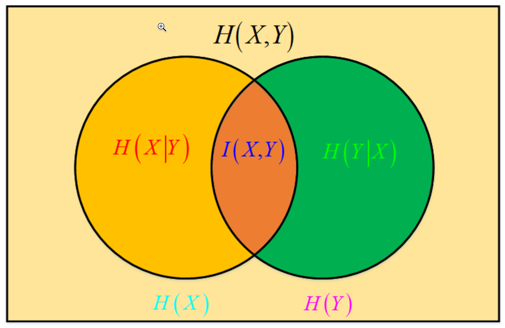

# 9 信息论和决策树

## 熵
+ 离散
  $$H(X)=-\sum_{i=1}^n p_i\log_2 p_i$$
+ 连续（微分熵）
  $$h(X)=-\int p(x)\ln p(x) \mathrm{d}x $$
  + 注意连续熵的符号和对数为自然对数
  + 微分熵可以为0或者负值

> 正态分布的微分熵为
> $$h(X)=-\int p(x)(-\frac 12\ln(2\pi\sigma^2)-\frac{(x-\mu)^2}{2\sigma^2})\mathrm{d}x=\frac 12\ln(2\pi e\sigma^2) $$

### 联合熵
+ 离散
  $$H(X,Y)=\sum_{x}\sum_yp(x,y)\log_2 p(x,y)=-\mathbb{E}_{X,Y}[\log_2p(X,Y)] $$
+ 连续
  $$h(X,Y) = -\int p(x,y)\ln p(x,y)\mathrm{d}x \mathrm{d}y$$

### 条件熵
+ 离散
  $$
  \begin{aligned}
      H(Y|X)&=-\sum_{x}p(x)\sum_yp_{Y|X=x}(y|x)\log_2p_{Y|X=x}(y|x)\\
      &=-\sum_{x,y}p(x,y)\log_2 p(y|x)\\
      &=\sum_xp(x)H(Y|X=x)\\
  \end{aligned}
  $$
+ 连续
  $$
  \begin{aligned}
      h(X,Y)&=-\int p(x,y)\ln p(y|x)\mathrm{d}x \mathrm{d}y
  \end{aligned}
  $$

### 互信息
+ 度量的是联合分布与两个边缘分布的信息量之差
  $$I(X;Y)=\sum_{x,y}p(x,y)\log_2 \frac {p(x,y)}{p(x)p(y)}$$

### KL散度
+ 度量两个给定分布之间的距离，但是是不对称的
  $$ \operatorname{KL}(p\|q)=\sum_x p(x)\log_2 \frac{p(x)}{q(x)} $$

### 各种熵之间的关系

## 多元高斯分布的熵
+ 考虑$d$维多元正态分布
  $$p(\boldsymbol{x})=(2\pi)^{-\frac d2}|\Sigma|^{-\frac 12}\exp\left(-\frac 12(\boldsymbol{x}-\boldsymbol{\mu})^\top \Sigma^{-1}(\boldsymbol{x}-\boldsymbol{\mu})\right)$$
+ 首先，令变量代换$\boldsymbol{y}=\boldsymbol{x}-\boldsymbol{\mu}$，由于变换的Jacobi矩阵为$\frac {\partial \boldsymbol{y}}{\partial \boldsymbol{x}}=I_d$，于是有$p_Y(\boldsymbol{y})=p_X(\boldsymbol{x}-\boldsymbol{\mu})$和$ \mathrm{d}\boldsymbol{y}=\mathrm{d}\boldsymbol{x} $，因此有
  $$
  \begin{aligned}
      \int p_Y(\boldsymbol{y})\ln p_Y(\boldsymbol{y})\mathrm{d}\boldsymbol{y}&= \int p_X(\boldsymbol{x}-\boldsymbol{\mu})\ln p_X(\boldsymbol{x}-\boldsymbol{\mu}) \mathrm{d} \boldsymbol{x}\\
      &=\int p_X(\boldsymbol{x})\ln p_X(\boldsymbol{x})\mathrm{d} \boldsymbol{x}\\
  \end{aligned}
  $$
  从上面的过程可以看出，平移变换不会改变随机变量的熵。
+ 其次，对$\boldsymbol{y}$应用白化变换，$\boldsymbol{z}=\Sigma^{-\frac 12}\boldsymbol{y}$，新的随机向量$Z\sim N(\boldsymbol{0}, I_d)$。此操作的Jacobi矩阵为$\frac{\partial \boldsymbol{z}}{\partial \boldsymbol{y}}=\Sigma^{-\frac 12}$，因此$p_Z(\boldsymbol{z})=\frac 1{|\Sigma|^{-\frac 12}}p_Y(\Sigma^{\frac 12}\boldsymbol{z})$，且$\mathrm{d}\boldsymbol{z}=|\Sigma|^{-\frac 12}\mathrm{d}\boldsymbol{y}$。故我们有
  $$
  \begin{aligned}
      h(Z)&=-\int p_Z(\boldsymbol{z})\ln p_Z(\boldsymbol{z})\mathrm{d}\boldsymbol{z}\\
      &=-\int \frac 1{|\Sigma|^{-\frac 12}}p_Y(\Sigma^{\frac 12} \boldsymbol{z})\ln \left(\frac 1{|\Sigma|^{-\frac 12}}p_Y(\Sigma^{\frac 12} \boldsymbol{z})\right)\mathrm{d}\boldsymbol{z}\\
      &=-\int p_Y(\boldsymbol{y})\left(\ln \frac 1{|\Sigma|^{-\frac 12}}+\ln p_Y(\boldsymbol{y})\right)\mathrm{d}\boldsymbol{y}\\
      &=h(Y)+\ln |\Sigma|^{-\frac 12}
  \end{aligned}
  $$
+ 由于$Z$是中心化的标准正态分布$N(\boldsymbol{0}, I_d)$，对独立的随机变量，联合熵是各个随机变量的熵之和，故
  $$h(Z)=\frac d2 \ln(2\pi e)$$
+ 因此最终有
  $$h(X)=\frac 12\ln((2\pi e)^d|\Sigma|)$$

### 高斯分布是最大熵分布

