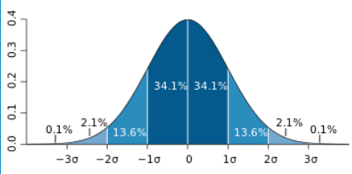

# 正态分布
给定$\mu \sigma >0$和连续型随机变量X，f(x) = $\frac{1}{\sqrt{2\pi}\sigma}e^{-(x-\mu)^2/2\sigma^2}$，则X服从参数为$(\mu, \sigma^2)$的正态分布。记作$X-N(\mu, \sigma^2)$
+ 图形关于$x=\mu$对称
+ $x=\mu$取最大值$\frac1{\sqrt{2\pi}\sigma}$
+ 渐近线为y=0
+ $x=\mu\plusmn\sigma$为图形的拐点
+ 当$\mu$改变，图形左右移动；当$\sigma$变大时，图形变“瘪”，当$\sigma$变小时，图形变尖

+ 

## 标准正态分布
当$\mu=0,\sigma=1$时，称其为标准正态分布。此时$f(x)=\frac1{\sqrt{2\pi}}e^{-x^2/2}$
+ 首先证明是一个分布。即证$\int_{-\infty}^{+\infty}\frac1{\sqrt{2\pi}}e^{-t^2/2}dt=1$。需要使用二重积分的代换

## 正态分布的分布函数
 $F(x)=\int_{-\infty}^{x}\frac{1}{\sqrt{2\pi}\sigma}e^{-(t-\mu)^2/2\sigma^2}dt$
 + 若$X-N(\mu, \sigma^2)$，则$Y=(X-\mu)/\sigma$服从$N(0,1)$