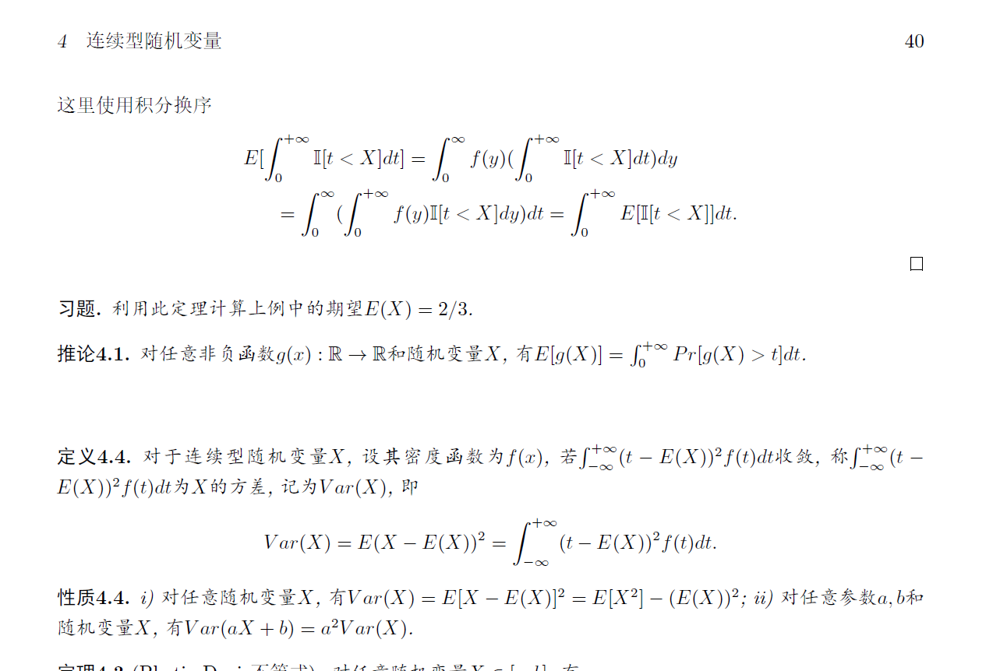

# 连续型随机变量
## 分布函数
$F(x) = P(X\leq x)，其中X为随机变量$

性质：  
+ 单调不减
+ $\lim_{x\rightarrow-\infty} F(x)=0=F(-\infty)$
+ $\lim_{x\rightarrow+\infty} F(x)=1=F(+\infty)$
+ $F(x)$在$x=x_0$处右连续
+ 对于任意一个随机变量，他的分布函数是唯一的

> 在[0, 1]随机挑选一点，X表示落点坐标，假设X落入任意子区间的概率和区间长度成正比，求X的分布函数
>> 当$x<0$时，F(X)=0  
>> 当$0\leq x\leq 1$时，F(X) = P(X<=x)=kx...

## 密度函数
$对X分布函数F(x)，若存在f(x)使得F(x)=\int_{-\infty}^{x}f(t)dt,称X为连续型随机变量，f(X)为X的密度函数$  
**也就是说，所有的随机变量都有分布函数，但是只有存在密度函数的随机变量才是连续型随机变量。**

性质：  
+ $f(x)\geq 0$
+ $\int_{-\infty}^{+\infty}f(t)dt=1$
+ 对连续型随机变量，分布函数F(X)在R连续当且仅当f(x)可积，F(X)在x=x0可导当且仅当f(X)在x0连续
+ 如果对于一个随机变量，如果它的分布函数存在，则唯一

## 连续型随机变量的期望
连续型随机变量X，其密度函数为f(X)。若$\int_{-\infty}^{+\infty}tf(t)dt$绝对收敛，$E(x) = \int_{-\infty}^{+\infty}tf(t)dt$，被定义为期望。 

性质：  
+ $E(ax+b) = aE(x)+b$
+ 若$g(x)$连续，随机变量$Y=g(x)$，则$E(Y) = \int_{-\infty}^{+\infty}g(t)f(t)dt$
+ 若对于连续型随机变量X，X非负，则$E(X) = \int_{0}^{+\infty}P(X>t)dt$
  + 为了证明这一点，我们引入指示函数$I[A]$。若A为真，则$I[A]$为1.否则$I[A]$为0.对于指示函数，有$E[I(A)]=P(A)$
  + 下面证明。  
  + 见pdf
  + 

## 常见的连续型随机变量

### 均匀分布
连续型随机变量X， 满足$f(X)=\frac1{b-a}(x\in[a, b])，或者f(X)=0(x\not    \in [a, b])，$则称X服从区间$[a, b]$上的均匀分布。记作$X - U(a, b)$  
**类似这种题都需要1.验证X是一个分布。2.看题目是否要求了求期望和方差。**  
+ $E[X] = \frac{a+b}2$
+ $Var[X] = \frac{(b-a)^2}{12}$

### 指数分布
$\lambda > 0,X为连续型随机变量，f(x)=\lambda e^{-\lambda x}(x>0),或者f(x)=0(x\leq 0)，则称X服从参数为\lambda的指数分布$  
+ 无记忆性：$P(X>s+t|X>t) = P(X>s)$
  + 证明：
  + $P(X>s+t|X>t)=\frac{P(X>s+t)}{P(X>t)}=\frac{1-\int_{0}^{x}\lambda e^{-\lambda t}dt}1-\int_{0}^{x}\lambda e^{-\lambda t}dt)}$