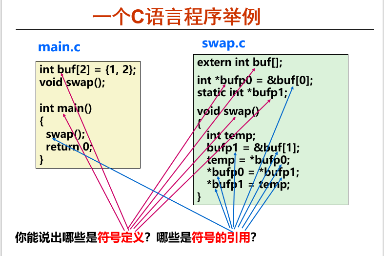
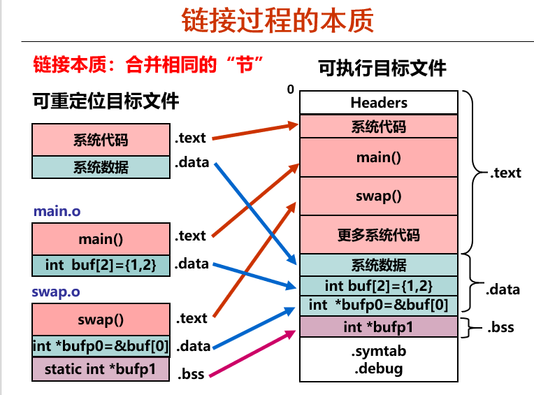
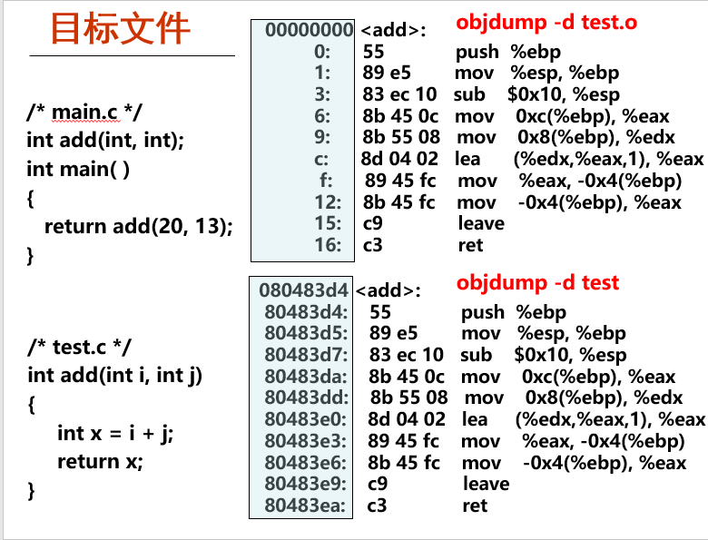
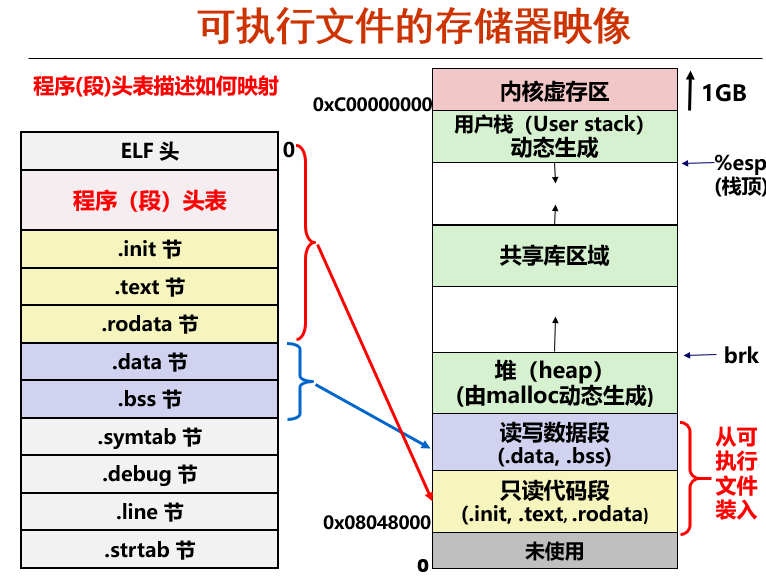
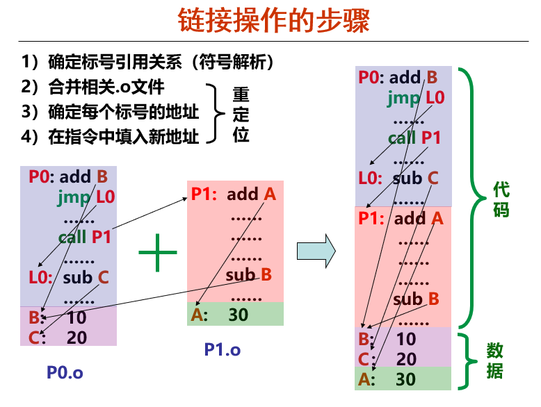
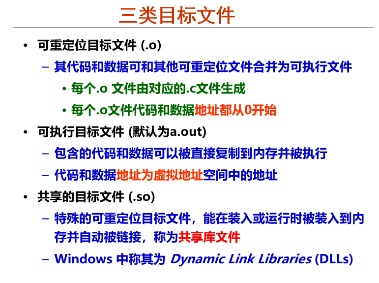
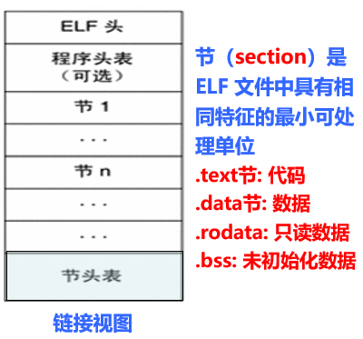
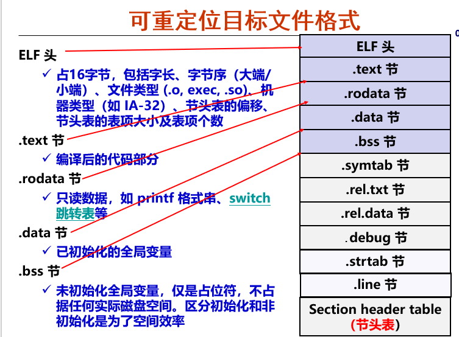

# Chapter 4:程序的链接
+ 使用链接的好处
  + 模块化
    + 一个程序可以分成很多源程序文件
    + 可构建公共函数库，例如数学库，标准C库等
  + 效率高
    + 时间上，可分开编译，并且文件修改后，只需单独编译被修改的文件
    + 空间上，无需包含共享库的所有代码
+ 符号定义与符号引用  

---
# 一、可执行文件的生成
+ 每个.o文件中都有各自的节，**链接本质就是合并相同的节**。  

## .o文件：可重定位目标文件
+ 可重定位目标文件中的标识符和节的地址都是暂时的，在-o链接后标识符的地址会发生变化  

## 可执行文件
+ 可执行文件的存储器映像  

## 链接的操作步骤
1. 符号解析（Symbol Resolution）：确定标号的引用关系
  + 程序中有**定义符号**和**引用符号**两种符号
  + 将定义的符号放在Symbol Table中
  + 将每个引用符号与它的定义符号建立关联
2. 合并相关的.o文件
  + 将多个代码段和数据段分别合并为一个单独的代码段和数据段
  + 计算每个定义的符号在虚拟地址空间中的绝对地址
  + 将**引用符号**处的地址修改为**定义符号**的绝对地址
3. 重新确定每个标号的地址
4. 在指令中填入新地址  

---

# 二、目标文件格式
三类目标文件  

## 标准目标文件格式
+ Windows：PE格式（Portable Executable）
+ Linux：ELF格式（Executable and Linkable Format）
## ELF格式
+ 两种视图
  + 链接视图  
      
    各部分内容和作用如下图  
    
  + 执行视图  
    
    + 比如只读数据段，包含了.init,.rodata, .text三个节。
