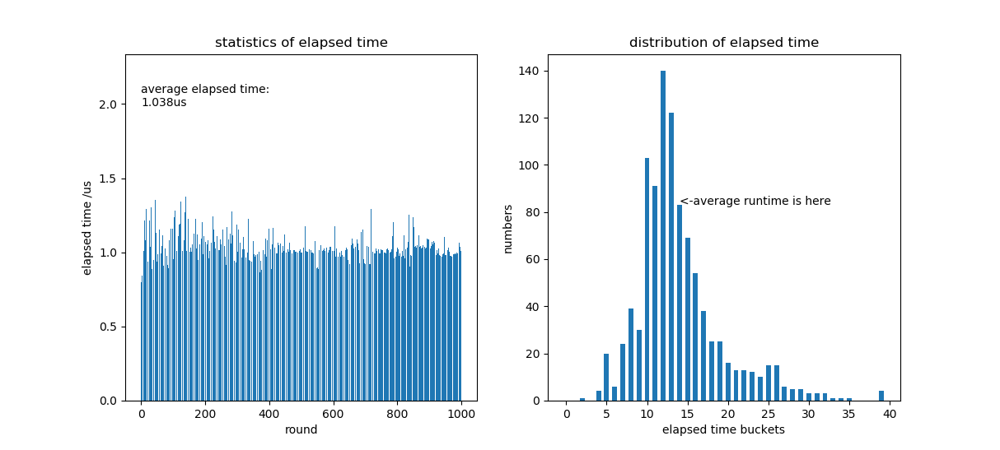
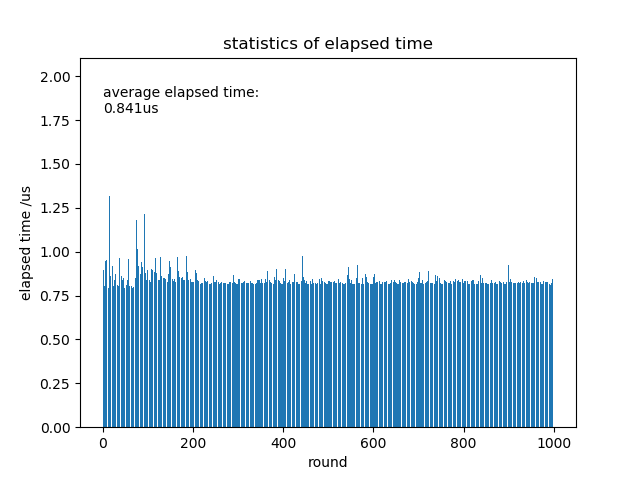
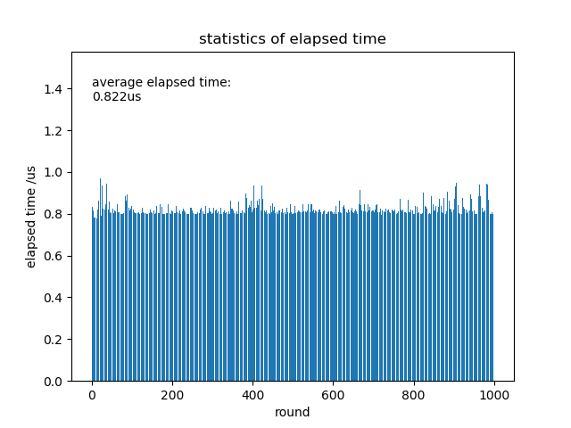
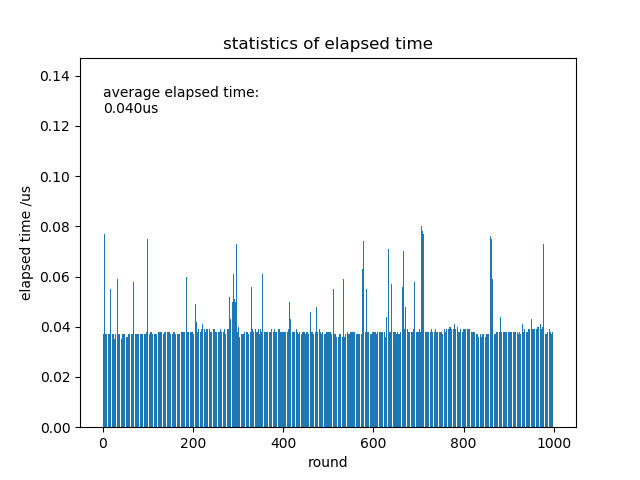
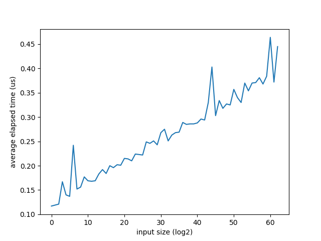
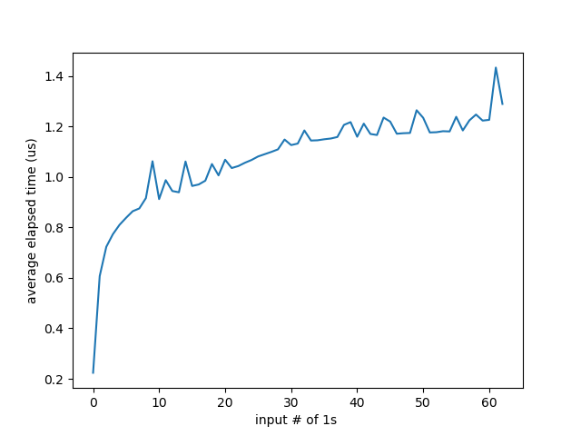
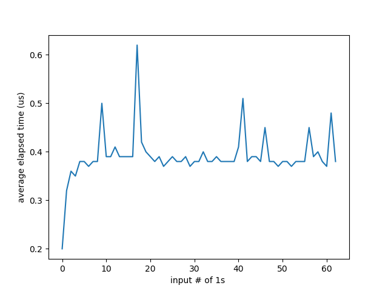

# Lab3实验报告
高辰潇
人工智能学院
SID：181220014

*注：在Lab3的实验过程中我曾经更改过电脑的主机名，从do-not-connect-this（某个公选课上总有同学连接我的电脑的热点，故更名）更改为eureka。因为发觉提交时会记录主机名，特此说明qaq。*
***又注：在Lab3的实现过程中我曾经将一个很大的测试文件提交到了版本库中，导致目录过大，submit失败。参考了jyy老师和一位助教老师给的方法后，将commit全部重写、将所有日志中对该文件的引用全部清空并git gc --prune后，reflog记录也被相应地清空了...再次特此说明。***

## 任务一：实现命令行工具
1. 命令行工具perf的实现参考```main.c```  
   使用```make```编译后，在终端键入```./perf-64```加上需要测试的程序名即可对程序进行运行时间分析。
2. perf会将指定的程序运行指定的```round```次，在终端输出该程序的平均运行时间（单位为微秒），并生成统计报告进行展示。
3. 统计报告包含以下两点
   + **运行的各个轮次中每次的运行时间和平均时间**
   + **运行时间的分布情况。将运行时间分在40个桶内，对落在每个桶内的数量进行计数。**
   以下为运行```multimod_p1```总计1000轮后生成的统计报告。

<figure class="one">
    
</figure>

## 任务二：获取精确时间
+ 使用了```<time.h>```模块中的```clock()```函数计时。该函数返回的数值为当前的时钟数，换算成时间精度为```1 us```。但是这个精度仍然不足以精确计量```multimod```的运行时间，因此我修改main.c的代码为每次round都将该程序运行1000次，计算总时长，然后取平均值作为单个round的运行时间。

### 任务三：调查multimod实现的性能差异
+ 将multimod三个实现的代码加入到impl.c中，并额外提供函数```multimod_p1```,```multimod_p2```, ```multimod_p3```将它们包装起来，提供输入。
+ 在```impl.c```中定义宏```INPUT```。若```INPUT```被定义，则表示```multimod_pi```从```stdin```接收输入作为```a,b,m```的值。若未定义宏```INPUT```，表明为```a, b, m```随机生成值。
+ 分别运行各个multimod实现，指定轮数为1000次，最终结果如下(单位：微秒).
    ||p1|p2|p3|
    |:------:|:------:|:------:|:------:|
    |运行时间(us)|0.841|0.822|0.040|
<figure class="third">
    
    
    
</figure>

#### 调查不同输入设置下multimod的实现的性能差异
##### 1. 输入a，b，m的大小不同
+ 测试代码详见```test.py```中的```TEST1()```.通过生成不同大小区间内的输入a，b，m并传送给perf作为输入，得到了以下实验结果。其中，横轴为输入的a，b，m的大小关于2的对数，纵轴分别为```multimod_p2```和```multimod_p3```在该输入下的运行时间，单位为微秒。

<figure class="two">
    
    
</figure>

+ 可见，随着输入规模的上升，```multimod_p2```的**运行时间大致与输入规模的对数呈线性关系**。```multimod_p3```类似。

##### 2.输入a，b的二进制位串中1的个数
+ 测试代码详见```test.py```中的```TEST2()```. 通过生成含有不同数量的1的a和b输送给perf作为输入，得到了以下实验结果。其中，横轴为输入a，b的二进制表示中1的个数，纵轴分别为```multimod_p2```和```multimod_p3```在该输入下的运行时间，单位为微秒。

<figure class="two">
    
    
</figure>

+ 可见，随着位串中1的数量的增加，```multimod_p2```的运行时间**先迅速上升，然后缓慢上升**。```multimod_p3```类似。