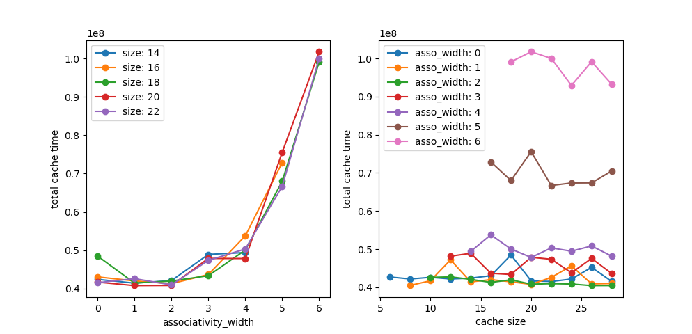
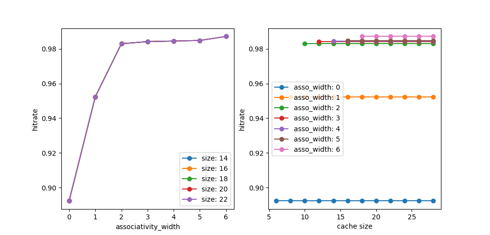
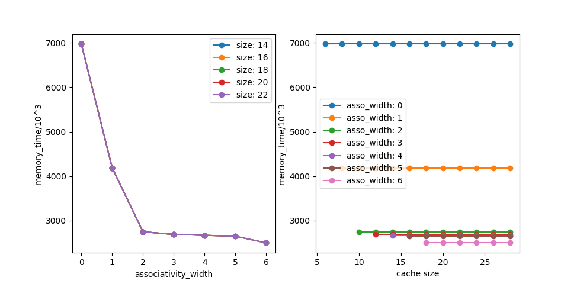

# Lab3实验报告
高辰潇
人工智能学院
SID：181220014

*注：在Lab4的实验过程中我曾经更改过电脑的主机名，从do-not-connect-this（某个公选课上总有同学连接我的电脑的热点，故更名）更改为eureka。因为发觉提交时会记录主机名，特此说明qaq。*
***又注：在Lab3的实现过程中我曾经将一个很大的测试文件提交到了版本库中，导致目录过大，submit失败。参考了jyy老师和一位助教老师给的方法后，将commit全部重写、将所有日志中对该文件的引用全部清空并git gc --prune后，reflog记录也被相应地清空了...再次特此说明。***

## 任务一：实现cache
+ 参考```cache.c```，略

## 任务二：性能分析
+ 在本次试验中可能会影响cache性能的主要有两个因素：关联度大小和cache容量。以下实验探究了cache访问时间(cache time)、命中率(hit rate)和内存访问时间(memory time)和这两个因素之间的关系。
+ 用于数据分析的脚本内容见```analysis.py```

### cache访问时间
+ 使用```<time.h>```中的```clock_gettime```函数对程序运行时间进行纳秒级度量。具体见函数```time_increase()```
+ 结果如下
<figure class="one">
    
</figure>

+ 左图为进行1000000次cache访问所需的总时间(ns)在不同cache大小下和关联度大小的关系，右图为cache访问总时间在不同关联度大小下和cache大小的关系。
+ **可以发现，在cache大小固定时，cache访问时间大致与关联度呈现二次函数关系，而在关联度固定时，cache访问时间在一定范围内上下波动。**
### cache命中率
+ 结果如下
<figure class="one">
    
</figure>

+ 左图为在不同cache大小下，cache命中率与cache关联度之间的关系；右图为在不同关联度大小下，cache命中率和cache大小的关系。（左图的大部分点是重叠的，因而只能看到一条曲线）
+ 为了控制变量，在测试时均使用了一样的种子。
+ 从实验结果可以看出，**cache命中率与cache大小没有直接关联**，因为cache大小决定的是将被映射到同一组cache line的主存块的数量，在程序局部性前提下这个数量不会直接影响命中率。
+ 同时可以发现，**命中率随关联度的上升而上升，且上升趋势先急后缓**。

### 内存访问时间
+ 使用1000000次操作所需要的周期数(cycle)来度量内存访问时间。
+ 结果如下
<figure class="one">
    
</figure>

+ 左图为在不同cache大小下，内存访问时间(单位：1000周期)与cache关联度之间的关系；右图为在不同关联度大小下，内存访问时间和cache大小的关系。（左图的大部分点是重叠的，因而只能看到一条曲线）
+ 可见，**内存访问时间与cache大小并无直接关联，这与我们在命中率上得到的结论是一致的，因为cache命中率决定了内存访问的次数。**
+ 同时，**在cache大小固定的前提下，cache的关联度越高，主存访问时间越小**。

## 任务三：给出最佳cache设计
+ 对比以上实验结果，可以发现关联度为2时，cache命中已达到较高水平，同时cache访问时间最低。
+ 再根据cache访问时间的相关数据，可推断较合适的cache大小为$2^{18}$到$2^{20}$字节，即256KB～1MB
+ 故最佳cache设计为256KB到1MB，4路组相连。