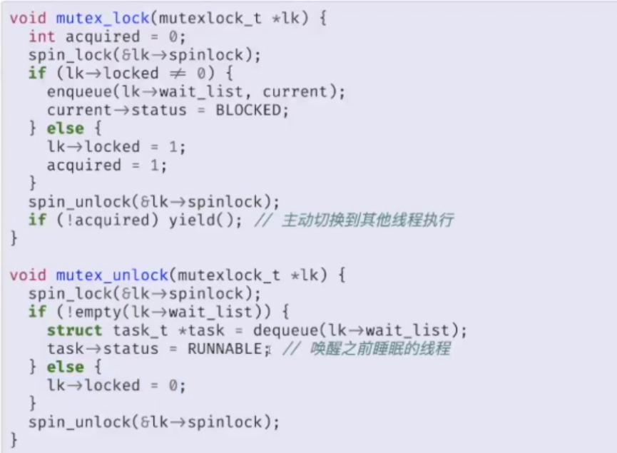

# 操作系统中的互斥
## 操作系统中的自旋锁：自旋锁
### 自旋锁v1
```c
typedef struct {
    intptr_t locked;
} spinlock_t

void lock(spinlock_t* lk) {
    while(_atomic_xchg(&lk->locked, 1));
}

void unlock(spinlock_t* lk) {
    _atomic_xchg(&lk->locked, 0);
}
```
+ safety似乎没有问题
+ liveness没有问题
+ 但是fairness出现问题：一段时间内几乎总是同一个线程获得锁
  + 原因在于，外部中断不一定总是在unlock的时候到来，更大概率在printf到来，就算切换到别的线程，也只能spin，无法进入临界区

### 自旋锁v2
+ 从上述分析可以看到，当上锁时不应该发生中断，否则其他线程会花大量时间进行自旋
+ 解决方法是在加锁后立即关中断

```c
// 注意关中断和开中断的顺序
void spin_lock(spinlock_t* lk) {
    cli();
    while(_atomic_xchg(&lk->locked, 1));
}

void spin_unlock(spinlock_t* lk) {
    _atomic_xchg(&lk->locked, 0);
    sti();
}
```
+ 但是有新的问题
  + 如果出现多个锁嵌套关中断再出现嵌套开中断，第一次开中断时中断就直接被打开了

### 自旋锁v3
+ 在线程第一次lock时保存中断状态
+ 在线程最后一次unlock时恢复保存的中断状态
  + lock -> `pushf`
  + unlock -> `popf`
+ flags栈应保存在线程或cpu中
+ 但上述实现还有问题
```c
lock(&lk);
lock(&lk);
...
```
+ 如果多次lock，会发生死锁。第一次lock后再次lock时会在while自旋
+ 还要注意顺序问题，pushf应在关中断之前，popf应在开中断之后

### 自旋锁小结
+ 关中断+自旋通常用来**保护一段较短的临界区**
  + 持有锁期间，线程不能被中断
  + 其他等待锁的线程/处理器只能自旋

## 操作系统中的长临界区
+ 如果操作系统中只有一个磁盘，那么磁盘的读写属于长临界区
+ 有的时候磁盘的读写也是通过中断实现的，关中断会出现问题
+ 只需要在自旋中yield即可！

```c
void mutex_lock(spinlock_t* lk) {
    while(_atomic_xchg(&lk->locked, 1)) {
        yiled();
    }
}
```
+ 进一步优化：采取上述措施后，仍然可能出现需要yield一整轮才能让持有锁的线程运行的情况，因此进一步的优化措施是**当某个线程在自旋等待锁时，将它的状态设置为WAITING**，让调度函数进行相应调度和状态维护



+ 说明
  + mutexlock_t内部还维护了一个所变量，用于保证对mutexlock_t维护操作的原子性
  + 也就是说，**自旋锁是保证lock-unlock区间操作原子化的方法**。保证原子性后，可以通过简单的if-else分支来实现锁功能

## 一个编程技巧：打印递归调用栈
```c
void getcallerpcs(void* v, uint pcs[]) {
    uint *ebp;
    int i;

    ebp = (uint*)v-2; // 32位，ebp旧值在第一个参数-0x8位置，64位模式下可以考虑使用内联汇编直接mov
    for (i = 0; i<10; i++) {
        if (ebp==0 || ebp<(uint*)KERNBASE || ebp==(uint*)0xfffffff)
            break;
        pcs[i] = ebp[1] //向高地址再取一位，即ebp+x4，即返回地址
        ebp = (uint*)ebp[0]
    }
    ...
}
```