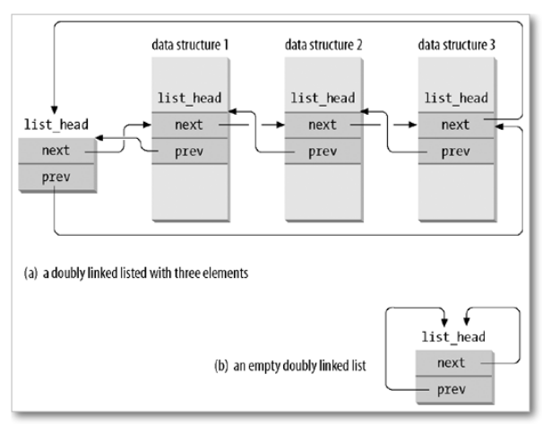

# 并发数据结构
+ 数据结构（链表）
+ 并发数据结构（并发链表）
+ 并发数据结构设计（malloc）

## List Head
+ 一种嵌入在其他数据结构中的双向循环链表
+ 嵌入后可以通过List Head来实现遍历操作
```c
struct list_head {
    struct list_head *next, *prev;
};
```

+ 相比于用list来实现的方法，list head有如下优势
  + 单个对象可以被嵌入到多个链表当中
  + 通常情况下我们在遍历列表时，会同时使用链表节中的数据。此时，访问的**局部性**可提高性能

### List Head使用
+ List Head被嵌入到某个数据结构后，怎样访问该结构中的其他成员？

```c
struct task {
    struct list_head wait_queue;
};
struct list_head {
    struct list_head *prev, *next;
};

#define list_entry(ptr, type, member) \
    ((type *) \
        ( (char *)(ptr) - (uintptr_t)(&((type *)0)->member) ) \
    )

struct task *task = list_entry(ptr, struct task, wait_queue);
```

+ define定义的宏用于取出list_head所在结构体变量的基址

## 并发数据结构
+ 允许多个线程在不同处理器上并发访问的数据结构
+ 互斥锁能够帮助我们**串行化**对数据结构的并发访问
  + 譬如可以在链表的头部放一把锁

## 并发数据结构设计
+ strace可发现，linux系统中分配小内存时使用sbrk，分配大内存时使用mmap
+ 首先分析malloc和free的行为
  + 维护一个被分配的区间的集合$[l_0, r_0)\cup ...\cup [l_i, r_i)\subseteq [l_0, R_0)\cup [L_1, R_1)\cup...$
    + $[L_i, R_i)$是从操作系统获得的内存区间
    + 这些区间互不相交
  + free需要根据变量寻找到区间，修改标记
    + 需要通过左端点找到右端点

## 现代malloc算法
+ 需求
  + 并行
  + 需要应对复杂的workloads
+ 两套系统
  + fast path：性能极好，99%情况下都OK
  + slow path：不在乎速度，但把事情仔细做好

### Fast Path
+ Slab分配器
  + 为每种可能分配的大小实现per-cpu / per-thread的分配空间
  + 由于大小固定，可省去记录大小的步骤和空间，并实现相对高效的管理（链表，bitmap）
  + 当一个Slab上的空间用完时，再开拓一个新的Slab，将两个代表相同大小的Slab使用链表链接起来
  + 当一个Slab上的对象全部被归还时，回收该Slab

### Slow Path
+ 回归集合管理的本质
+ Buddy System：使用线段树来实现区间管理
  + 可以在$O(\log n)$的时间内实现区间的分解


## 技巧：在c语言中实现锁的上下文管理器
```c
#define HoldLock(lk) \
    for (int __lock_var = (pthread_mutex_lock(lk), 0);
            __lock_var < 1;
            pthread_mutex_unlock(lk), __lock_var++)
```

## 工具：strace打印系统调用过程
## 工具：ltrace追踪库函数调用