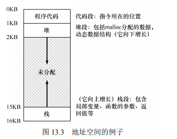

# 虚存抽象与地址空间
## 进程的地址空间


+ 栈区
+ 堆区
+ 数据
+ 代码
+ 每个部分都有其各自的权限（可读可写可执行等）
+ 查看地址空间的映射命令
  + pmap
+ 管理进程地址空间的系统调用
```c
void *mmap(void *addr, size_t length, int prot, int flags, int fd, off_t offset);
    // + prot: 权限
    // + fd: 文件描述符，mmap允许我们将内存中的某一段映射为文件中的某一段
int munmap(void *addr, size_t length);
int mprotect(void *addr, size_t length, int prot);
```

+ mmap的实际作用
  + 将虚拟地址空间直接映射到文件、代码上。
  + 但并不是实时加载的，而是需要访问时，先发生缺页，然后将需要用的部分加载到物理内存来，然后进行访问。