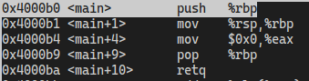

# 应用眼中的操作系统
## （应用）程序
+ 可执行文件和其他数据文件
  + Linux中有多种可执行文件格式，ELF最常用
```bash
file <file>   # 查看文件格式
```

+ 常见应用程序
  + Core Utilities
    ```bash
    ls
    ```
  + 系统、工具程序
    ```bash
    ip address
    ps
    ...
    ```
+ 可执行文件也可以被看作文本文件，其中ELF文件以`0x7f`开头
  ```bash
  vim /bin/ls    # 乱码
  xxd /bin/ls    # 字节码
  ```

## ELF文件
关注信息：
  + ELF Header
    + 文件内容分布、指令集体系结构、入口地址
    ```bash
    readelf -h <elf file>
    ```
  + Program Header
    + 决定ELF文件应当被如何加载
    ```bash
    readelf -l <elf file>
    ```

## Hello OS World!
+ 编写`main.c`
+ `gcc -c main.c`生成可重定位文件`main.o`
#### 尝试1
+ 尝试链接`ld hello`
```bash
(base) ➜  [/home/derek/test] git:(b2) ✗ ld main.o
ld: warning: cannot find entry symbol _start; defaulting to 00000000004000b0
main.o: In function `main':
main.c:(.text+0xc): undefined reference to `puts'
```
  + 出现该问题是因为在`-O0`优化下编译器仍会把`printf`优化为`puts`，而此处没有与`libc.a`链接，之后会处理该问题。这里我们把`printf`注释掉。

#### 尝试2
+ 这里我们把`printf`注释掉。重新编译并链接。
```bash
(base) ➜  [/home/derek/test] git:(b2) ✗ ./a.out 
[1]    27462 segmentation fault (core dumped)  ./a.out
```
+ 尝试gdb调试，发现是因为无人调用`main`，然而`main`在`ret`时返回地址存在且越界


#### 尝试3
+ 不用`main.c`, 编写一段汇编。


#### main之前发生了什么
+ 首先是操作系统动态链接器，加载了libc
+ 然后是libc完成了初始化
+ 最后是`main`
+ 在`main`函数执行前，会先调用`constructors`构造器，`main`结束后会调用`destructors`析构器

## 图形界面 Demo
+ GUI编辑器`xedit`
+ 通过`strace`查看`xedit`的系统调用
```bash
recvmsg(3, {msg_namelen=0}, 0)          = -1 EAGAIN (Resource temporarily unavailable)
poll([{fd=3, events=POLLIN|POLLOUT}], 1, -1) = 1 ([{fd=3, revents=POLLOUT}])
```

## objdump
+ 用于展示目标文件的信息
+ 参数
  + -d：展示反汇编
  + -S：如果目标文件使用-g选项编译，-S可以同时展示源代码和汇编

## strace
```bash
strace <program>
```
+ 打印程序的系统调用

```bash
strace -f gcc main.c
```
+ 获取子进程的系统调用
