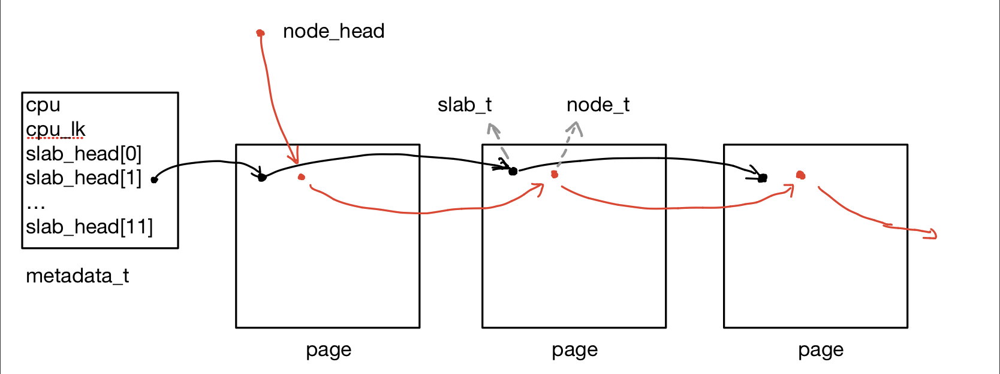

## L1 实验报告
+ Name: 高辰潇
+ STUID: 181220014
+ Email: derek.gaocx@gmail.com

### 框架说明
```
├── include
│   └── common.h   
└── src
    ├── lock.c    # 自旋锁以及lock/unlock函数
    ├── os.c     
    ├── pmm.c     # kalloc, kfree, init函数
    └── utils.c   # 其他kalloc中使用到的函数
```

### 实现细节
+ 整体上采用Slab分配器的思路，通过为每个cpu分配cpu-local的缓存来实现高效的内存分配

#### 关键数据结构
+ `node_t`： 链表，用于链接当前所有已被使用的内存页面的链表。
+ `slab_t`： 链表，用于链接cpu局部的、块大小相同的页面，其中成员变量`size`指示该页面中数据区的块大小
+ `page_t`： 内存页面结构体。每一张页面大小均为32KB，其中前4KB为元数据，后28KB为数据区。前4KB中，嵌入了`node_t`和`slab_t`两条链表，此外还有该页面上的对象计数`cnt`、位图`bitmap`等信息
+ `metadata_t`： 存放各个cpu的元数据，包含：cpu的局部锁`cpu_lk`，哨兵数组`slab_head[ITEM_NUM]`。哨兵数组中存放着每个块大小的页面的链表的哨兵。

#### 架构与功能实现
+ 内存的第一页用于存放元数据，包括各个cpu的`metadata_t`结构体，全局锁等等。
+ 将剩余内存划分成32KB大小的页面，使用嵌入在页面上的嵌入链表`node_t`链接起来，并使用锁`global_lk`进行并发管理。同时，每张页面上都有一把锁`page_lk`，当需要对页面上的数据进行修改/读取时，上锁。
+ 每个cpu都拥有一个cpu的局部锁`cpu_lk`和一个Slab分配器，其中总共有12个常见块大小：2B， 4B, 8B, 16B, 32B, 64B, 128B, 256B, 512B, 1KB, 2KB, 4KB
+ 对于每一种块大小（block size），为它们分别分配内存页面。当页面被占满（用光）时，可通过`global_lk`申请新的页面。同一种块大小的页面用嵌入在页面上的带有哨兵的双向循环链表`slab_t`链接起来。  
<figure>
    
</figure>

+ 当调用`pmm->alloc(size)`时
  + 首先将size调整到距离它最近的2的幂次，记为`upper`。然后根据当前的cpu编号，找到当前cpu对应的哨兵数组，根据upper找到对应于`upper`的块大小的哨兵。遍历链表找到第一个未满的页面，然后进入页面，找到一块内存，修改bitmap并返回地址
+ 当调用`pmm->free(ptr)`时
  + 根据`ptr&~(PGSIZE-1)`找到页面，对页面加锁并修改bitmap即可

#### 并发处理
+ 在上述设计中总共定义了三种锁：全局锁`global_lk`，cpu的局部锁`cpu_lk`和各个页面的锁`page_lk`
  + 其中，`global_lk`用于保护已使用页面的链表结构（即`node_t`链表）。因而当某次kalloc需要申请新的内存页面时，会对`global_lk`进行加锁
  + `cpu_lk`用于保护cpu局部的页面的链表结构（即`slab_t`链表）。在根据`upper`查找空余的页面过程中需要加锁
  + `page_lk`用于保护页面本身的数据信息，例如`bitmap`, 对象计数`cnt`等。
+ **OJ的Hard Test性能要求实在很高，在不影响最终正确性和功能的前提下，我并未对以下情况中可能的并发进行处理**
  + 在遍历`slab_t`链表查询未被占满的页面时，需要读取页面上的`cnt`变量并与`full`进行比对。这里应当锁上`page_lk`以防止和free并发，但是由于我们只需要读取`cnt`变量而不会修改，并且即使`cnt`读取数字有误，最坏情况下也只是向全局内存多申请一张页面而已。因而这里可以不对页面加锁，而不影响整体功能的正确性

### 印象深刻的Bug
+ 遍历`bitmap`时我使用了`__builtin_ctz`函数，并且想当然地认为`__builtin_ctz(0)`的结果应该是32。然而，在实际调试时我发现编译器直接跳过了对`if (32 == __builtin_ctz(0))`的编译，并且导致了一些错误。查阅手册后得知，`__builtin_ctz(0)`是UB，本地编译时gcc认定不会出现返回值为32的情况，因而直接进行了优化。